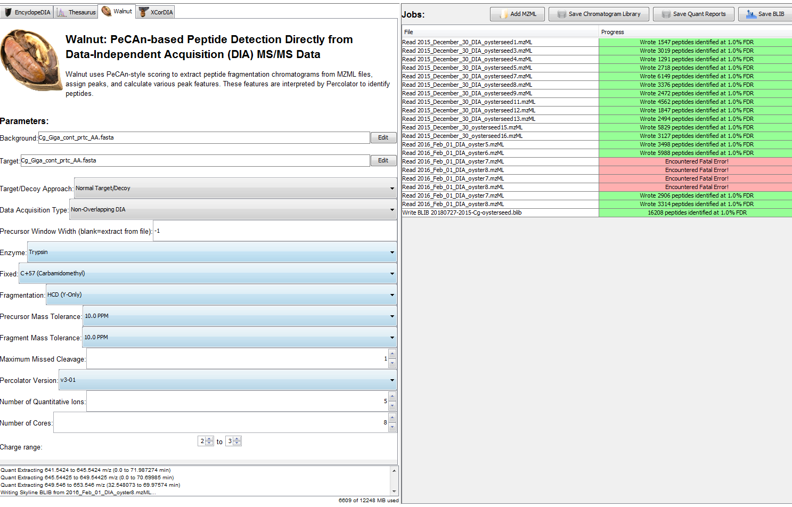
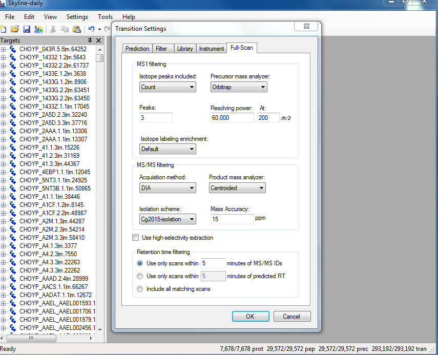

Today Walnut finished up using Walnut to make a new BLIB file with the 2015 C.gigas Oysterseed raw files. Then, I used the new BLIB in SKyline, along with changing the minutes to 5, and double-checking I used the same .mzML files used in Walnut as my results in Skyline. The peaks still look pretty bad. I just emailed Emma...

### Walnut
When I arrived today, there was a "fatal error" in Walnut for February RAW files number 7 and 8. So I tried it again, but it still didn't work.       

So then I went back to [owl and re-downloaded the two RAW files](http://owl.fish.washington.edu/phainopepla/C_gigas/2015-12-30/). I then converted them to .mzML using MSConvert (without demultiplexing). Then I added them to Walnut, and it worked! Then I hit "Save BLIB".         

Then, I went through the [DIA protocol](https://github.com/RobertsLab/resources/blob/master/protocols/DIA-data-Analyses.md), but I made a few changes per Emma's suggestions. 
- I used the new BLIB file I made using Walnut
- In [Step 4e (12)](https://github.com/RobertsLab/resources/blob/master/protocols/DIA-data-Analyses.md#step-4e-adjust-transition-settings-in-skyline), I changed the minutes to 5
      
- In [Step 4f](https://github.com/RobertsLab/resources/blob/master/protocols/DIA-data-Analyses.md#step-4f-import-dia-data-into-skyline) I made sure I used the same .mzML files as the results that I used to create the BLIB in Walnut and that each oysterseed sample was it's own subdirectory

So, with all this changes, the peaks still looked awful. I didn't calculate an error rate because it felt like a waste of time. Instead I just looked at about 15 or 20 random peptides and noted that not one of them looked good. There was tons of noise and no clear peaks. I don't know what to do, so I emailed Emma and sent her a .zip of my Skyline document. I JUST sent it a little bit ago (around 4pm), and I know she's leaving for a bit, so she may not see it for a while, unfortunately. 

I know Nick from Skyline suggested I use the Advanced Peak Picking option, but the [protocol](https://skyline.ms/_webdav/home/software/Skyline/@files/tutorials/PeakPicking_2-5.pdf) doesn't have super clear instructions for how to do this for DIA Analysis. Emma told me that the pipeline for this isn't super concrete yet, so that may be why I'm not sure how to do it. 

I'll leave this for now and go back to it on Monday with some fresh eyes...
