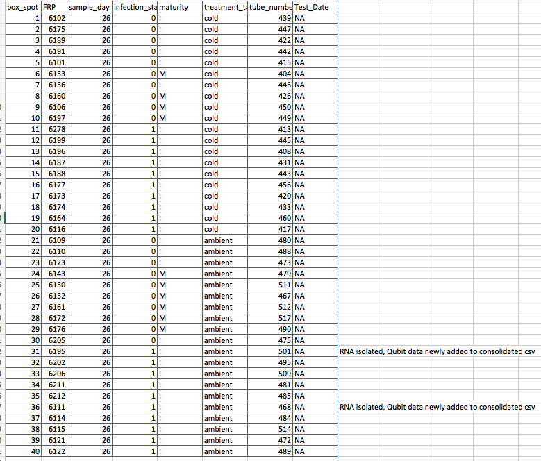

I am picking some samples for Sam to use an RNeasy Mini Plus Kit on. They are from Day 26 (samples were taken in triplicate), and 10 were picked from each of the following groups: uninfected, cold; infected, cold; uninfected, ambient; infected, ambient. I also made a spreadsheet that contains the hemolymph sampling data of all the crabs in the whole experiment (including those that died) left_join-ed with Qubit results data. However, after going through my Qubit csv folder, I found a couple of .csv's that didn't make it into the consolidated qubit csv. So I am currently trying to join the hemolymph data csv with the UPDATED Qubit results data based on tube_number, but am getting an error.

# Samples for Sam 
Here are the samples I picked out for Sam:    

*Note: tubes 501 and 468 have had 1/3 tubes processed with RNAzol. The Qubit results have just been added (along with several other sample tubes' results) to the UPDATED [20180801-Qubit-consolidated.csv](https://github.com/RobertsLab/project-crab/blob/master/data/20180801-Qubit-consolidated.csv)

### **The tubes are in a [box in the -80](https://docs.google.com/spreadsheets/d/1Qsvz3QTURlPF_hX05BQxjom3484WuMfqQ1ILl9LEljU/edit#gid=2006985773): Rack 2, Column 3, Row 4** Labeled: "Samples for Sam; Crab hemolymph; 08/01/18"

The box is organized such that each tube corresponds to the above picture by the box_spot column. For example, sample tube number 512 will be in position 27. The box is labeled 1 --> 9 , etc., so it should be easy see where all 40 samples are. I need to find replacements for 501 and 468 (because there are only 2 samples instead of 3, due to my failing to update the Qubit results data and not realizing those samples were already processed).

# Data organization: Hemolymph sampling and Qubit results master data file
I made a file today in R using "left_join" as a part of the dplyr package. I originally combined these two files:    
- [20180514-all-Qubit-RNA-isolation.csv](https://github.com/RobertsLab/project-crab/edit/master/data/20180514-all-Qubit-RNA-isolation.csv)
- [20180522-all-crabs-hemo.csv](https://github.com/RobertsLab/project-crab/edit/master/data/20180522-all-crabs-hemo.csv)

I used left_join by "Uniq_ID" and it resulted in this file:   
[20180801-hemo-Qubresults-missing.csv](https://raw.githubusercontent.com/RobertsLab/project-crab/master/data/20180801-hemo-Qubresults-missing.csv)   
Each row is a sample, so each individual crab has multiple rows associated with it's unique FRP number. 

However, after going through my Qubit results folder, I found a few Qubit results csv's that had tube numbers with results that weren't in the above file, meaning I failed to update the [20180514-all-Qubit-RNA-isolation.csv](https://github.com/RobertsLab/project-crab/edit/master/data/20180514-all-Qubit-RNA-isolation.csv) with the new Qubit results that I did after first creating that csv. 

So, I updated the qubit consolidated csv: [20180801-Qubit-consolidated.csv](https://raw.githubusercontent.com/RobertsLab/project-crab/master/data/20180801-Qubit-consolidated.csv). 

I then tried to use R and do the left_join with the [20180801-Qubit-consolidated.csv](https://raw.githubusercontent.com/RobertsLab/project-crab/master/data/20180801-Qubit-consolidated.csv) and the [20180522-all-crabs-hemo.csv](https://raw.githubusercontent.com/RobertsLab/project-crab/master/data/20180522-all-crabs-hemo.csv) based on "tube_number". Both files have columns called "tube_number", and to be sure they were typed the exact same way, I copy and pasted the name of the column from one spreadsheet to the other. 

However, my script came up with an error (GitHub Issue [#334](https://github.com/RobertsLab/resources/issues/334))    

So close to having something useful... and yet so far... 
