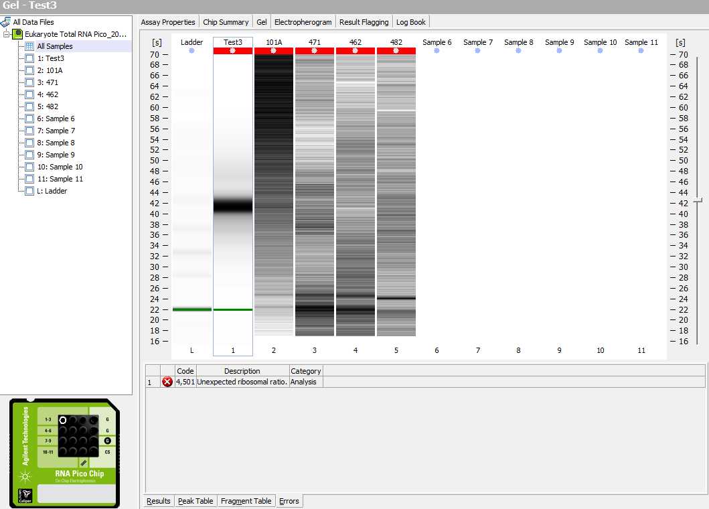

Today I discussed with Sam about how to use R for making a better master file. We identified some short term and long term goals for me to work on (and get help with via GitHub Issues). I also ran the Bioanalyzer on Test3 (from when lyophilizer was used and using Tri-reagent ), and four samples that I extracted last Friday using (wihtout lyophilizer, with Tri-reagent). The Bioanalyzer didn't run great because the ladder and the markers didn't show up... will have to re-run. 

# R code goals
Long-term:    
- Create a code for making a hemolymph data sheet.

Currently, my hemo master data ([20180522-all-crabs-hemo.csv](https://github.com/RobertsLab/project-crab/blob/master/data/20180522-all-crabs-hemo.csv)) is copy and pasted from an [excel file that Pam sent me](https://github.com/RobertsLab/project-crab/blob/master/data/20180125-NPRB-crab-sample-data.xlsx). It's copied from the tab labeled "all crabs". The excel sheet has empty cells, so in order to make the .csv, I manually filled the cells. 

Short-term:    
- Create code for reading in new Qubit files, creating a vector of the tube_numbers
- figure out how to make the vector to join the Qubit data file (make it a column called "tube_number")
- add the "extraction_method" to the new Qubit file
- add yields in ng
- join the new Qubit file to the [hemosample_qubit_table.csv](https://github.com/RobertsLab/project-crab/blob/master/analyses/hemosample_qubit_table.csv) based on "tube_number"

Having a workflow for this will make my life SO MUCH easier, as I have a lot more RNA extractions to do, and I have to keep track of which samples have been extracted, what the yields were, and extraction method.

# Bioanalyzer results
[Bioanalyzer file](http://owl.fish.washington.edu/scaphapoda/grace/Crab-project/Eukaryote%20Total%20RNA%20Pico_2018-10-08_17-15-52.xad)

I ran five samples in the Bioanalyzer.       
Test 3, one of the lyophilized samples from what [Sam extracted](http://onsnetwork.org/kubu4/2018/09/17/3558/) (the other two didn't have detectable RNA in the Qubit, so Sam only gave me the sample with detectable RNA) using Tri-reagent protocol.        
The other four samples are from what I extracted (not lyophilized) using Tri-reagent protocol on [Friday](https://github.com/grace-ac/grace-ac.github.io/blob/master/_posts/2018-10-05-trireagent-extraction-no-lyophilizer.md).

### Electropherogram:     
    

### Gel:     

**Thoughts on the results:**     
Clearly, the samples that I extracted on Friday were no good, even though they had detectable RNA.     
The ladder didn't show up, so that's not good... I'll have to re-run.    
[GitHub Issue #393](https://github.com/RobertsLab/resources/issues/393)
