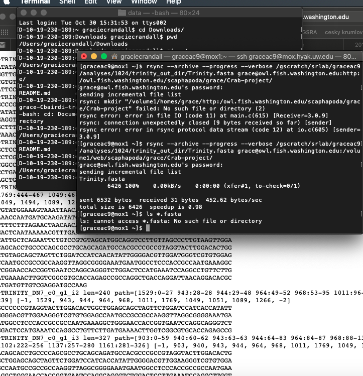

Today I re-ran Trinity because the original files I used that I downloaded to my computer from nightingales were too small and not .fastq.gz. Sam showed me how to do ```rsync``` from nightingales to mox. I also am working on doing a BLAST with the finished Trinity.fasta that is too small so that once my real assembled transcriptome is ready, I'll have a pipeline set up.

### Trinity
GitHub Issue [#452](https://github.com/RobertsLab/resources/issues/452)

When I downloaded the files from [/nightingales/C_bairdi/](http://owl.fish.washington.edu/nightingales/C_bairdi/), my computer wouldn't download the whole file and it would show up like this in my downloads:   


It is unknown exactly how this happened, but probably something in my settings.

I learned that I should just stick with using ```rsync``` to move files from Owl to Mox, and vice versa. 


I updated the file names in my [20181030_Cbairdi_trinity_01.sh](https://github.com/fish546-2018/grace-Cbairdi-transcriptome/blob/master/scripts/20181030_Cbairdi_trinity_01.sh) and re-sent the job on Mox.  

[FastQC results](http://gannet.fish.washington.edu/Atumefaciens/20181015_Cbairdi_fastqc/multiqc_report.html)

### BLAST practice with Trinity.fasta
Here is the output from the weekend's Trinity assembly, that was way too fast because it used the 64KB .fastq files:    
```
[graceac9@mox1 ~]$ cd /gscratch/srlab/graceac9/analyses/1024/trinity_out_dir/
[graceac9@mox1 trinity_out_dir]$ ls
304428_S1_L001_R1_001.fastq.P.qtrim.gz	  inchworm.kmer_count
304428_S1_L001_R1_001.fastq.PwU.qtrim.fq  insilico_read_normalization
304428_S1_L001_R1_001.fastq.U.qtrim.gz	  jellyfish.kmers.fa
304428_S1_L001_R2_001.fastq.P.qtrim.gz	  jellyfish.kmers.fa.histo
304428_S1_L001_R2_001.fastq.PwU.qtrim.fq  left.fa.ok
304428_S1_L001_R2_001.fastq.U.qtrim.gz	  partitioned_reads.files.list
304428_S1_L002_R1_001.fastq.P.qtrim.gz	  partitioned_reads.files.list.ok
304428_S1_L002_R1_001.fastq.PwU.qtrim.fq  pipeliner.32691.cmds
304428_S1_L002_R1_001.fastq.U.qtrim.gz	  read_partitions
304428_S1_L002_R2_001.fastq.P.qtrim.gz	  recursive_trinity.cmds
304428_S1_L002_R2_001.fastq.PwU.qtrim.fq  recursive_trinity.cmds.completed
304428_S1_L002_R2_001.fastq.U.qtrim.gz	  recursive_trinity.cmds.ok
both.fa					  right.fa.ok
both.fa.ok				  scaffolding_entries.sam
both.fa.read_count			  trimmomatic.ok
chrysalis				  Trinity.fasta
inchworm.K25.L25.DS.fa			  Trinity.timing
inchworm.K25.L25.DS.fa.finished
```

I  used ```rsync``` to transfer the ```Trinity.fasta``` from Mox to my [owl folder](http://owl.fish.washington.edu/scaphapoda/grace/Crab-project/). 



Then, I started running this BLAST notebook: [20181025-blast-Cbairdi_swiss-prot.ipynb](https://github.com/fish546-2018/grace-Cbairdi-transcriptome/blob/master/notebooks/20181025-blast-Cbairdi_swiss-prot.ipynb)    

I also have this .sh ([20181025_bash_BLAST_script.sh](https://github.com/fish546-2018/grace-Cbairdi-transcriptome/blob/master/scripts/20181025_bash_BLAST_script.sh)) for BLAST that I'm working on... will run both with the Trinity.fasta ([query.fa](http://owl.fish.washington.edu/scaphapoda/grace/Crab-project/fasta_files/query.fa)). 

