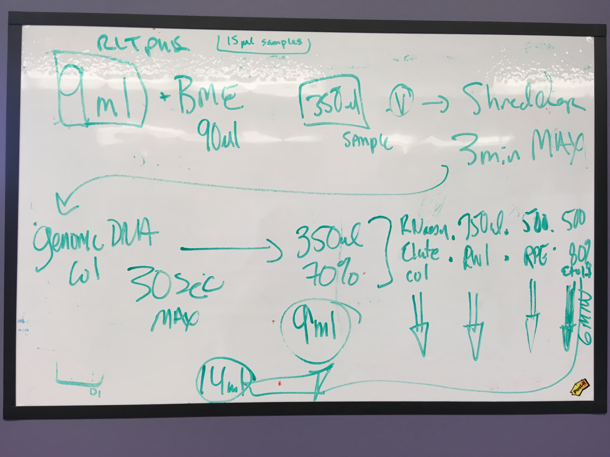
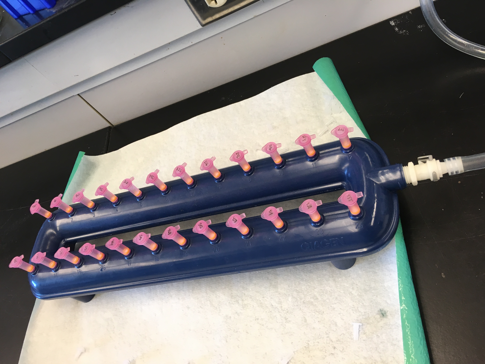
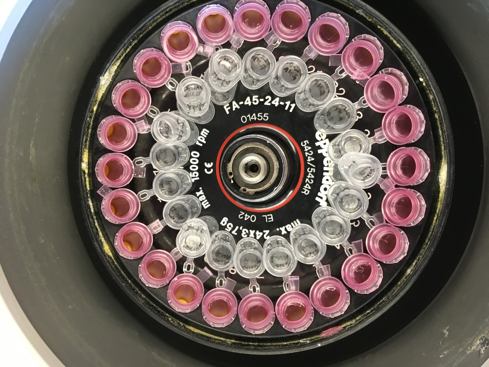

Today I tried out the new plan for extracting RNA. It took quite a long time and none of the 24 samples had detectable RNA. Details in post.

### Set up and preparation
The longest part of this whole thing was labeling tubes. 

I labeled:
- 24 RNase-free snap cap tubes (for the 15ul of slurry)      
- 24 QIA shredder columns (cap and side of tube)
- 24 gDNA columns 
- 24 RNeasy MinElute columns (had to do this right before use because they're supposed to be cold... but it took forever, so they probably weren't cold)
- 24 1.5ml snap cap tubes that contain the eluted RNA

I prepared solutions for 24 samples plus extra:    
- 70% ethanol (7mL ethanol and 3mL DEPC-H2O)
- 80% ethanol (10mL ethanol and 2.5mL DEPC-H2O)
- BufferRLT Plus and B-ME (9mL Buffer RLT and 90ul B-ME)

### Sampling out slurry
I selected 24 samples --> two from each of the 12 temp treatments/infection status groups     

| Tube number | sample day | infection status | temp trtmnt |
|-------------|------------|------------------|-------------|
| 135         | 9          | 0                | NA          |
| 31          | 9          | 0                | NA          |
| 90          | 9          | 1                | NA          |
| 142         | 9          | 1                | NA          |
| 317         | 12         | 0                | Amb         |
| 342         | 12         | 0                | Amb         |
| 352         | 12         | 1                | Amb         |
| 326         | 12         | 1                | Amb         |
| 242         | 12         | 0                | Cold        |
| 236         | 12         | 0                | Cold        |
| 234         | 12         | 1                | Cold        |
| 212         | 12         | 1                | Cold        |
| 285         | 12         | 0                | Warm        |
| 266         | 12         | 0                | Warm        |
| 271         | 12         | 1                | Warm        |
| 291         | 12         | 1                | Warm        |
| 499         | 26         | 0                | Amb         |
| 506         | 26         | 0                | Amb         |
| 468         | 26         | 1                | Amb         |
| 503         | 26         | 1                | Amb         |
| 458         | 26         | 0                | Cold        |
| 419         | 26         | 0                | Cold        |
| 438         | 26         | 1                | Cold        |
| 455         | 26         | 1                | Cold        |
|             |            |                  |             |

This part also took a really long time. For one, finding the tubes in the -80 took some time because I did not place them in there in number order.       

Additionally, it took a long time to let them thaw, vortex for a few seconds, and then sample out 15ul of the slurry. 

Thawed hemolymph slurry:    

### Starting protocol finally (1.5hrs for 24 samples)
1. Added 350ul of Buffer RLT + B-ME (did under hood in 209 because it smells awful)
2. Vortexed all for a few seconds
3. Transfered contents to QIA shredder columns (under hood as well because stinky)
4. Centrifuge 2min full speed (takes a while putting in and taking out 24 tubes)
5. Transfer flow-through to gDNA eliminator column with 2ml colletion tubes. Centrifuge 30s at full speed. Discard column. Save flow-through. (While this was happening, I was furiously unwrapping and labeling RNeasy MinElute columns... took a long time... samples sat in centrifuge for a few mins...)
6. Add 350ul 70% ethanol (pipetted individually). Mix by pipetting.
7. Transfer sample to RNeasy MinElute column. Close lids. Vacuum.      

8. Add 750ul of Buffer RW1 (used repeat pipet- amazing!). Close lid. Vacuum.
9. Add 500ul of Buffer RPE (used repeat pipet). Close lid. Vacuum. 
10. Add 500ul 80% ethanol (used repeat pipet). I think I miscalculated my volumes in the preparation, because I ran out of it and had to run and make more. Close lid. Vacuum 5mins. (While vacuuming 5mins, I was labeling the 1.5ml snap cap tubes).
11. Put RNeasy column in new 1.5ml snap cap. Add 14ul RNase free water to center of membrane. Cut off pink lids. Centrifuge for 1min at full speed. 

### Qubit
Made working solution: 5.6mL Buffer for RNA HS + 28ul RNA HS dye        

Made standards: 10ul of each + 190ul working solution

Ran 1ul of each sample (added 199ul working solution)

Vortexed all.

**ALL TUBES READ "OUT OF RANGE, TOO LOW**

[-80](https://docs.google.com/spreadsheets/d/1Qsvz3QTURlPF_hX05BQxjom3484WuMfqQ1ILl9LEljU/edit#gid=2006985773)     
Put the hemolymph pellets that I thawed and used 15ul of in -80 (Rack 7, col 2, row 2)     
Put eluted "RNA" samples in -80 (Rack 7, col 3, row 1)
