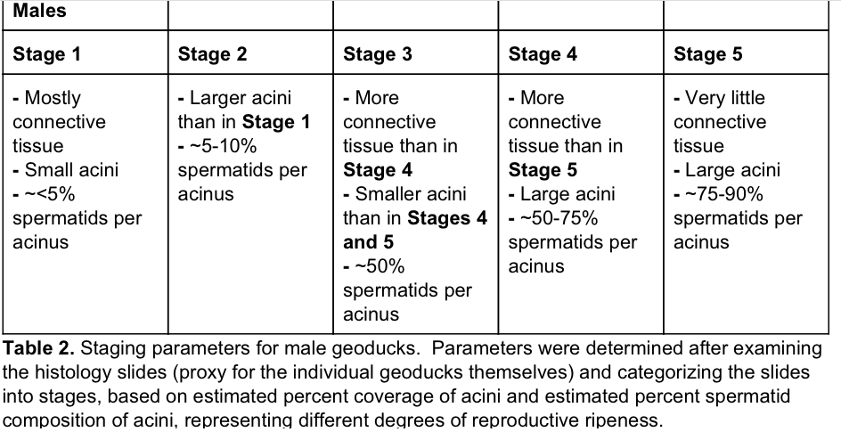
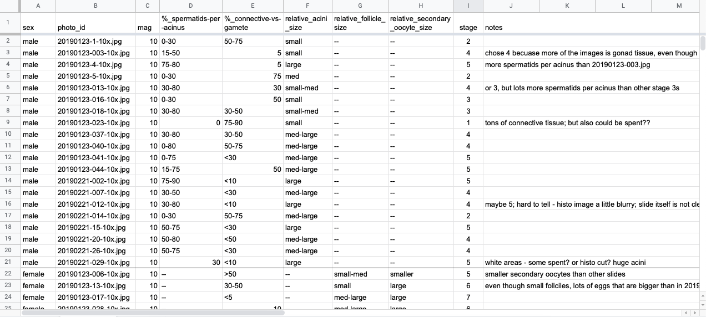

Today I wrapped up staging geoduck histology slides for reproductive maturation for a project that Shelly has been working on. GitHub issue: [#1008](https://github.com/RobertsLab/resources/issues/1008). The post below details the results and my process in figuring out what stage of reproductive maturation the geoduck were at time of sampling. 

# Resources used: 
- Figshare from my capstone: [Reproductive Maturation in Geoduck Clams (_Panopea generosa_)](https://figshare.com/articles/dataset/Reproductive_Maturation_in_Geoduck_clams_Panopea_generosa_/3205975)
- images for the slides (only looked at 10x versions of the images because the images I was given from Shelly are 10x) (can be found at the figshare link)
- The capstone paper, specifically tables 1 and 2 where I detailed the parameters for each stage for females and males, respectively (Can be found at the figshare link, also screenshots of tables below:)

Females (Table 1 from Capstone paper):       

Males (Table 2 from Capstone paper):       

Images of the slides from Shelly can be found:      
- Females: [here](https://github.com/shellytrigg/paper-GeoduckReproDev_pH/tree/master/data/histology/Female_Gonad/IMG/Originals)     
- Males: [here](https://github.com/SamGurr/Pgenerosa_histology/tree/master/Male_hist_photos_10x)       

# Results

### **Note**: I have not looked at what Kaitlyn stage assignments were (her notebook post and results are linked in the GitHub Issue [#1008](https://github.com/RobertsLab/resources/issues/1008)). 

Google drive folder with spreadsheet and images: [here](https://drive.google.com/drive/folders/1QtDzfOG-C4ZTVwKOORCl0F-b4c0NhE_H?usp=sharing)

Spreadsheet: [here](https://docs.google.com/spreadsheets/d/1FDRi4WFk12X38gN1xrbOui3Vntj2CSHz6f8CKsKxWfg/edit?usp=sharing)   

Screenshot of spreadsheet and description of columns:      

Column explanations:      
- **sex**: male or female as determined by Shelly and/or Sam Gurr

- **photo_id**: photo ID 

- **mag**: magnification; all were taken at 10x, as described in the photo ids

- **%_spermatids-per-acinus**: estimate of percentage of spermatids within the acini of the image, most listed as range of percent. Only applicable for male images

- **%_connective-vs-gamete**: estimate of percent of the connective tissue to gamete in the slide images. most presented as a range of percents. Higher the percent, the more connective tissue present relative to gamete cells. 

- **relative_acini_size**: relative to the other photos, the general size of the acini in the males. described as large, medium, and small, and ones that are a good mix between two sizes are listed as "small-med" or "med-large". Only applicable for male images.

- **relative_follicle_size**: relative to the other photos, the general size of the follicles in the females. described as large, medium, and small, and ones that are a good mix between two sizes are listed as "small-med" and "med-large". Only applicable to female images. 

- **relative_secondary_oocyte_size**: relative to the other photos, the general size of the oocytes in the females. described as large or smaller, with only two photos having obviously smaller oocytes than the others. Only applicable for female images. 

- **stage**: column with the assigned reproductive maturation stage. For males, the range is from 1-5, and for females the range is 1-7. It should be noted that there were no females that were below stage 5. 

- **notes**: column with some notes about what I saw as I assigned stages to the images 

## Males

Some difficulties discerning the different stages as several were very close and could go a couple ways, but after comparing the photos to each other and to the photos on the figshare from my capstone, I think the final stage assignments are pretty good. Again, due to the similarities between several slide images, there may be some wiggle room where some images could fall well enough under two different stages.  

Males were staged on the scale as shown in the image at the beginning of this post of the table for males. 5 stages total. 

| Male reproductive maturation stage | Number of male geoduck assigned to the stage |
|------------------------------------|----------------------------------------------|
| 1                                  | 1                                            |
| 2                                  | 3                                            |
| 3                                  | 2                                            |
| 4                                  | 8                                            |
| 5                                  | 6                                            |
| Total male geoduck:                | 20                                           |

## Females

Relative comparisons. Wasn't able to measure the microns across for the eggs because the scale bar was missing from several images, so I wasn't sure if they were zoomed in more or cropped... etc. Therefore, I decided to base the stages off of the relative coverage of connective tissue vs. gonad tissue - with more gonad tissue/follicle coverage = more ripe; and general follicle size, which larger follicles being more towards ripe. 

Additionally, by visually comparing the images provided by Shelly with the images in the figshare  from my capstone for the females, it seems pretty clear that none of the females from Shelly's images fall under stages 1-4 based on general oocyte size. 

| Female reproductive maturation stage | Number of female geoduck assigned to the stage |
|--------------------------------------|------------------------------------------------|
| 1                                    | 0                                              |
| 2                                    | 0                                              |
| 3                                    | 0                                              |
| 4                                    | 0                                              |
| 5                                    | 2                                              |
| 6                                    | 12                                             |
| 7                                    | 5                                              |
| Total female geoduck                 | 19                                             |

