In this post, I detail the steps that I took to create, edit, and publish DecaPod - the podcast used as a resource and outreach tool for the NPRB project (1705) that cromprised the majority of my MS thesis work. This may not be the most smooth or efficient way to create, edit, and publish, but it's the way that I did it after lots of googling! 

# Tools and software used:
### Software
- GarageBand (Version 10.3.5)
- Wordpress
- Music (fka iTunes; Version 1.0.6.10)
- Owl 

### Hardware
- laptop (MacBook Pro 2012, macOS Catalina Version 10.15.7)    
- External microphone (Samson Meteor Mic, USB Studio Microphone for Computer Recording)

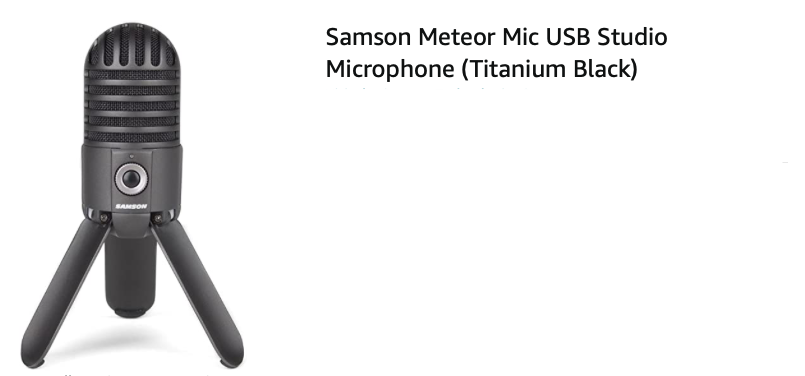

### Resources for royalty-free music and sounds (to create intro and outro)
The first 5 websites were recommended from a workshop offered at UW IT I went to for Audacity, which is a software often used for podcasts. I had already been working in and felt comfortable with GarageBand, so I didn't try Audacity, but I got other helpful tips from that workshop (notebook post from that workshop: [March 2, 2018](https://grace-ac.github.io/Crab-samples-and-Podcast-Audicty-workshop/)).    
- [freesound.org](https://freesound.org)     
- [incompetech.com/music](http://incompetech.com/music/)       
- [bensound.com](https://www.bensound.com)      
- [pacdv.com/sounds](http://www.pacdv.com/sounds/)     
- [soundbible.com/sounds](http://www.pacdv.com/sounds/)      
- [stock.adobe.com/audio](https://stock.adobe.com/audio)

# 1. Create an intro and outro
The intro and outro sound bites are used to help make your podcast feel more like a series, and can easily be tacked on to the beginning and end of your recordings. I made mine using GarageBand and by finding royalty-free sounds and songs to add some pizazz - links to some websites that have royalty-free songs and sounds in the section above. Or, you could even make your own intro/outro songs and sounds within GarageBand. 

#### 1a. I browsed through Adobe Stock to find a song that I liked to use for this podcast How-To demonstration. I found a song under the "Epic" mood collection, entitled "Wash". I had to create an account (free) in order to download the song.           
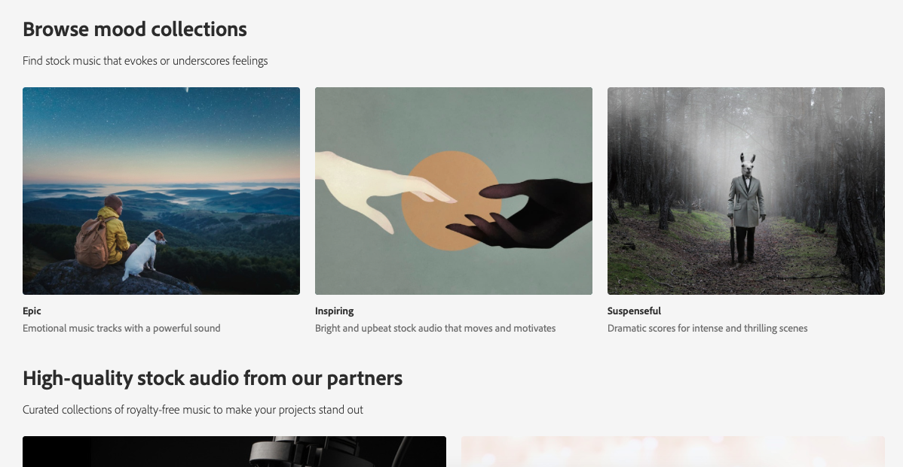      

#### 1b. Download and save it to my computer.        
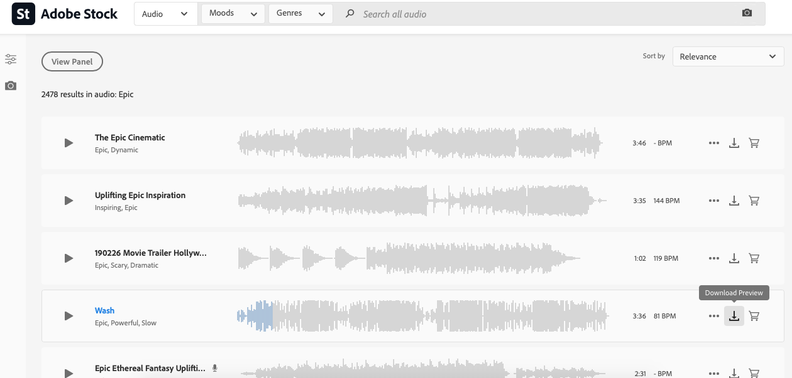

#### 1c. Open up garage band to record the intro. Create a new project for voice.      
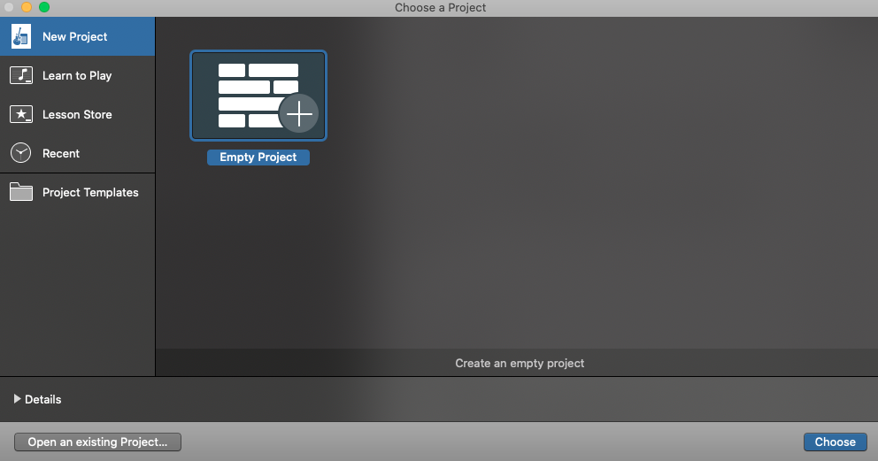         

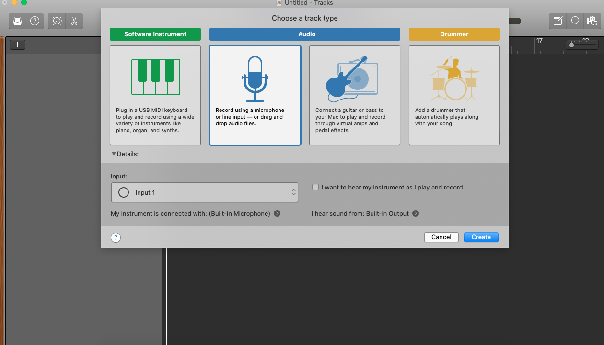      

#### 1d. Make sure GarageBand is detecting your external mic (if you're using one), in this case the Samson Meteor Mic.      
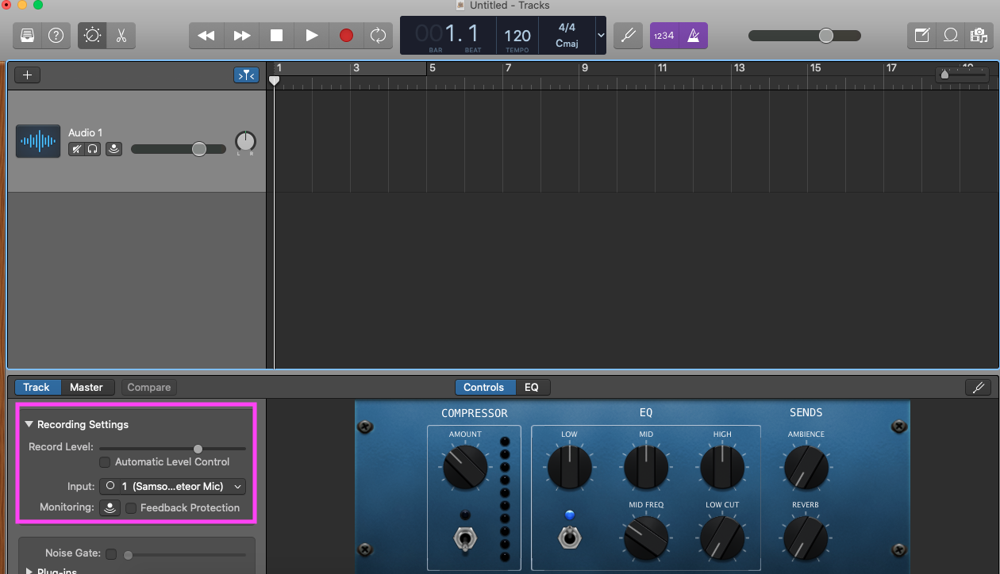     

#### 1e. Open your download folder (or wherever the downloaded royalty-free song lives) in Finder, and drag it into GarageBand to add it to your vocal project.     
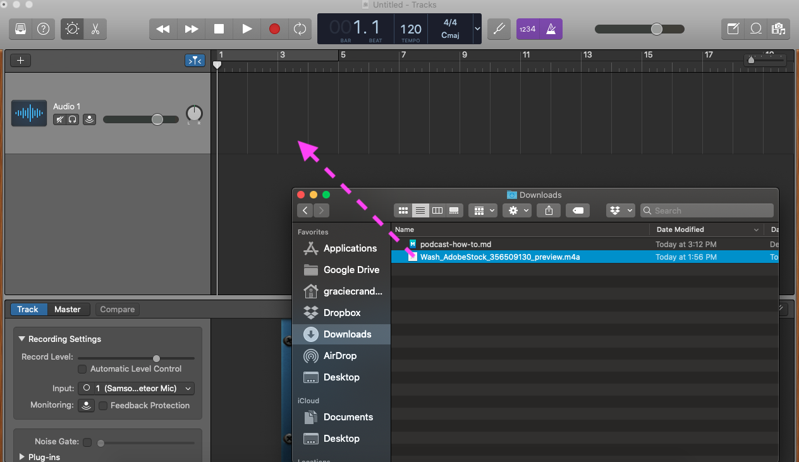

#### 1f. Now that you have the royalty-free song in place, you'll need to add another track so that you can record your voice. Press the '+' sign, highlighted below in purple/pink, and select the microphone symbol to add a new track for voice.   
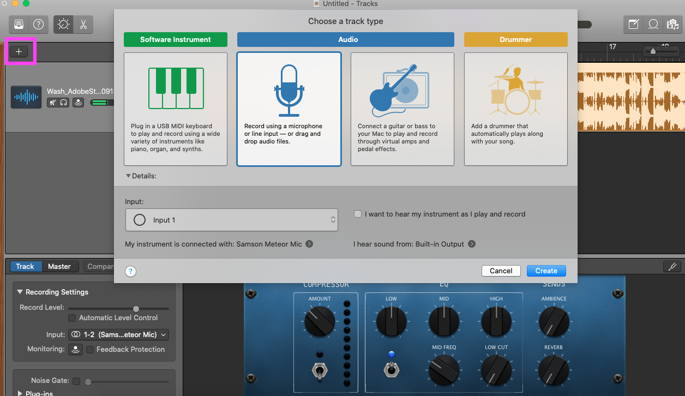

#### 1g. Record your voice for your intro. First, mute the track that contains the royalty-free song (1), then make sure the playhead (highlighted in purple/pink) is where you'd like to start recording (2), and finally, press the red record button (3) when you're ready to start recording.     
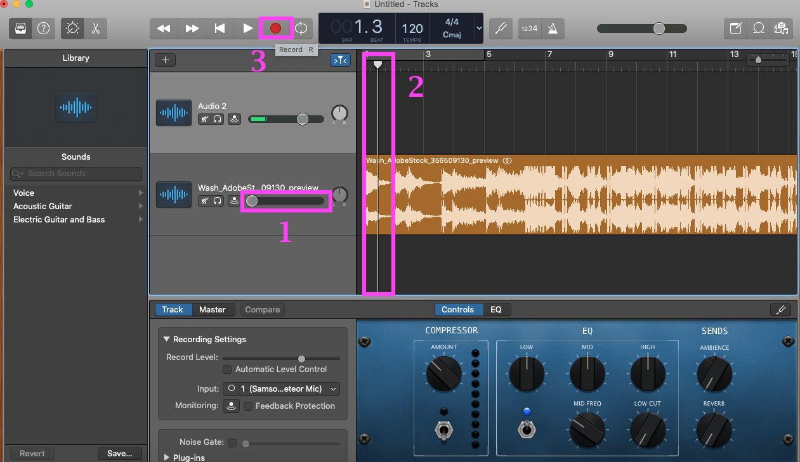

#### 1h. After you've finished saying your bit, it will look like the image below (newly recorded vocals highlighted in purple/pink box).    
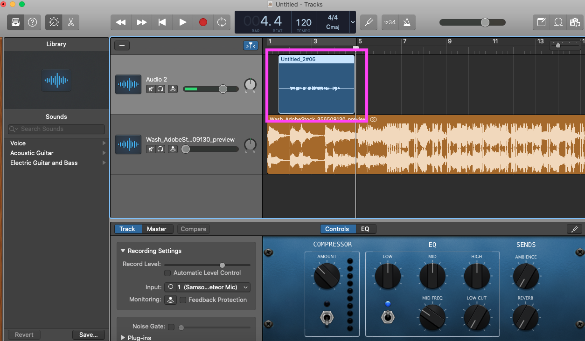

#### 1i. Now that you have your voice recording and the royalty-free music in the project, you can play around with the volume of each track to fade the music in and out to blend the two tracks together. To do this, go to the menu bar and select Mix > Show Automation (top image). Click on the two tracks, and a yellow line will appear within each track (purple/pink arrows pointing in bottom image). 

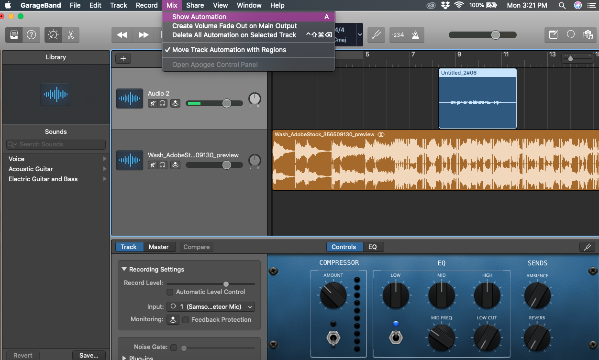      
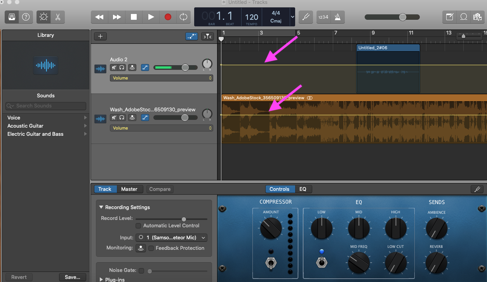

#### 1j. There is likely extra music in your project, and to keep your intro file short and sweet, you can cut the rest of the music that you don't wish to include. To do this, select the track that you want to shorten (1). Then, move the playhead to the part of the track that you'd wish to cut it (2). Finally, go to Edit > Split Regions at Playhead to cut the track at that point. Now, you can delete that extra section of music after the two regions have been separated (bottom image). 

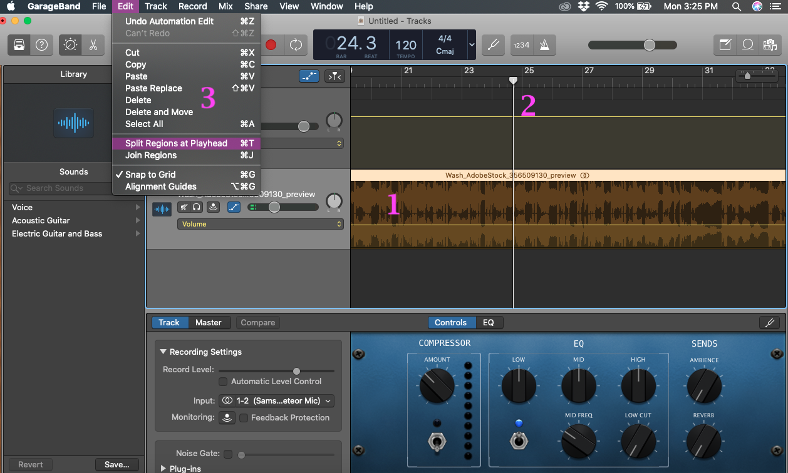

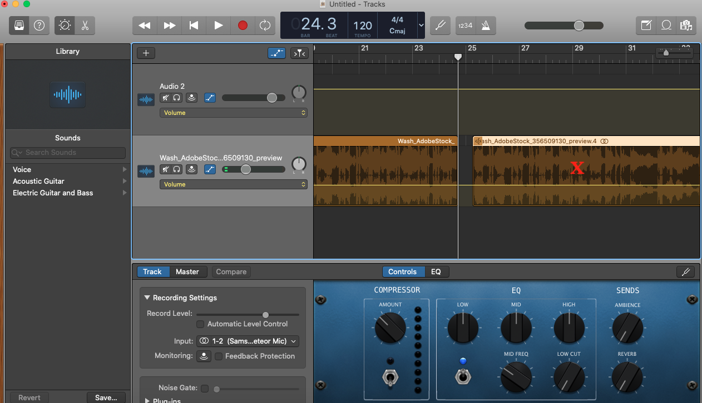

#### 1k. Save your file if you haven't already done so. My file gets saved to GarageBand. 
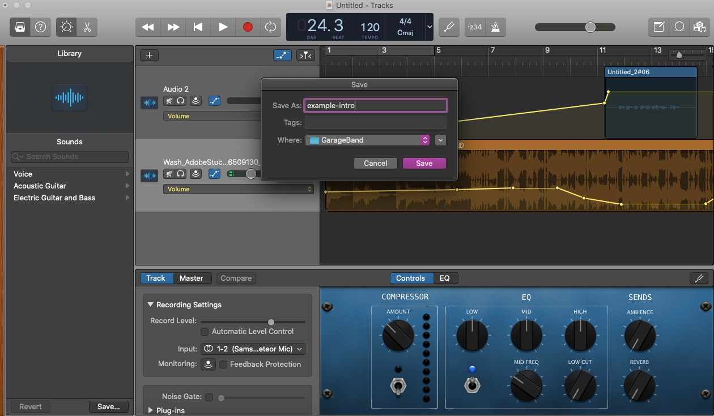

#### 1l. Now, you're going to Share your project to Music (fka iTunes). You can rename it at this point if you wish (bottom image).    
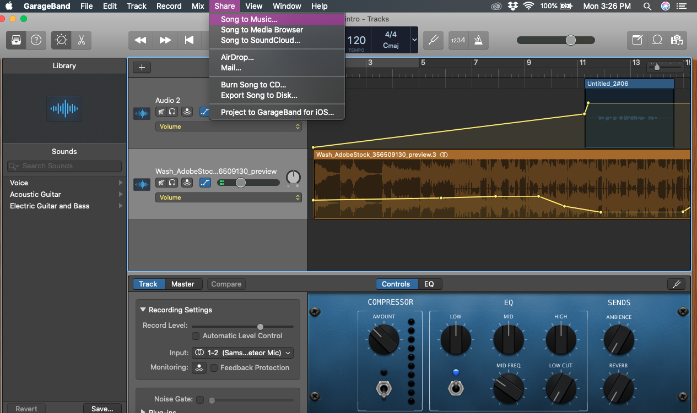    

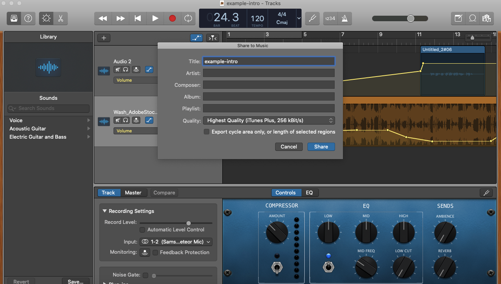

#### 1m. After it gets shared to Music, mine gets put in a playlist called GarageBand (automatically), and it can now be found there.    
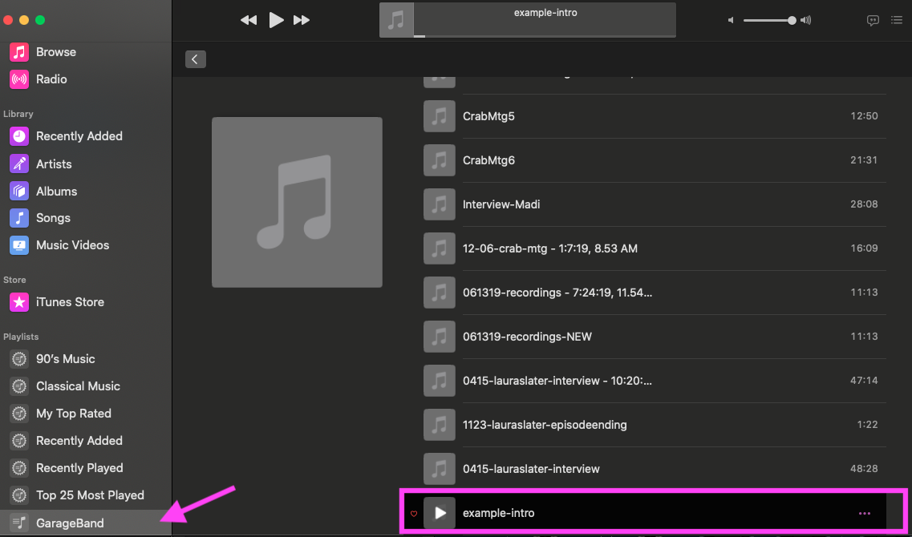    

### Create outro. Do the same thing as detailed in the above steps, but with some voice-over thanking the listeners for tuning in, maybe provide the name of a website or some other resource where they can learn more, or ask them to subscribe to the podcast to stay updated on the project/topic. 

# 2. Record your first episode
Recording an episode is done in garage band. You can either use your laptop/computer's built-in microphone, or an external microphone for a little better sound quality. I used Samson Meteor Mic, USB Studio Microphone for Computer Recording.

### 2a. Open garage band and start a new project for Voice. Save the episode with a helpful name, I often would name it date-description. Record the audio and don't worry about making it perfect, because the next step is editing! 

### 2b. After you have all your audio recorded, you can go in and edit out chunks that you don't want to include, rearrange, and play with the equalizers to fix for any background noises, loud sounds, or soften certain letters like "p", which can sometimes pop. The gif below goes through how I edit out chunks of audio, rearrange audio chunks, and play with the equalizers. 

