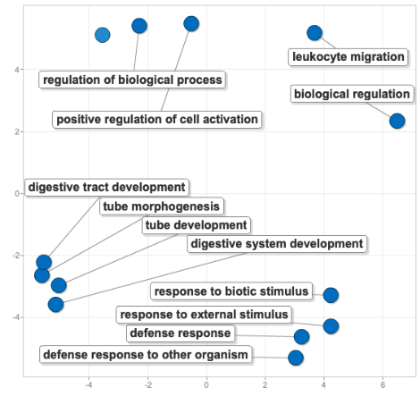
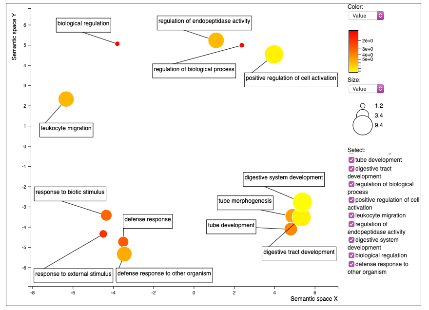
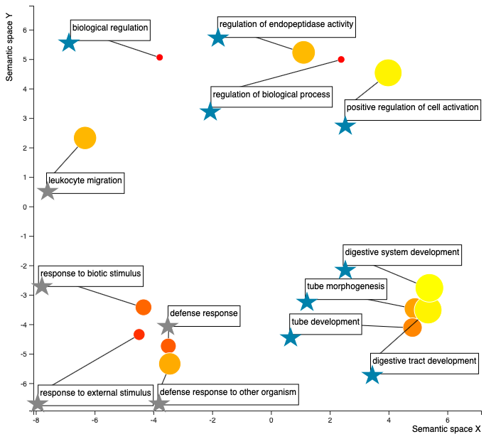

I've made a little bit of progress with the oyster paper this week. I've read through it and have started to very casually browse through the literature to add more to my discussion. I also have been looking into creating better figures for Figs. 2 and 3, and have tried a few things. ALSO: crab paper "in review" on _Scientific Reports_ - link provided at end of post. 

### Oyster paper: [here](https://docs.google.com/document/d/1OaYNzlOJr5QibCYt8--GMNGvXlzHPR9_daCkNUVkj-U/edit) 

### Oyster paper repo: [here](https://github.com/grace-ac/paper-pacific.oyster-larvae)

## Updates
I've read through the paper, and have started looking through the papers that were suggested by Matt, but haven't done any writing yet. 

I have tried to make **Fig. 3** look better by trying to play around with the .R script that was downloaded from REVIGO. I originally downloaded it in May 2020: [scripts/REVIGO_enrich-diff.abund.proteins_fix-colors.R](https://raw.githubusercontent.com/grace-ac/paper-pacific.oyster-larvae/master/scripts/REVIGO_enrich-diff.abund.proteins_fix-colors.R). I decided to run the 18 enriched terms (list here: [analyses/enriched_diff.ab.proteins-for-Revigo.csv](https://github.com/grace-ac/paper-pacific.oyster-larvae/blob/master/analyses/enriched_diff.ab.proteins-for-Revigo.csv)) through REVIGO again to see if it still came out the same... and it didn't! REVIGO has re-done their online service, and the figure came out quite differently. 

Here's the original figure of the 18 enriched GO terms from the differentially abundant  protein comparison between the two temp regimes:        
 

For this figure, I decided to make all the dots the same size and color in order to focus on the terms themselves and the proximity of the dots - the closer the dots, the more semantically similar the words, and thus processes. 

The new figure created with the revamped REVIGO is this:       
 

REVIGO no longer allows for making the colors and size of dots the same. You can only change the color based on the comparative value that you put in to create the figure (in my case, the fold enrichment from DAVID), or the log of that value. I decided to go with the actual value rather than the log. 

Here's the .R script to work with this figure in R --> the direct download from REVIGO: [here](https://raw.githubusercontent.com/grace-ac/paper-pacific.oyster-larvae/master/scripts/REVIGO-diffab-proteins_1.R), and the one that I'm playing around with to see if I can make it better: [here](https://raw.githubusercontent.com/grace-ac/paper-pacific.oyster-larvae/master/scripts/REVIGO-diffab-proteins_2.R). 

The .R scipt is kind of difficult to work with... so I was thinking that I could just do some table `join`-ing to figure out which enriched terms are associated with which temperature regime and add some stars to the terms to specify, something like this (except I'd make sure the temperature assignments of the terms is correct! this is just an example):     

    

So blue stars are enriched processes that are more abundant in the higher temp (29 C), and the grey stars are the enriched processes more abundant in the low temp (23 C). The colors of the dots - closer to red, the smaller the fold enrichment value, or in other words, I think the less enriched the process is relative the _C. gigas_ proteome... I think...? The size of the dots - the larger the dot, the larger the fold enrichment value, or in other words, the more the process is enriched relative to the _C. gigas_ proteome. So I think that means, the large yellow dots are processes that are the most enriched processes in the oysters compared to the _C. gigas_ proteome. Need to make sure that interpretaion is correct, but I think it is...

### Goals for Pubathon for next week: 
- Start some writing to contextualize the Discussion some more --> read some literature!! 
- Work more on the figures - maybe try making a new Fig. 2, model after **Fig. 3** in Heckwolf _et al._ 2020

# Crab update:
Paper is now "in Review" online!!! Link here: https://www.researchsquare.com/article/rs-276408/v1 

