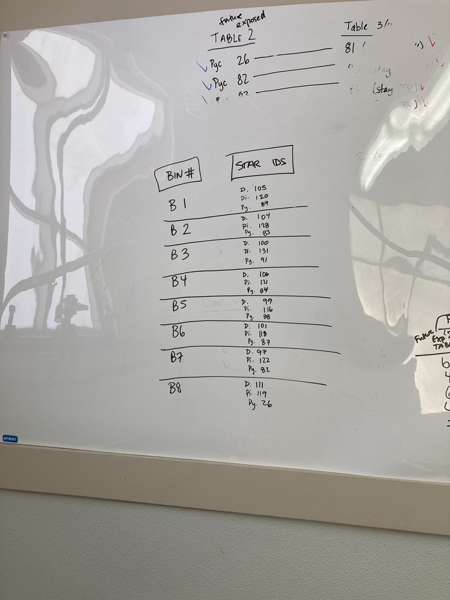
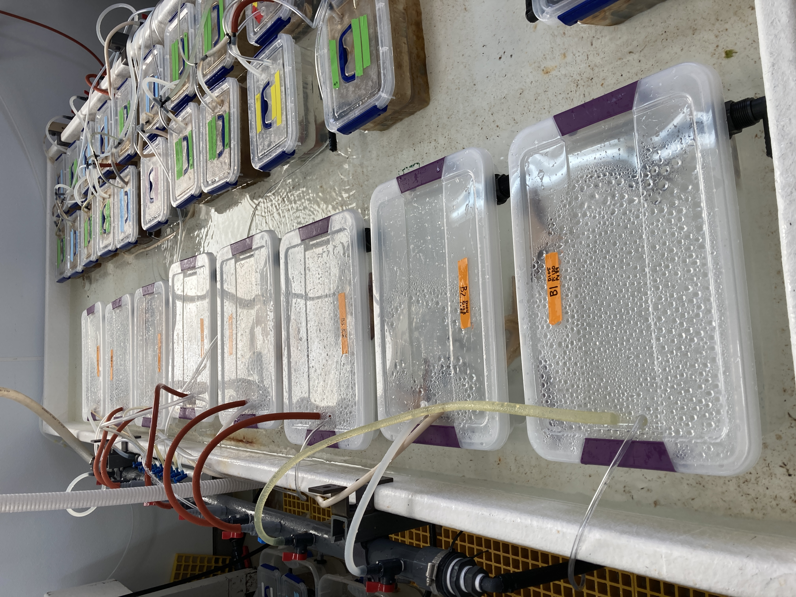
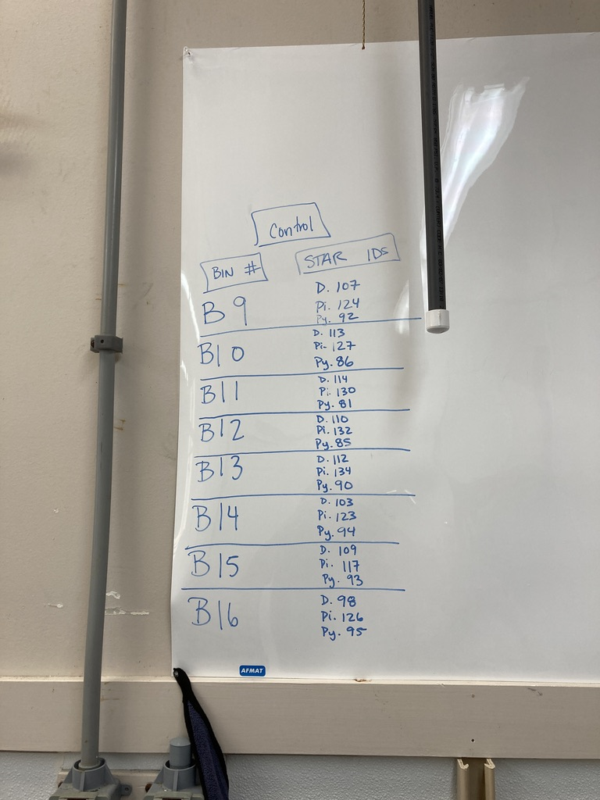
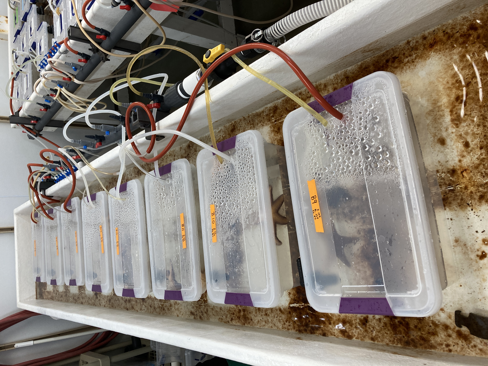
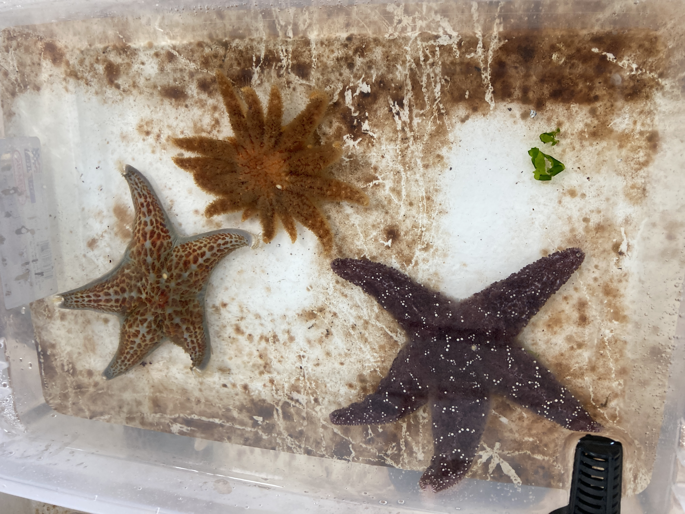
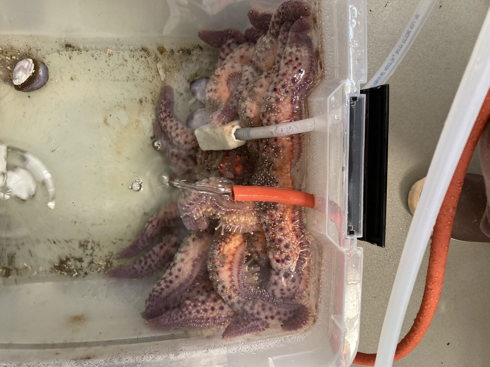

Today we co-housed the three species that will be part of our multi-species experiment.

Background info:
The goal of this experiment is to see if disease can transmit from a wasting _Pycnopodia helianthoides_ to _Dermasterias imbricata_ and/or _Pisaster ochraceus_. We have n=16 of each species that will part of the experiment. We will be looking at the gene expression from their coelomocytes over a time series in order to compare immune response. By doing a time series, we'll be able to capture any response that might be happening, regardless of whether or not there's a phenotype, which is good because one, we don't know if there is going to be transmission, and two, if there is, we don't know if there'd be any outward signs in, for example, a _Dermasterias_ as they are thought to be more resistant than the other two species.

The way that these stars will all get the same exposure, is there will be a wasting _Pycnopodia_ placed in each cohouse bin. The wasting _Pycnopodia_ will be a Friday Harbor lab-raised star that we'll inject with raw sick CF from a wasting adult that was from the field. This is great because the Friday Harbor stars are very small and it would be hard to get coelomocytes from them as they are much smaller than the wild-caught stars (~5cm in diameter vs 15-17cm in diameter).

We decided to co-house the three stars (not the Friday Harbor stars, we'll put them in once we inject them with raw sick CF or for controls, heat-killed CF).

Here's the stars that will be exposed to a wasting Friday Harbor star:

Here they are in their bins!

Here are the stars that will be the controls (a Friday Harbor star injected with heat-killed CF):

And here they are in their bins:

And here's what they look like together (an example: Bin 15)

Some notes:
- The IDs that are on the board - each star has a unique number, and then the numbers are preceded by initials for the species (D for dermasterias; Pi for pisaster; Py for pycnopodia)
- The stars are grouped together where the smallest stars of each species are in Bin 1 (exposed) and Bin 9 (control), and upward to Bin 8 and Bin 16
- The Friday Harbor stars that will be the source of either exposure to disease (wasting after injection with raw sick CF) or control (after injection with heat-killed CF) will be size-grouped where the smallest ones will be in Bin 1 and Bin 9, and upward within each treatment group
- Normally we feed stars every Monday, Wednesday, and Friday, (1 mussel each) but we didn't feed these stars today (Wednesday) because we didn't have enough food. Therefore, they missed out on feeding for today, but we collected more mussels and they'll be fed on Friday. Because we don't know if they'll share, we'll place enough food in each bin so each star has 2 potential mussels it can eat. The mussels are collected under a shellfish license I got from WDFW, we freeze them for at least 36 hrs (we discovered mussels can withstand freezing for 24 hours ... and they are too difficult for our _Dermasterias_ to eat), then fed to the stars.

Afternoon note:
The adult (E) is twisty!! See image below. So, we will start the multi-species experiment tomorrow.

Here's a rough agenda of tomorrow:
- 9am-lunch - sample coelomocytes from n=16 _Dermasterias imbricata_, n=16 _Pisaster ochraceus_, and n=16 _Pycnopodia helianthoides_ (wild ones, not the Friday Harbor lab-reared ones)
- after lunch onward: collect coelomic fluid from E (the adult pycno exposed to wasting and actively twisting). Heat-kill some (at least 200ul x 8 = 1600ul, so aim to do about 2ml) for the n=8 Friday Harbor control stars (200ul injection per star), and preserve some for coelomocytes, coelomic fluid for smears and then at least 2ml for injections into the n=8 Friday Harbor exposed stars (200ul injection per star). Inject the Friday Harbor stars, and then place them in their bins where they'll be cohousing with the other species.

Then celebrate!!

Daily tasks will be:
Take down data observations for each star every morning and evening. Sample coelomocytes every 3 days for all stars, and also for all stars in each bin once the Friday Harbor exposed star does it's first arm drop. Feed all every Monday, Wednesday, and Friday. Take pictures of each star every evening check, and a bin photo so that you can see where they are relative to each other. Take a photo of any star in the morning check that looks odd/sick/etc.

More to come!
