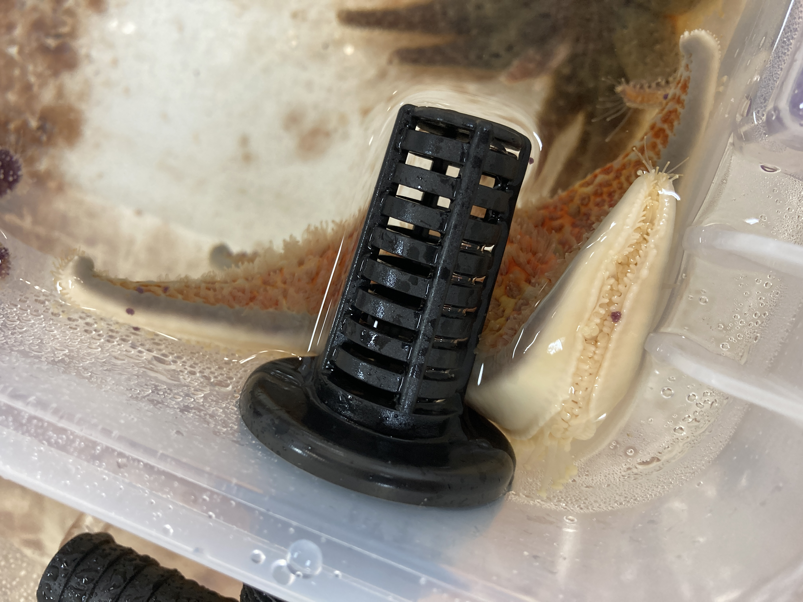

Likely to start soon!!! Waiting for the adult that has been exposed to another wasting adult to show signs of twisting, then the coelomic fluid from that star will be used to inject into the Friday Harbor stars (raw for exposed, and heat-killed for control), and then the Friday Harbor stars will be placed in their bins with the other stars.

Here's the adult pycno as of this morning:      

We're waiting for it to be a very convincing twist of arms. This star has been cohoused with another adult pycno that was actively wasting. The disease source for this line of wasting was from an adult pycno from the field. We've had healthy-appearing adults in the lab, with all in their own bins, that we then cohouse with wasting adults to transmit disease. We have figured out that we can transmit disease from the coelomic fluid from a very twisty and exposed adult pycno.

Once the star has a convincing twist, we'll:
- Collect coelomocytes from all the stars in the experiment (except not the Friday Harbor stars): n=16 _Pisaster ochraceus_, n=16 _Dermasterias imbricata_, and n=16 wild _Pycnopodia helianthoides_. These coelomocytes will be extracted for RNA and will be our pre-treatment gene expression comparison for all these animals
- Collect coelomic fluid (CF) from the sick adult. Aim for (200ul x 48) + some extra mLs for preservation (preserve some CF raw flash frozen, do a couple of coelomic fluid smears, and also collect some coelomocytes from the adult?)
- Split the CF in half and heat-kill half (preserve some flash frozen)
- Inject 200ul of CF (raw for exposed 8 Friday Harbor stars; heat-killed for the 8 control Friday Harbor Stars). Immediately after injection, place the star in the bin that it will be in for the Experiment

I pre-labeled some tubes today so that we'll be ready to do the pre-treatment sampling the morning that we see convincing twisting from our adult disease source pycno. We'll be taking coelomic fluid, which we'll then spin down to pellet the cells (1200rpm for 5mins), remove and save the supernatant in a microfuge tube and placed in -80C, and then the pelleted cells will get 300ul of DNA/RNA Shield and placed in the -80C. This preservation method with the shield was optimized with the assistance of technicians from Zymo Research, and it's great because it's also the first step in the DNA/RNA extraction method for the Zymo Research Quick-DNA/RNA Microprep Plus Kit (D7005).

We'll sample coelomocytes from all stars every three days. We'll also do some coelomic fluid smears across the different species. 

I'll also be printing out observation sheets and a sample log.

Can't quite say when the start date will be... but once we have a convincing twist from the adult pycno, we'll get it started!

Side note:       
I checked on the stars with Andrew McCracken (current intern, and PhD student at ____). We noticed that the dermasterias looked interesting... they had purple/brown spots on them. I took pictures and showed them to Alyssa, and she immediately knew that it was pedicillaria from _Pisaster ochraceus_ ... so they are attacking the derms... very interesting! Here's some pics of what that looked like:     
     
     
