Today, we started the multi-species experiment! Very exciting! Details in post below.

### Pre-Treatment Sampling!
We took observation data down for each star prior to sampling. Observation data follows what we've done for these experiments the previous 2 summers and this summer. Each star has it's own data sheet. We record the date, time, whether or not it's getting fed, location (location in the bin: Far side (FS), near side (NS), Right (R), Left (L), Bottom (B), Surface (S), where the far side R is the drain end), whether or not it's moved since the previous data point (yes/no), disease score (0-4, based on disease signs at time of observation), number of arms twisted, number of arms crossed, number of lesions, stretching (yes/no: we've noticed that some will be stretching their arms out prior to arm loss), uneven turgor (yes/no: we've also noticed that their turgor pressure will be off prior to waste), bleaching (yes/no: this is specific to Derms as we don't know exactly what a wasting one will look like, but there has been some sightings of bleaching tissue... possibly wasting), number of arms dropped, and whether or not we're sampling the star.

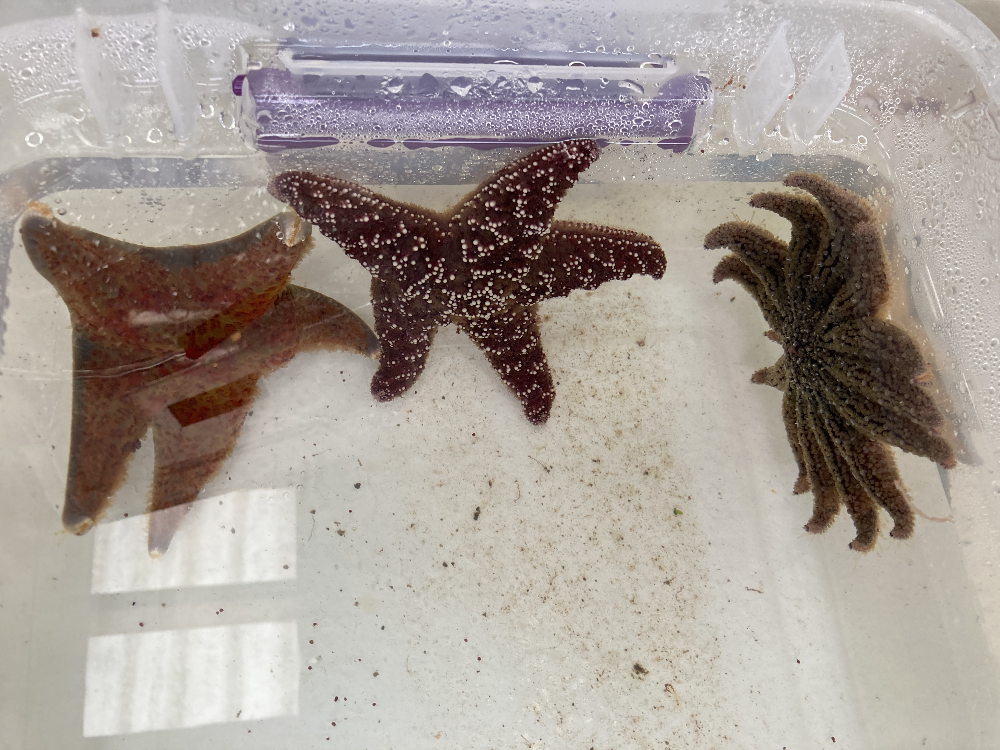

We sampled all of the stars for coelomic fluid (CF) and preserved the coelomocytes (spun CF 12,000rpm for 5min) with 300ul DNA/RNA Shield and put in the -80C, and saved the supernatant in a microfuge tube and placed in -80C.

We sampled them all between 10am and 11:30am. Alyssa and I did the sampling, Melanie would come and get batches of the CF to process for preserving coelomocytes and supernatant, and Andrew helped keeping track of the tube numbers in the sample log and with holding the bins as they filled back up with water.

To sample, we dumped the bin's water out down the drain. Sampled the CF using needles and syringes (29G 1/2" insulin syringes (amazon link: [here](https://www.amazon.com/Brandzig-U-100-Insulin-Syringes-100-Pack/dp/B08MQCYH3N/ref=sr_1_2?crid=71B5NJXD4F4&keywords=BD+insulin+syringe+0.3ml+29G+12.7mm&qid=1659557547&sprefix=bd+insulin+syringe+0.3ml+29g+12.7m%2Caps%2C348&sr=8-2)) for the _Dermasterias imbricata_ and the _Pycnopodia helianthoides_, and 1 ml syringes (amazon link: [here](https://www.amazon.com/Syringe-Sterile-Luer-BH-SUPPLIES/dp/B07VF8CKGL/ref=pd_bxgy_img_sccl_2/140-1246690-3827836?pd_rd_w=AkjiW&content-id=amzn1.sym.a6bed837-ef89-4bc6-a842-3962a5387175&pf_rd_p=a6bed837-ef89-4bc6-a842-3962a5387175&pf_rd_r=ZJHJK38FAC4B7DBC435G&pd_rd_wg=PIUm0&pd_rd_r=4d79b775-da73-4702-bd45-759a99bd1112&pd_rd_i=B07VF8CKGL&psc=1)) with 26G 1-inch needles for the _Pisaster ochraceus_ and some of the larger _Dermasterias_).

For the Derms, we figured out that putting the needle into the beige-colored part of the armpits toward the central disc cavity yielded most frequently a lot of CF, but sometimes would put in at the top of the arms going in toward the central disc if the armpit didn't work. The below example wasn't typical, but this particular Derm was upside down.      
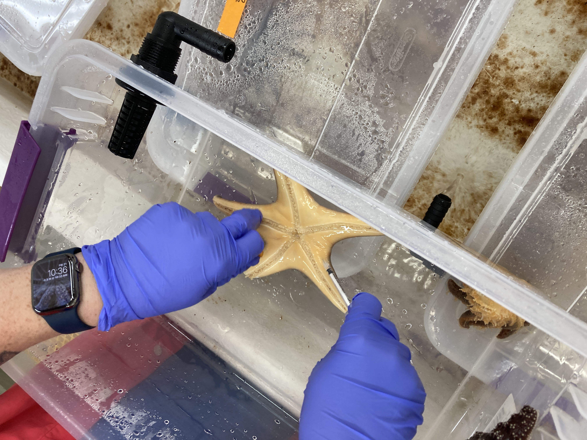   

For the Pisaster, we put the needles in nearly horizontal at the top of the arms, in toward the central disc.       
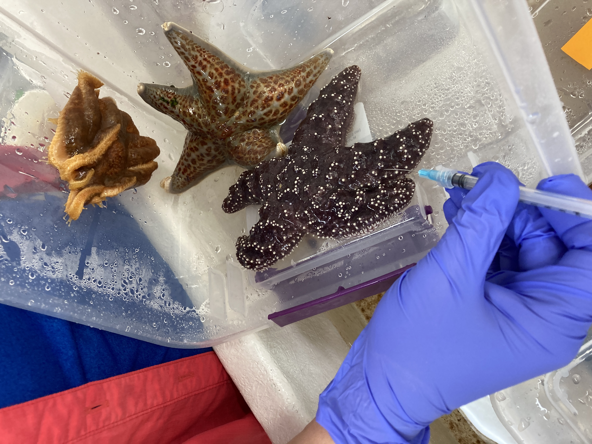

For the Pycno, we do what we always do, which is put the needle in at the armpit, angled toward the central disc cavity.      
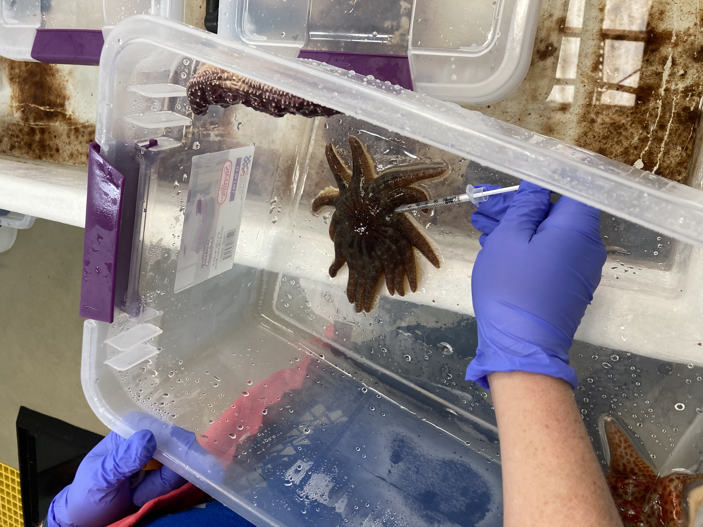

The CF was placed in a labeled microfuge tube (PSC ###), where each tube number is unique, and we put in our sample log what animal it is associated with, and what time the CF was collected. Melanie spun the CF down, removed the supernatant, added 300ul of shield to the cells, and saved the supernatant (PSCS ###). She marked down the time that the samples were placed in the -80C.

A side note: Alyssa and I sampled the bins at the back (Table 2, bins 1-8) together as she finished the ones in the front (Table 4, bins 9-16) before I finished. We were each sampling a bin, I was doing bin 7 and she was doing bin 6. The lids ended up getting mixed up when we finished such that the stars in bin 6 got put in bin's 7 spot and the bin 7 lid, along with the water hose and the airstone, were placed in with bin 6 stars. We realized it quickly and I cleaned the lids, and replaced the water hoses and airstones for both bin 6 and 7.

Bin 7 was exceptionally foamy post-sampling... likely the pycno. Several pycnos were foamy after sampling, but not all. Likely the saponins that get released as a stress response...?     
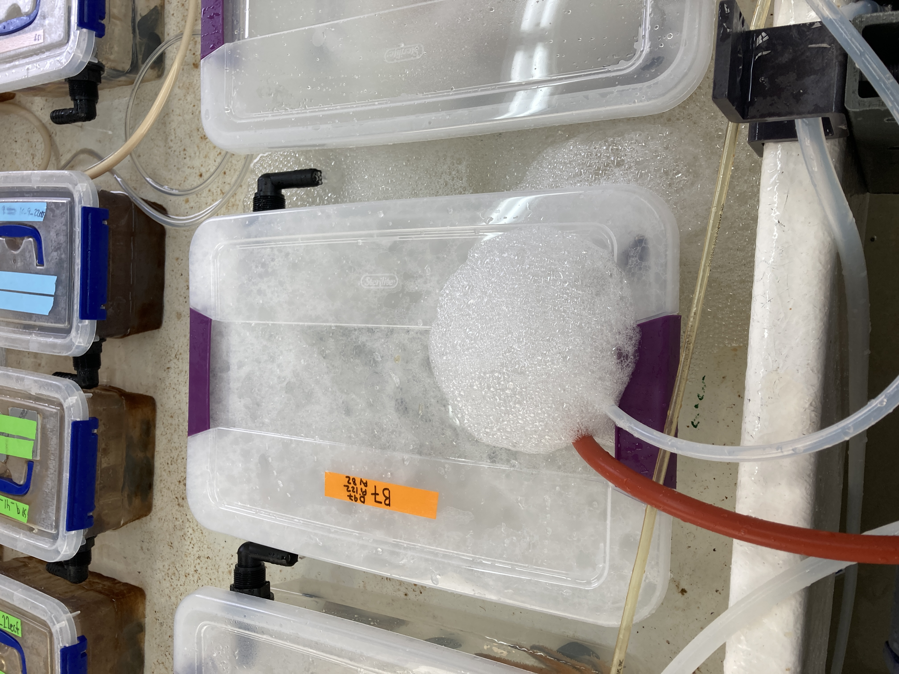  

We fed the stars after sampling. Because they're co-housed and there's no good way to ensure each gets 1 mussel like they usually do in their individual bins, we decided to overfeed them. We put 6 mussels (enough for 2 each) into each bin with the hopes that they'll each get at least one. There's no way for us to know for sure, but that seemed like the best option.

### Inoculation!
Adult pycno - disease source:        
This star was co-housed with another adult wasting pycno on Saturday July 15 through Sunday July 16th. That is how we keep disease transmission going in the lab so that we have the same disease source for our experiments. The first star that was the initial wasting star was collected from the field, then we've been co-housing adults throughout the summer and using them as our source of disease for experiments. It feels weird to hope for disease signs in these beautiful animals that we all love, but it's part of the nature of this work... we need sick animals in order to hopefully identify the causative agent(s) and to understand their immune systems.    
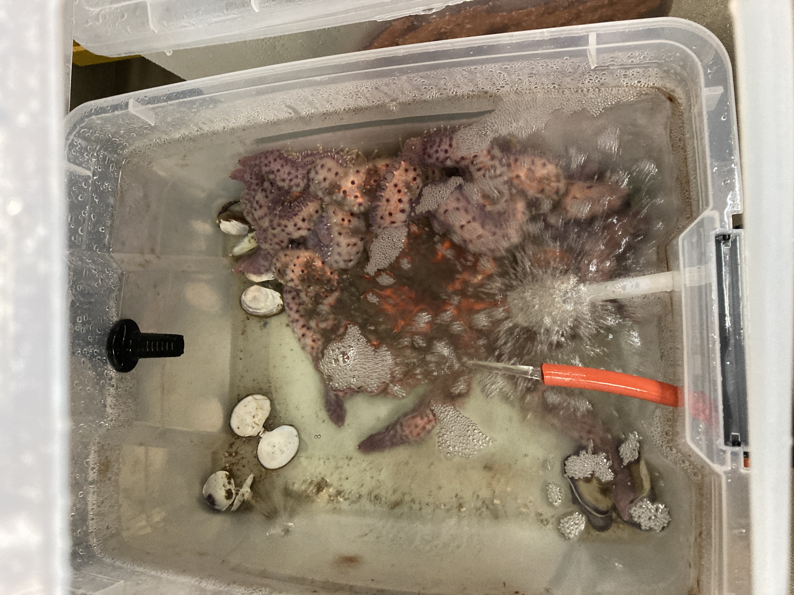    

And here's what it looked like right before I collected CF:      
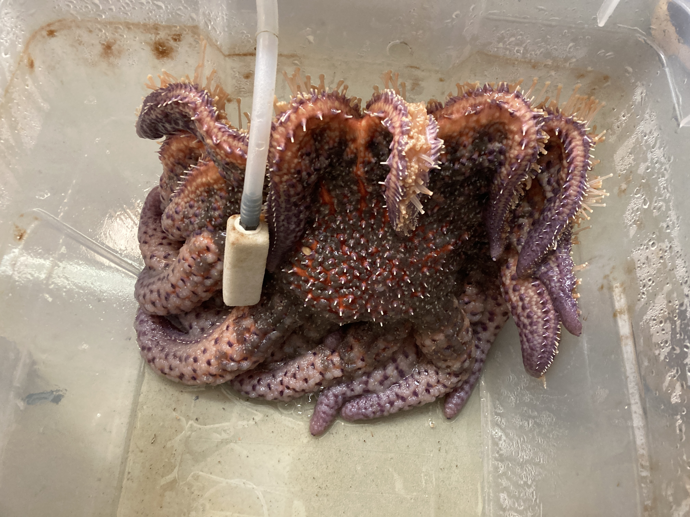

I collected ~7ml of CF from adult E, using a 3ml syringe and a 26 G 1 inch needle. We use a new needle for each new pull of CF, and remove the needle to put the CF into the 25ml short falcon tube so that it's hopefully avoiding getting any microbiota that might be on the needle from the star's dermis in with the CF.

Here's what the tube of CF looked like:      
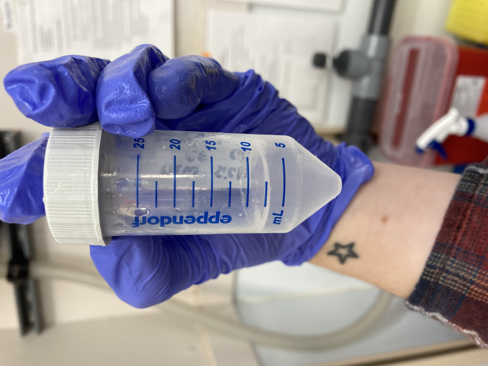

Calculation for goal amount of CF: 200ul x 16 = 3,200ul; we want about 300ul for coelomoocytes and coelomocyte supernatant and 2 smears, and then about 750ul for saving the CF with shield... total about 4,250ul. Aim for about 5ml of CF to collect.

We heat-killed ~3ml (placed in 25ml short falcon tube and placed in boiling water-bath for 10 mins). Melanie injected 200ul of heat-killed CF into n=8 Friday Harbor (FH) stars. She took the FH star out of it's bin, injected it, and then placed it in it's assigned bin for co-housing with the other stars.

Here's Melanie injecting heat-killed CF into a Friday Harbor star. We did it out of water to ensure injection was successful. After injection, she immediately placed it in it's bin:      
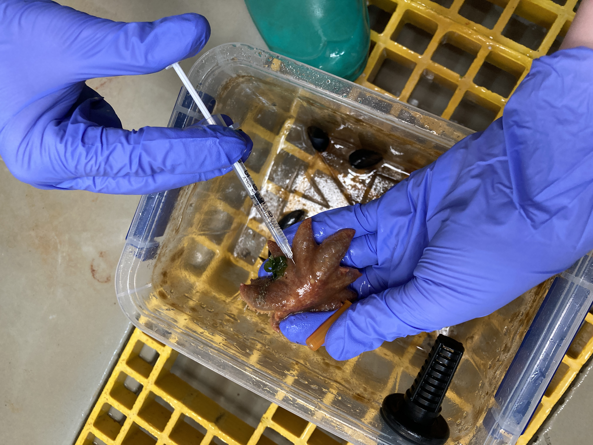

I did the same, but with raw CF from adult E.

Samples preserved from adult E:             
- 1 tube of coelomocytes with shield and a tube of the associated coelomocyte supernatant   
- 2 coelomic fluid smears   
- Remaining CF - DNA/RNA Shield added for Melanie's pathogen discovery work. 750ul of CF with 750ul of Shield, and then the remaining ~400ul of CF with 750 shield.

Notes:
- When injecting the heat-killed CF, we realized we only had 100ul remaining for the last star in bin 16. So our options were to inject 100ul (which is less than all the stars), or to collect more CF from E, heat-kill, and mix it with the remaining 100ul of CF and inject 200ul. We opted for the second option, so the timing for injection for that final control star was a bit delayed than the others. The reason why I couldn't heat-kill more from the first collection is because I had already preserved the CF from what I had... I think it was an ok thing to do.     
- We took observation data in the evening for all of the stars in the bins. I took photos of each bin. Some of the Friday Harbor stars already had pedicillaria from the _Pisaster_ stuck on their bodies --  bullying!     

An example of a bin with it's new housemate (small Friday Harbor star):     
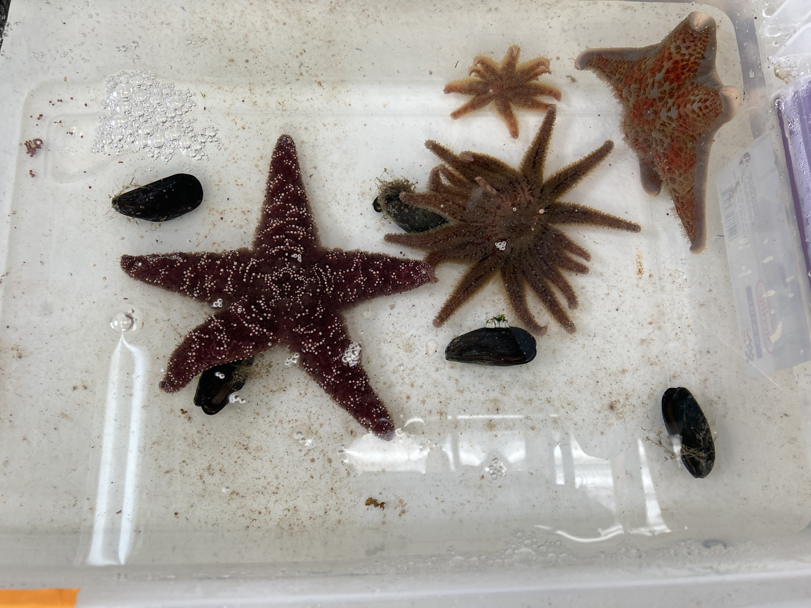

An example of a new housemate that was bullied by a _Pisaster_ (small purple dots on arm tips are the pedicillaria from the _Pisaster_):     
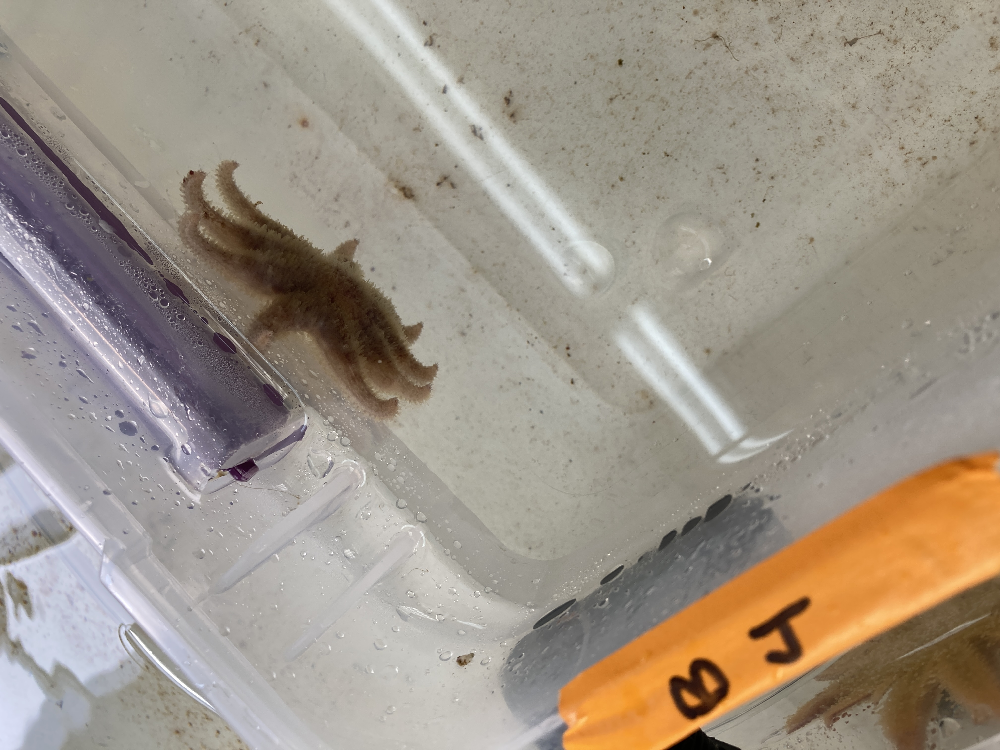
