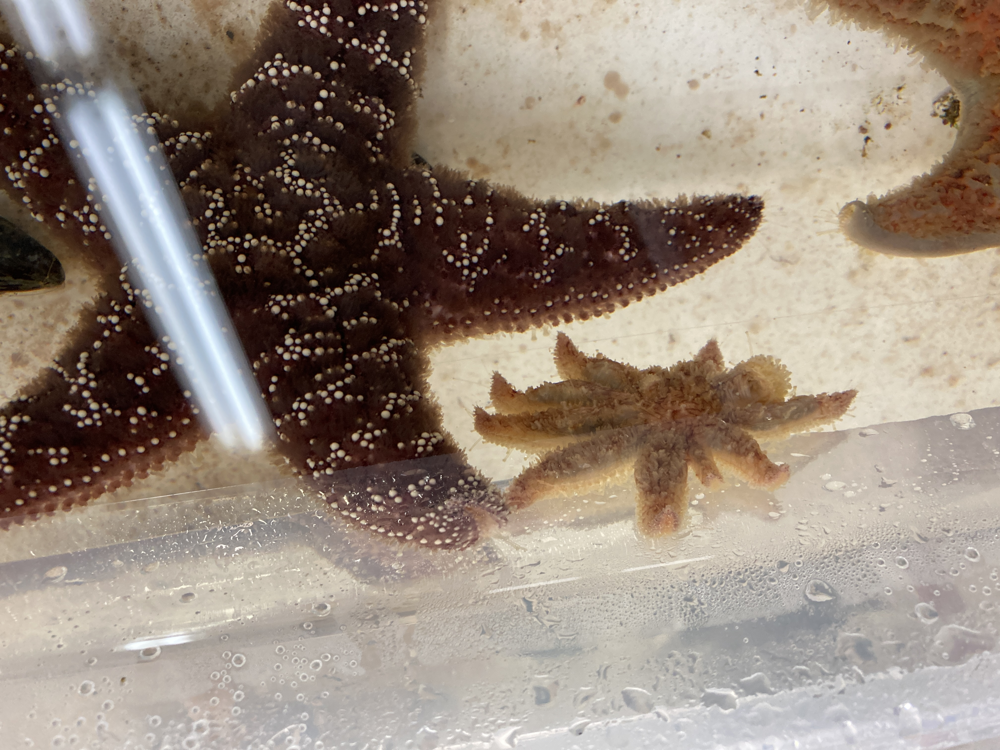
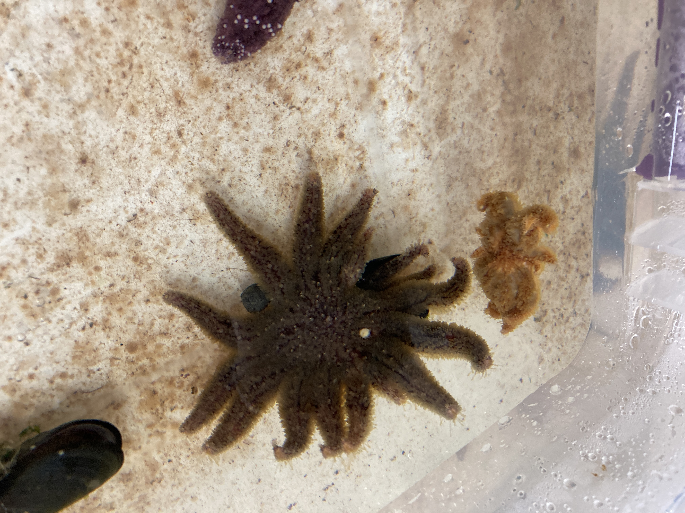
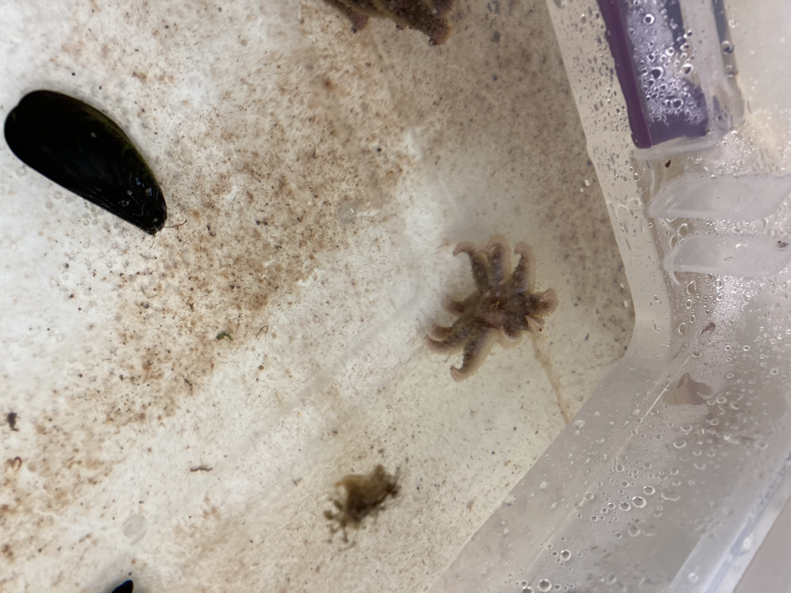
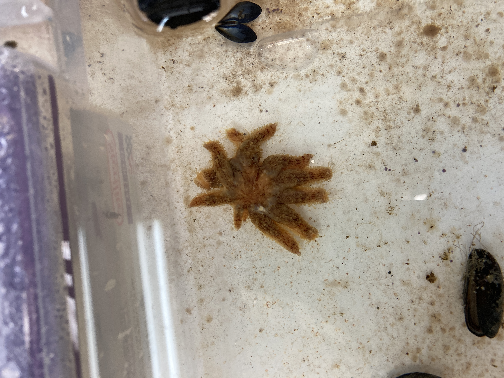
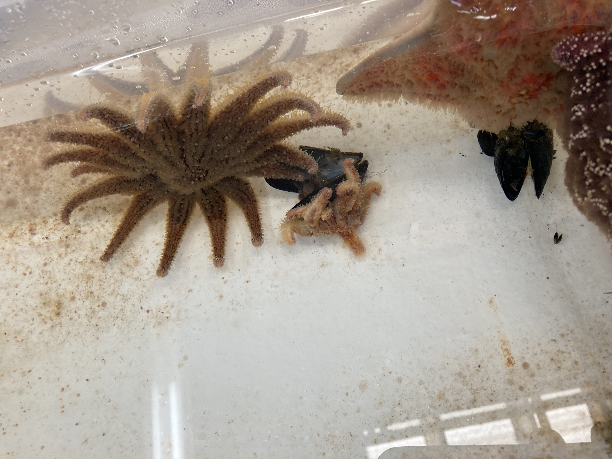
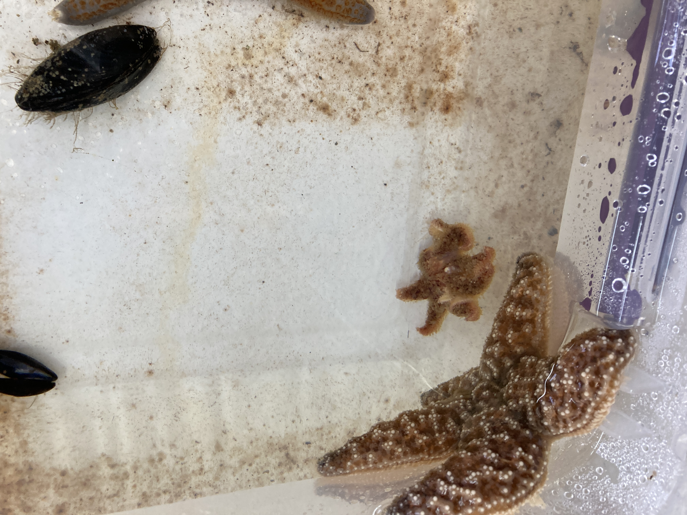

Today marks day 5 of the multi-species experiment. We've done one time-series sampling day (Day 3). We also had some disease sign sampling (Day 5), and added in a little extra sampling for Melanie's pathogen discovery work. Details on sampling scheme plan and other observations in the post.

### Multi-Species Sampling and Checks Update:
Sampling scheme:

Coelomocytes and coelomocyte supernatant:
- collect every 3 days (time series dates below)
- collect for all stars in bins (along with control pair stars) at first arm drop of Friday Harbor exposed stars      

| Experiment Day | Date       |
|----------------|------------|
| Day 0          | 2023-07-21 |
| Day 3          | 2023-07-24 |
| Day 6          | 2023-07-27 |
| Day 9          | 2023-07-30 |
| Day 12         | 2023-08-02 |
| Day 15         | 2023-08-05 |
| Day 18         | 2023-08-08 |
| Day 21         | 2023-08-11 |
| Day 24         | 2023-08-14 |
| Day 27         | 2023-08-15 |
| Day 30         | 2023-08-18 |
| Day 33         | 2023-08-21 |

Coelomic fluid (for Melanie):
- collect at disease signs of Friday Harbor star (first arm drop, death) and disease signs of pisaster, pycno, and dermasterias when it aligns with the time series sampling for Coelomocytes. Idea behind this is to get Melanie samples, but to not overly stress the stars by adding extra sampling days. Since we need to drain the tanks and collect coelomic fluid anyway for the coelomocytes, we'll collect extra tube of coelomuic fluid at the same time if it aligns with disease signs.

Coelomic fluid smears:
- smear sick and control pair at least two of each species when disease signs start

#### Day 1 --> 2023-07-22
Morning and evening checks went great.

Decided that we'll take photos in the morning checks only if something looks odd/sick/weird. And all stars will have a photo taken of them in the evening check. Because they're cohoused, that might mean that we only have to take a couple photos if we have multiple stars in one photo.

#### Day 2 --> 2023-07-23
Morning and evening checks went great again!

Some of the _Dermasterias_ looked extra fuzzy... I don't know much about these stars, but Alyssa suggested it might mean that they're relaxed? See photos below of a fuzzy (bin3) and non-fuzzy derm (bin 8):      

 

There's also a pycno in bin 8 that has something coming out of the top of it's central disc... we don't know what it is... see photo below:     

#### Day 3 --> 2023-07-24
Morning checks looked great.

I labeled some tubes for Day 3 sampling of all stars that's happening tomorrow. All stars except the Friday Harbor stars... so 16 x 3 = 48 samples. I labeled 48 tubes for coelomocytes (PSC ###), and 48 tubes for coelomocyte supernatnat (PSCS ###).

We started sampling around 10am. Alyssa did the control bins (9-16), I did the exposed bins (1-8), and Andrew took notes and helped keep track of what tubes we were both using for which stars.

We did it such that Alyssa sampled Bin 9 at the same time as I sampled Bin 9. We processed the first four bins of each of our treatment groups (Alyssa Bins 9-12; me Bins 1-4), then I took all the tubes and spun them down for 5 min at 1200 rpm, took off the supernatant and put into the labeled PSCS tube, and added 300ul of DNA/RNA Shield to the pelleted cells in the labeled PSC tubes. I then put them in the -80C for storage.

The timing of that first set of 8 bins was we started sampling at 10:01 am, stopped sampling at 10:50am, and all those samples were in the -80C by 11:25am.

We did the same thing for the remaining bins (Alyssa bins 13-16, me bins 5-8). Timing was we started sampling around 10:53am, ended sampling around 11:20am, and all those samples were processed and in the -80C by 11:45am.

Evening checks went great, and we fed all the stars. We didn't want to feed in the morning right before sampling the MUSP stars.

Here's our feeding/uneaten food removal plan for the MUSP stars:     
Every sampling day (every 3 days) we remove all the mussels we can get without disturbing the stars and keep a log of how many were removed, and how many were eaten. We feed every M, W, and Fr 8 mussels (6 larger and 2 smaller for the Friday Harbor stars). This timeline does mean that we might remove food the day after they were fed, but because we dump the water out every three days for sampling, it feels better to remove food at that time rather than reach into their water-filled bins on M, W, Fr to remove uneaten food. I think we feed them often enough that this isn't going to be an issue, and they are eating most of what we feed them.

#### Day 4 --> 2023-07-25
Andrew and I checked the stars in the morning and evening. All controls looked good. Exposed group: most of the Friday Harbor stars looked like they could drop an arm soon! The Friday Harbor stars are so small that they don't obviously twist like the larger juveniles and adults do, so that's why we chose the disease sign of arm-drop for the sampling scheme.

Friday Harbor star from exposed bin 2. Things I notice in this star: 1 twisted arm:      
     

Friday Harbor star from exposed bin 3. Thins I notice in this star: uneven turgor pressure, some twisty arms:      

Friday Harbor star from exposed bin 4. Things I notice in this star: low turgor pressure (arms look a little "skinny") and some curled arm tips (though this sign is tricky because sometimes they do just have curled up arm tips):    

IN between the morning and evening check, Andrew and I met up with Ken Collins (SCUBA diver on our collection permit) at Whidbey to see if he'd be able to collect more juvenile pycnos for our next experiment. Sadly, there was wasting in the field, so we couldn't get any more pycnos.

#### Day 5 --> 2023-07-26
Just Melanie and I today. We did the morning check, and the first couple bins had some twisty-looking Friday Harbor pycnos.

Friday Harbor star from exposed bin 1. Things I notice in this star: arm crossing, arm tip arching:     
    

Friday Harbor star from exposed bin 2. Things I notice in this star: uneven turgor pressure, curly arms:     
  

Friday Harbor star from exposed bin 5. Things I notice in this star: twisting arms, uneven turgor pressure:     

In the evening check, we saw that the Friday Harbor stars in Bins 2 and 3 (the exposed) had dropped arms! Following our sampling scheme, that means that we sampled coelomocytes from all stars (but not the Friday Harbor stars) in Bins 2 and 3, along with their control pairs in Bin 10 and 11. Melanie collected the samples from the controls, and I sampled from the exposed. We also added in a collection of coelomic fluid for Melanie's work for those stars as well.
