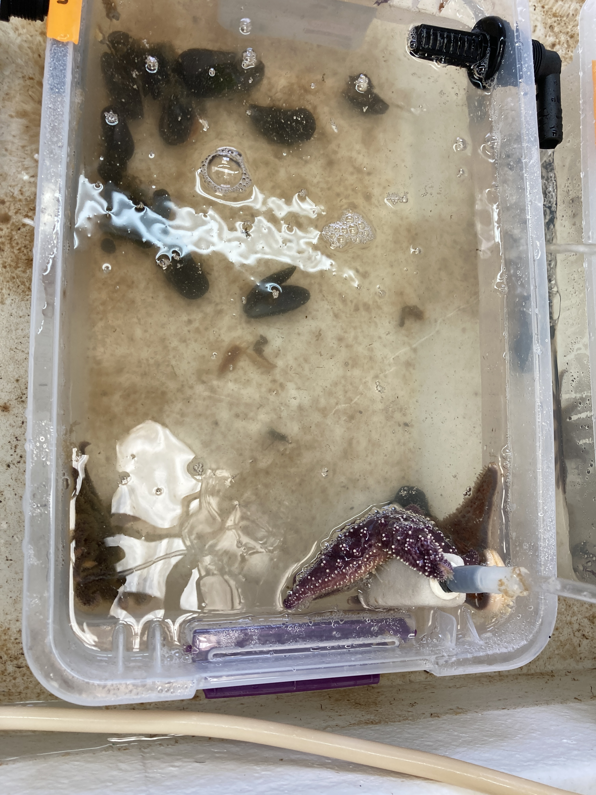
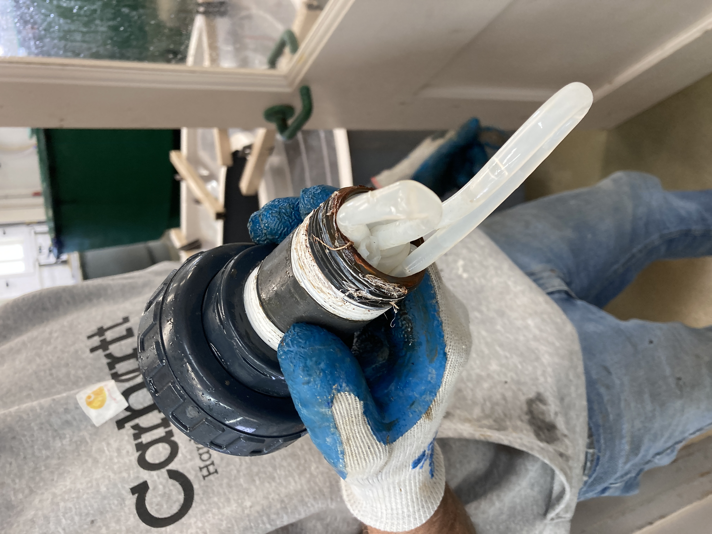
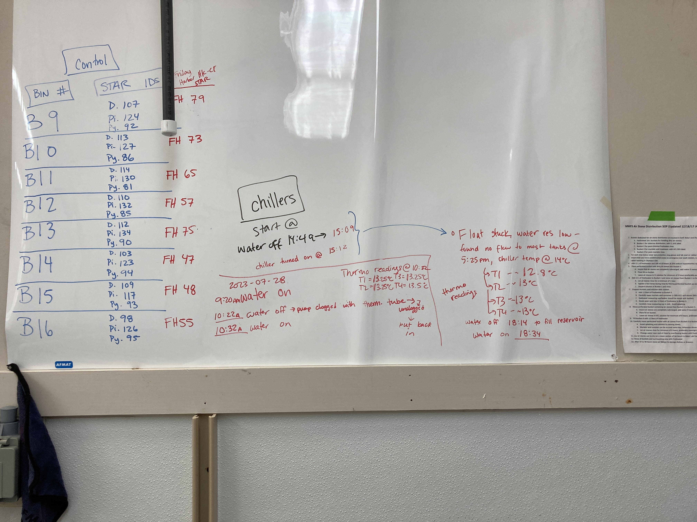
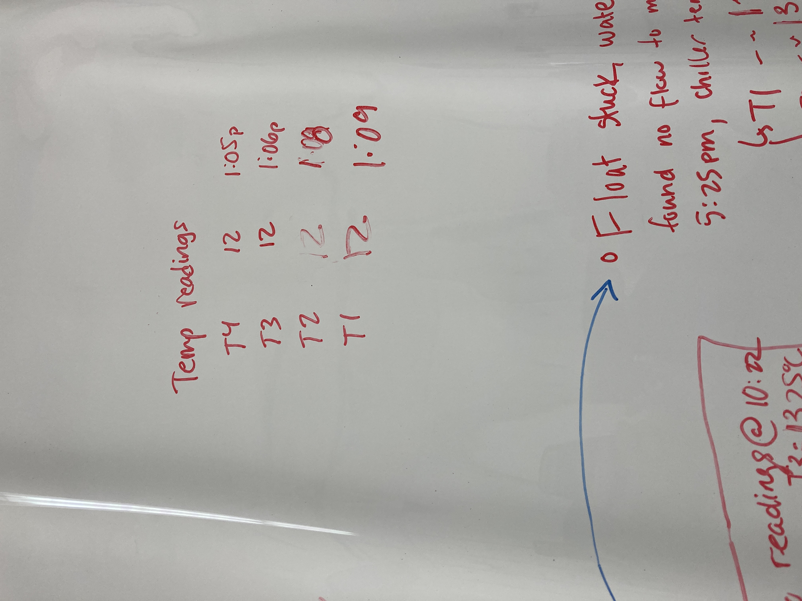
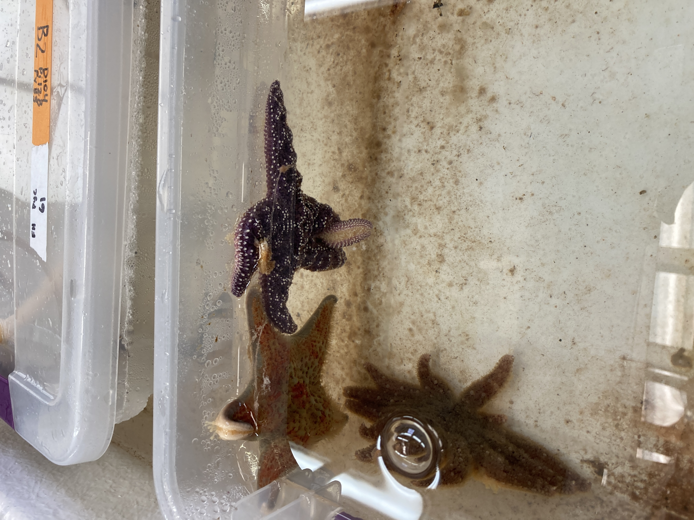

Day 6 sampling for all, and 4 more Friday Harbor stars from the exposed side have dropped arms! Also, lots of water flow and temperature issues... details in post.

## Day 6 --> 2023-07-27
Melanie and I again today! Also, today is Day 6 sampling for all multi-species bins (except for the FH stars).

Morning check:
All controls looked good       
Exposed: 4 more bins had the FH star arm drop (bins 1, 4, 5, and 8)
- Since we're doing sampling today anyway, we don't have to do extra sampling for the disease sign - it lined up well!

Note: the water for Bin 3 (which we sampled for Day 3, and yesterday for FH first arm drop) didn't have any water flow overnight... water looks yucky. Fixed it as soon as I saw it for the check.     

Sampled coelomocytes and coelomocyte supernatant from all the pisasters, dermasterias, and wild pynos from all bins     
Collected coelomoic fluid for Melanie for bins 1, 4, 5, 6, 7, 8, and bins 9, 12, 13,14,15,16    

Note: for bin 1, the Friday Harbor stars had two arms that fell off of the air stone, so unlike the other bins, this one will have two arms removed. The other bins will keep the decaying tissue of the Friday Harbor stars.

Temperature, flow, and chiller issues - see section below.

## Day 7 --> 2023-07-28

### Water Flow, Water Temperature, and Chiller Issues:   
#### 2023-07-27       
We are logging temperature data using HOBO loggers. Melanie noticed 2023-07-26 that the loggers' lights were flashing, which means that they were meeting the threshold she set for temperature alarms. She had it set that the lights will flash whenever the temperature is above 13 C for more than an hour, cumulatively. The recording happens every 30 minutes.

We asked the folks at USGS if we could get the chiller hooked up for our room, so they got to work on that. It took some time to flush the system and to get the chlorine out of the bins, so we weren't able to get it set up until 2023-07-27. They had to turn the water off for 20mins to switch over to the chilled line (14:49pm-15:09pm). The water came on and it looked like it was working great!

We checked the stars again for our evening check around 5:30, but the water was not flowing. We checked the float valve in the chiller tank and saw that it was (1) stuck in the up position, and (2), that the reservoir was nearly empty. We shut the pressure valve of the system off, and pushed the float valve down, and the reservoir started to fill up again. It took about 20mins to fill up. Once the reservoir was full, we turned the pressure system back on to get the flow going into our room and tanks. Things looked like they were working well around 6:35pm.

We checked the system again around 8:40pm, and saw that the float was stuck in the down position, and that the reservoir was completely empty and we had no flow in our room. We turned the pressure system off, let the reservoir filled again, and adjust the float valve. We realized that the likely main issue is that the flow rate for all of our tanks (we have a LOT of stars) is likely too high for the reservoir to keep up with! But we are unable to switch the system back to the ambient line and the stars need water, so we decided we'll spend the night turning off the pressure every 2 hours to let the reservoir fill (with water turned off for 20 mins) and then turning the water back on.

In the morning (2023-07-28) we'll ask if it's possible to have two of our four tables be put on the chilled water, and two on ambient. We could then keep our stars that are in the experiment in the two tables with chilled, and the other tables could house our quarantine stars that we're monitoring before we put them in an experiment.

Pisaster and dermasterias are probably ok-enough, but pycnos are very sensitive to temperature and flow rate - they need definitely below 13C (ideally below 12C) and high flow rate. We haven't had issues with this until this past week with warmer water temperatures. And we're going into the warmer-water season now, so we need to figure this out asap. These temperatures aren't ideal for any of the species, actually, because we don't know enough about the temperature-disease relationship, so we'd rather not have them stressed by temperature and low flow.

Here's our schedule for the night of 2023-07-27 to the morning of 2023-07-28:         
| Time Water Off | Time Water On |  
|----------------|---------------|
| 2:49pm         | 3:09pm        |
| 6:14pm         | 6:34pm        |
| 8:45pm         | 9:05pm        |
| 11:05pm        | 11:25pm       |
| 1:25am         | 1:45am        |
| 3:45am         | 4:05am        |
| 6:05am         | 6:25am        |
| 8:25am         | 8:45am        |

##### 11:42pm     
Change of plans. The water is not flowing at all into the reservoir. So... we have upped the air bubblers for all tanks, left a note for John to call us when he gets here in the morning, and then we'll go from there.

At the very least, all the stars are experiencing the same thing.

This could be thought of as an unintentional increase in disease exposure treatment for the multi-species experiment... and the controls are getting it, too. it just sucks that the temperature is going to be warmer than we want for all the stars.

##### 1:50am
Still no water. Will wait for help from John/Jake in the morning.

#### 2023-07-28
Jake arrived around 9am, so we asked him for help. We figured out several things:    
- I pushed the float valve too hard and ended up closing off the flow completely, which is why the reservoir never filled back up last night. The float valve does get stuck, but I pushed it down too hard, and it requires less of a punch and more of slap to get it unstuck...
- Jake realized that the pump was likely the issue. He planned on replacing it with a different pump, however when he undid the original pump he found the issue! The tubing that was holding the thermometer in the water had fallen into the tank and got caught in the plumbing! He removed it, replaced the pump and original things back, and everything has been working great since then!!!

The chiller is set to 9, but the likelihood of it getting that low in the room is very low because of our flow rate, but it should stay at or below 12C! We'll get the data from the HOBO loggers tomorrow and download it to capture the temperature changes the stars went through.

Notes on the whiteboard relating to water shutoffs, etc:     

### Star checks
#### Morning:      
All of the stars looked fine!!! Despite not having flowing water from 11pm last night to ~10am this morning, there were no outward signs of stress. The room also felt cool, which was a relief. Additionally, I think upping the air at the very least all night made a big difference.

We did notice that many bins had smelly water, but the flow getting back on helped clear and clean the water out.

This lack of water may have increased the disease exposure for our exposed bins (1-8)... potentially may have increased disease progression for the FH exposed stars, but bins 6 and 7 FH exposed stars still looked fine.

FH exposed stars in bins 1, 2, and 8 are definitely dead. We are leaving their tissue in the bin as it's more like the field, and they are so small that their ability to foul the water is minimal.

There was one _Pisaster_ in bin 1 that had 1 twisted arm. This is day 7 of exposure MUSP, but it does seem too soon for a _Pisaster_ to be showing disease signs, so it may be stress from the water issue.   

Some of the dropped arms from the wasting exposed Friday Harbor star are visible in this picture.    

#### Afternoon:
Water temp is good - all tables are around 11.5 C according to the ethanol thermometer. Melanie downloaded the HOBO logger data, so we'll get that data soon!

The water flow all looked great, and the reservoir is full to the top, as it should be! Yay!

##### MUSP:
- Controls: all looked great
- Exposed: the other stars all looked fine, the pisaster in bin 1 that had an arm twisted earlier is no longer twisting - there's just a crossing of two arms, so it likely was just stress? We'll see.

##### Melanie's water exposure experiment:   
Getting help from Roberts' Lab folks to figure out the filtering issue! GitHub Issue: [1688](https://github.com/RobertsLab/resources/issues/1688)

### HOBO logger update:
Overnight temps weren't too bad... the main issue might be that there just wasn't great flow. Never got above 14, and was more often around 13C. At least they all had air bubblers. 
