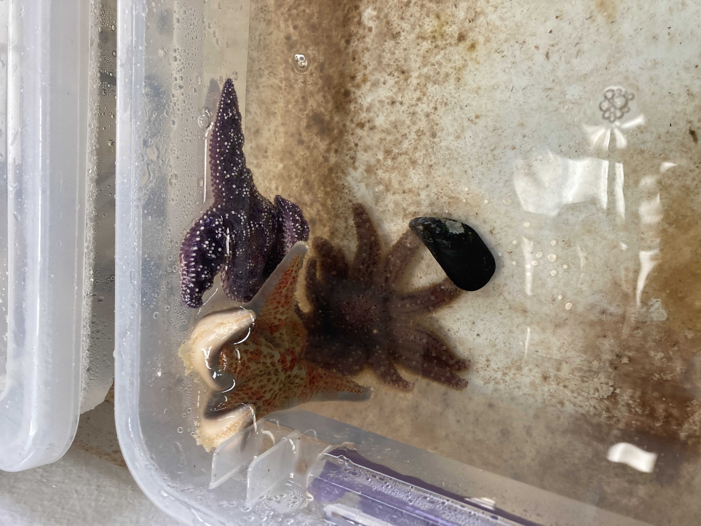

MUSP days 8-11... some time series sampling, some observations, some Friday Harbor exposed star deaths... details in post.

## Day 8 --> 2023-07-29
### Morning:      
Andrew and I do star check. Controls all look great. The exposed, there are likely several of the FH stars that are dead, but it's a little hard to tell for sure. A couple others are obviously dead. Have detailed notes on this.

I labeled more tubes (48 PSC tubes and 48 PSCS tubes) for tomorrow's Day 9 MUSP sampling.

### Afternoon:      
All controls continue to look lovely and healthy. In exposed, bins 6 and 7 FH exposed stars still look fine...

Air and water looks great for all stars. The temperature is about 12C for all tables.

#### Melanie's water transmission experiment:
I haven't heard yet from Chris about the supplies the REU group used for their water filtering, but it sounds like all the supplies are at Friday Harbor Labs... once she gets back to us for the equipment specifics, I wonder if there's a way we could borrow those supplies? Get them to Marrowstone? Or at the very least we can see if there's anything similar that would work that's already here at Marrowstone or maybe that we can borrow from UW Seattle. TBD.

## Day 9 --> 2023-07-30
### Morning:    
Andrew and I do the MUSP checks. Controls look great! Exposed stars - bins 6 and 7, FH stars still look totally fine. Wondering if maybe when injections happened, I injected in the armpit and into the body cavity too close to the mouth opening and the sick CF just went out of the star?? Or maybe they're resistant?? Or maybe they have a little resistance and will just take a little longer for disease signs than the other 6? I guess we'll see... If nothing happens, perhaps I'll take some samples of them and then we'll have to make some decisions of what to do with those bins and their control paired bins (14 and 15). Maybe they get taken out of MUSP and used in a small side project?

Sampling:     
- Controls --> Melanie sampled the controls wild pycnos, pisaster, and dermasterias    
- Exposed --> I sampled the exposed wild pycnos, pisaster, and dermasterias

Andrew helped take notes and keep tube numbers and star IDs on track and organized.

We started sampling at 10:30 and were completely finished by 1:30pm - not too bad!!

### Evening:
Andrew and I check MUSP and PRES experiment stars - nothing new to report.

## Day 10 --> 2023-07-31
MY DAY OFF!!!

Star update from Melanie and Andrew:    
MUSP controls all look good! And the _Pisaster_ in the exposed bin 1 has some twisting! Melanie has the photos. The Friday Harbor stars in bins 6 and 7 (exposed - injected with 200ul of sick CF on July 21, 2023) still look fine...

Here's a pretty picture from my day off:        
Staircase Rapids         

## Day 11 --> 2023-08-01
Melanie's day off!

### Morning:
Andrew and I check all the stars. MUSP controls look great! MUSP exposed - bin 1 pisaster is twisting for sure! Bins 6 and 7 Friday Harbor stars still look fine... not sure what to do...

_Pisaster_ in bin 1 this morning:     
     

#### Water Transmission Experiment Prep
This upcoming big experiment is going to be one where we'll be ramping up the pilot we did last summer where we were successfully able to transmit disease from a header tank with a wasting juvenile pycno (injected with 150ul of sick CF from an adult star) to a a recipient tank of a juvenile pycno. This summer's experiment will be ramped up in terms of replicates, and we'll also be adding more robust filtering and sampling.

The main thing we need to figure out is how we can filter 5L of seawater through 0.8um, then through 0.22um. The water that is filtered through the 0.22um will then be concentrated using something called a TFF cartridge that will concentrate virus-sized particles from the 5L of seawater to a 50ml sample...

Looks like we've figured something out!!! USGS has 2, 2L Buchner flasks... we can put a rubber stopper in the top. In one stopper hole, put a serological pipet down past the vacuum attachment, then attach tubing that has the holders for the 0.8um and 0.22um filters. That will filter the water and collect it into the flask. Then, in another hole in the same rubber stopper is another serological pipet that will collect to a tube that will go into another container. That will siphon off the water into the container by blocking off the other tube setup and blowing it into the other container...

Might go to a brewery supply store tomorrow to get 5L glass carboys? Better tubing? Would be ideal if we can process the 5L at once.

Andrew's sketch:     

### Afternoon:
- Labeled tubes for tomorrow's MUSP D12 sampling
- Image organization

PM star check:   
