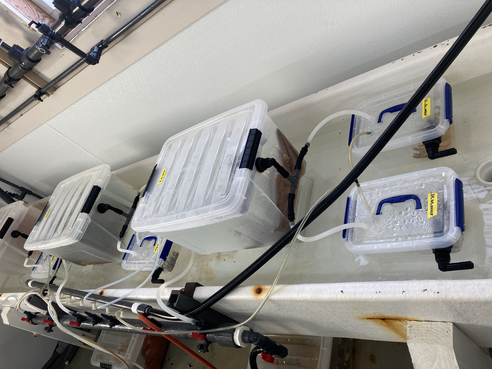
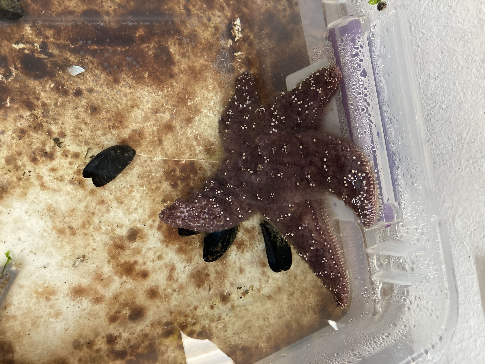
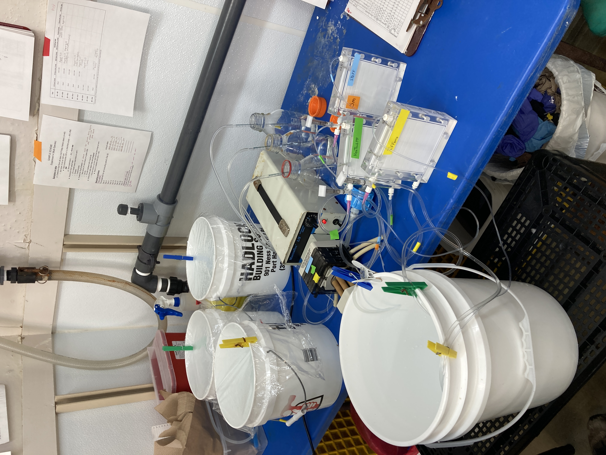

BIG UPDATE ON MUSP! Been really busy getting a new experiment ready with Melanie and Andrew, so here's a multi-day update. Note about the notes in this post: I have way more detailed data that I'm taking on everything, but for the purposes of these posts, I'm just sharing the basics.

## Day 12 --> 2023-08-02
### Morning:    
Controls --> all look great!    
Exposed --> bin 1 pisaster is twisty, and bins 6 and 7 Friday Harbor stars look fine

Sampled all for coelomocytes and coelomocyte supernatant. MP took controls, I took exposed. We also took coelomic fluid samples for Mel's work for bins 1 and 9 because of twisty pisaster.

### Evening:      
Controls --> all look great!     
Exposed --> bin 1 pisaster looks fine, bin 8 pycno has one arm twisted

Fed all MUSP stars.

## Day 13 --> 2023-08-03
### Morning:    
Controls --> all look great!    
Exposed --> pisaster in bin 1 has one arm dragging and a lesion

### Evening:    
Controls --> all look great!     
Exposed --> pisaster in bin 1 has one arm dragging and a lesion; pycno in bin 5 twisting  

#### Water Transmission (WAT) Experiment prep:
- Start re-arranging bins for Experiment    
One adult pycno will be the header tank to two juvenile pycno tanks. Control side: 3 adults, each with 2 juveniles, and exposed side: 3 adults, each with 2 juveniles.  

The WAT experiment will be a big one for Melanie as we'll be sampling headers (adults) and recipients (and their control pairs) at day 0, and at disease signs. We'll be sampling CF, and filtering water (0.8um filter, 0.22um filter, and viral concentrate). Additionally, because I've never saved coelomocytes from an adult pycno that was injected with sick CF (I only have adult pycno coelomocytes from summer 2021 and 2022 that were injected with raw sick tissue homogenate), I'll also take some coelomocytes and coelomocyte supernatant whenever the adults are getting sampled.  

## Day 14 --> 2023-08-04
### Morning:    
Controls --> all look great!    
Exposed --> pisaster in bin 1 is disintegrating 1 arm; pycnos in bins 2, 4, 5, and 8 are twisting. Friday Harbor stars in bins 6 and 7 look totally fine.

Plan for the Friday Harbor exposed stars in bins 6 and 7 that haven't shown any disease signs 2 weeks into experiment:    
Take a sample of the stars in bin 6 and 7 and their control bin pairs (bin 14 and 15) and include sampling of the FH stars.     

Once the adult A that we're waiting on is twisting, re-exposed the exposed FH stars with 200ul or more of raw CF, and re-inject their control FH paired stars with heat-killed CF.

Fed all the stars except for MUSP stars because wasn't enough mussels. After lunch went to Indian Island State Park at low tide to collect mussels. Will freeze them for 24+ hrs to fully kill the mussels (they can survive freezing for 12 hrs and live mussels are too difficult for some of the stars to eat). So we'll feed MUSP stars Saturday evening check.   

### Evening:    
Controls --> all look great!     
Exposed --> pisaster in bin 1 still disintegrating, pycnos in some bins twisting; FH pycnos in bins 6 and 7 still fine.

#### Water Transmission Experiment prep continued:      
Finished setting up bins:  
  

#### Preservation trial:
I sampled the remaining PRES star and we ended that trial.  

## Day 15 --> 2023-08-05
MUSP D15 sample    
### Morning:     
Controls --> all look great!    
Exposed -->    
- Bin 1: _Pisaster_ fully losing an arm that's disintegrating, lots of ossicles on the bottom of the bin (saved some of the arm for -80); wild _Pycno_ has 1 arm twisted; sampled extra CF for Mel for bin 1 and control bin pair (bin 9)
- Bin 2: wild _Pycno_ looks ok today, but had 4 arms twisting yesterday, so we took extra CF for Melanie for bin 2 and control bin pair, bin 10
- Bin 3: all ok
- Bin 4: wild _Pycno_ looks ok today, but had 1 arm twisted yesterday, so we took extra CF samples for Mel for bin 4 and control pair bin 12
- Bin 5: wild _Pycno_ had 2 arms twisted today, so we took extra CF samples for Mel for bin 5 and control bin pair, 13
- Bin 6: wild _Pycno_ looked ok at morning check, but then at sampling, it had 1 arm twisted. This is interesting because this bin (and bin 7) the Friday Harbor pycno has not shown any signs of disease... so maybe there's transmission, but also maybe some resistance in the FH star? We sampled all the stars including the FH star in this bin and the control pair bin 14 for coelomocytes and extra CF for Mel. Deciding to wait to re-inject the FH star and see how things play out for a week or so.
- Bin 7: all ok, took coelomocyte samples from all 4 stars and control bin pai (bin 15)
- Bin 8: wild _Pycno_ dropped 12 arms by the morning check, dropped 2 more (total 14) by the time of sampling (saved one arm for -80)

Quick look at sampling:    

MP sampled controls --> CF for bins 9, 10, 12, 13, 14, 16; collect from FH stars in bins 14 and 15    

GC sampled exposed --> CF for bins 1, 2, 4, 5, 6, 8; saved arms from bin 1 (_Pisaster_), bin 2 (wild _Pycno_), and bin 8 (wild _Pycno_); also collected coelomocytes from FH stars in bins 6 and 7      

### Evening:
Controls --> all look great!   
Expoesd -->
- Bin 1: _Pisaster_ is dropping a second arm, other two stars look fine
- Bin 2: _Pycno_ hasn't dropped any more arms since the sampling earlier, looks twisty and low turgor; other stars look fine
- Bin 3: all look ok
- Bin 4: all look ok
- Bin 5: wild _Pycno_ looks twisty, low turgor, wavy arms; otehr two stars look ok
- Bin 6: all look ok
- Bin 7: all look ok
- Bin 8: wild _Pycno_ dropped one more arm since sampling (total of 15 arms dropped), with one arm remaining attached to the disc, has weird pointy lump on disc; other two stars look ok

#### Water Transmission:
Andrew sterilized the filtering equipment while Melanie and I were sampling the stars for MUSP. He also pre-filtered seawater from the manifold through a 0.8um and 0.22um filters.

Lunch break.

Then, we started a test of the Tangential Flow (TFF) filtering to concentrate virus-sized particules. Started at 3:57pm, and it finished at 10:44pm... then we had to sterilize and clean everything, so we were done around 11:30/midnight.

## Day 16 --> 2023-08-06
### MUSP Morning:
Controls --> all look good, except _Pisaster_ in bin 15 looks interesting... some thinning tissue, looks kind of puffy. Not sure what's going on.
Exposed -->
- Bin 1: _Pisaster_ only has two arms connected to the disc... other remaining two have dropped (the fifth arm is the one that kind of dissolved that I collected for -80); wild _Pycno_ has some twisting
- Bin 2: wild _Pycno_ dropped a couple more arms
- Bin 3: all looked fine
- Bin 4: all looked fine
- Bin 5: _Pisaster_ looked kind of funny, like overinflated? Full of coelomic fluid? Maybe launching an immune response?; wild _Pycno_ dropped a ton of arms (saved one for -80)  
- Bin 6: all look ok
- Bin 7: all look ok
- Bin 8: wild _Pycno_ only has one arm attached to central disc

### Musp Evening:
Controls --> all look fine except _Pisaster_ in bin 15 is still interesting-looking.  

Exposed -->
- Bin 1: _Pisaster_ is dead, all 4 arms are detached; wild _Pycno_ very twisted
- Bin 2: wild _Pycno_ dropped more arms
- Bin 3: I think all ok? Hard to tell exactly because wild _Pycno_ was on airtube, so I couldn't fully remove airstone
- Bin 4: wild _Pycno_ a little twisty
- Bin 5: _Pisaster_ looks kind of weird- bunched up arm or two, possibly crossed? Wild _Pycno_ dropped a bunch more arms.
- Bin 6: FH _Pycno_ still looks fine, the wild _Pycno_ has 1 arm twisted
- Bin 7: all look fine
- Bin 8: wild _Pycno_ is dead

#### Water Transmission:   
We decided to start filtering for Day 0... just waiting on adult pycno A to get twisty, and that could happen any day now.

Our set up allows for running 3 samples at a time, so of the 12 samples to run, we'll do four sets of 3.  

Pre-filtering of the 3 samples took 1.5 hours.   

TFF filtering started at 5:35pm.  

Melanie and I finished it all up at 1:30am...

TFF filtering is not particularly difficult, it just takes a long time, a lot of monitoring, and lots of things need to be sterilized between uses.

Here's the set-up for the viral concentrate:    

I'll explain how it all works in a separate post later... this post is very long at the moment.

## Day 17 --> 2023-08-07
### MUSP Morning:
Controls --> all good
Exposed -->
- Bin 1: _Pisaster_ still dead; wild _Pycno_ dropped arms and twisty (saved 1 arm for -80)
- Bin 2: wild _Pycno_ dead
- Bin 3: _Pisaster_ has 2 arms crossed/twisted
- Bin 4: wild _Pycno_ dropped arms (saved one for -80)
- Bin 5: wild _Pycno_ dropped arms (already saved one at previous arm drop event)
- Bin 6: all look fine
- Bin 7: all look fine
- Bin 8: wild _Pycno_ is dead.

I pre-labeled PSC and PSCS tubes for tomorrow's Day 18 sampling of all MUSP stars.

Fed all MUSP stars.

### MUSP Evening:
Controls -->        
Exposed -->
- Bin 1:
- Bin 2:
- Bin 3:
- Bin 4:
- Bin 5:
- Bin 6:
- Bin 7:
- Bin 8:

#### Water Transmission:
Started another set of 3 samples this morning. Melanie got started around 7:30/8am sterilizing things while Andrew I checked the MUSP and other stars.

Pre-filtering for the next set of three started at 9:35am and ended between 11am and 12pm. One sample took longer because the 0.22um sterivex filter got clogged. Moving forward, if the flow gets to a slow drip, we'll switch to a new filter.

We started the TFF viral concentration filtering at ~12:45pm.
