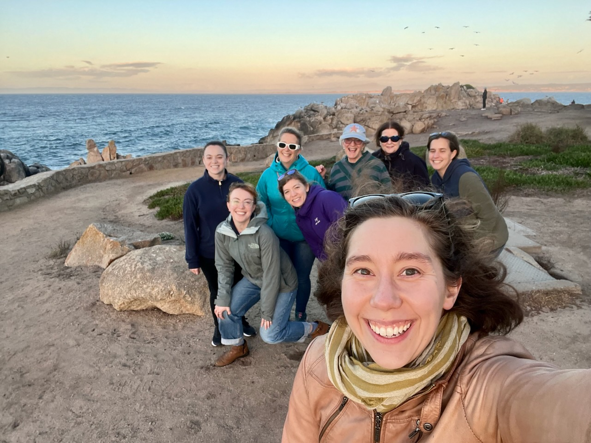
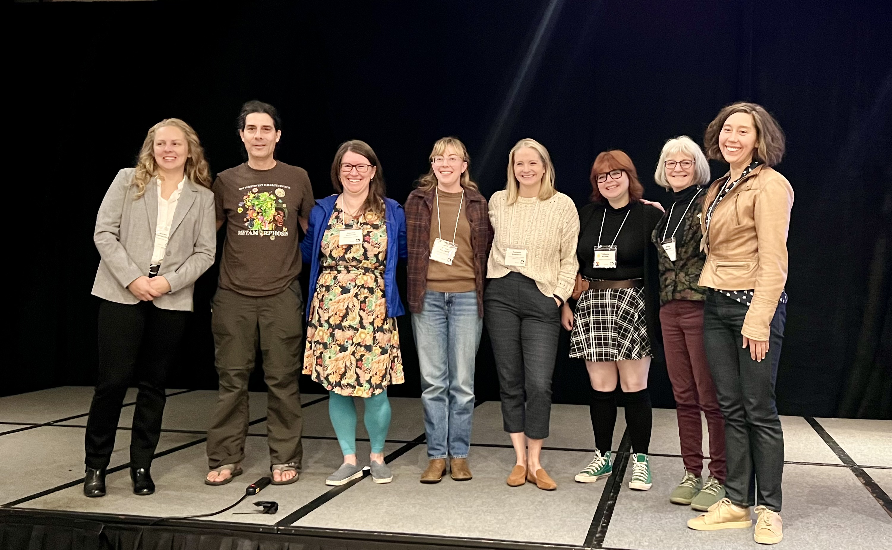
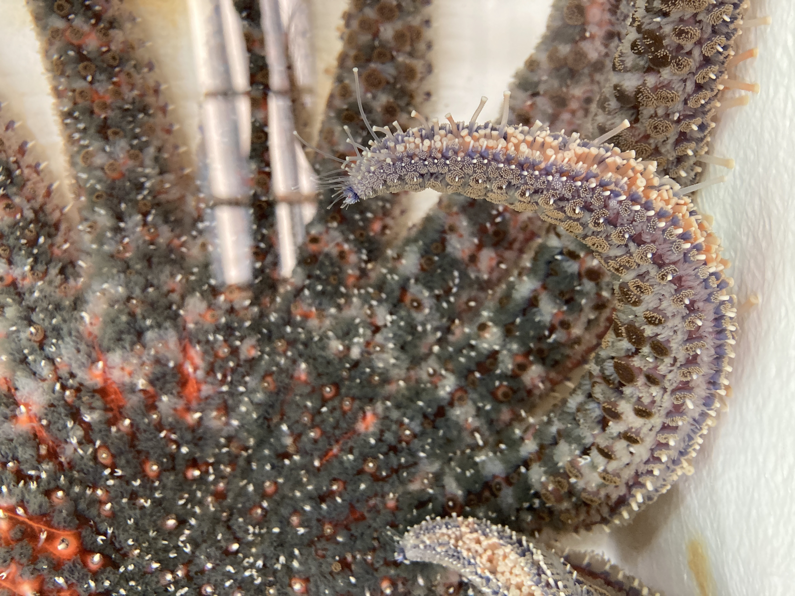

Had an amazing week last week! See post for details!

## Eelgrass Workshop
For the past year+ I've been fortunate to be part of an awesome team of folks working on an NSF Grant studying Eelgrass Wasting Disease, mostly centered in the Puget Sound/San Juan Islands, but also spanning along the West Coast. We had a great worksop pre-WSN where we chatted about the various aspects of the grant that folks have been working on and made plans and outlines for writing up the various projects. It was a great time and I'm looking forward to all the cool stuff coming up - keep an eye out!

Here's the team!

Dr. Lindsay Alma, Dr. Colleen Burge, Dr. Drew Harvell, Dr. Eileen Hoffman, Dr. Maya Groner, Me, Dr. Becca Maher, and Dr. Olivia Graham!

## WSN, Monterey, CA
I haven't been to a conference since the Alaska Marine Science Symposium in Anchorage, AK, January 2020... so it was a little nerve-wracking to head to my first one in so long! It was amazing, though! So much cool science, so many interesting and engaging talks and posters, and I had so much fun. Made some new connections that I'm excited to foster.

Dr. Olivia Graham did an amazing job putting together THREE Marine Disease Ecology sessions!! There were two sessions on Saturday - an eelgrass session during which a lot of the team pictured in the above section presented amazing work, and a miscellaneous section that had some great talks as well.

I was part of the Sunday morning session that was all about _Pycnopodia helianthoides_! Below is a photo of everyone who presented. My talk went well - I ended up getting Honorable Mention for it!

Dr. Lauren Schiebelhut, Dr. Jason Hodin, Dr. Alyssa Gehman, Me, Dr. Melanie Prentice, Tiffany Rudek, Dr. Drew Harvell, and Dr. Olivia Graham.

For fun, here's a pretty photo of one of our adult _Pycnopodia helianthoides_ from our Summer 2021 work that made many appearances in my talk:   

