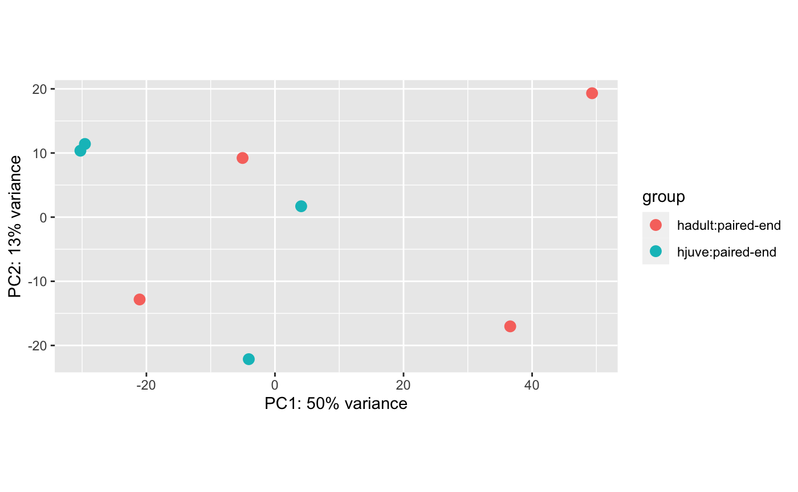
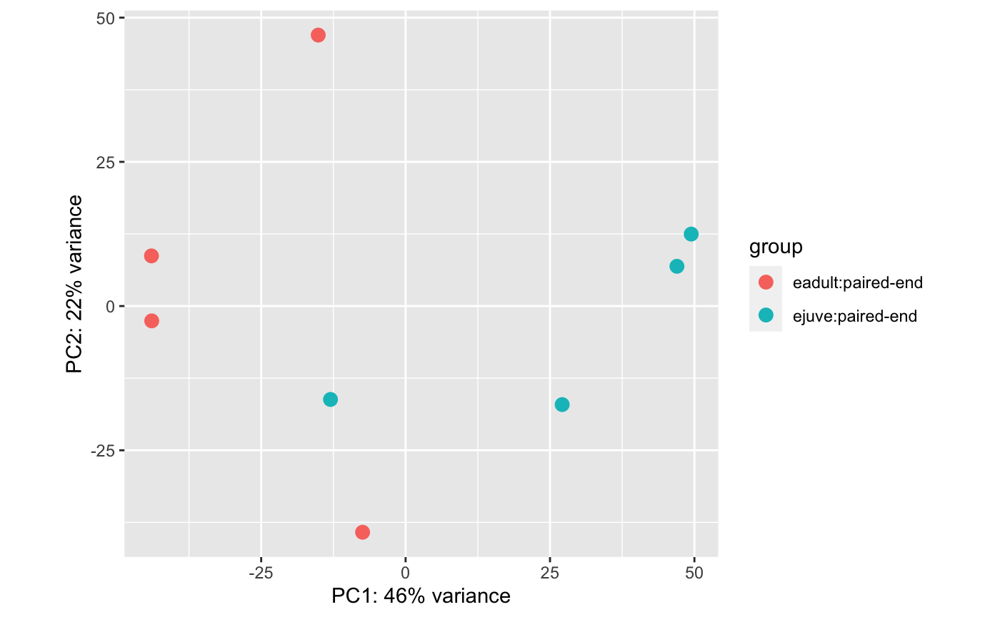

In preparation for tomorrow's lab meeting, this post will include code and figures of making plots. PCA plots comparing different groups of RNA sequence data from Summer 2022 _Pycnopodia helianthoides_ Sea Star Wasting Disease challenge experiments.

## Summer 2022 Data

Up until this point, for Summer 2022 Data I have:
1. Run QC
2. Trimmed

Moved trimmed data from Mox to Raven so I can run `kallisto`.
```
rsync --archive --progress --verbose graceac9@mox.hyak.uw.edu:/gscratch/srlab/graceac9/analyses/pycno/20231101_PSC2022_trimming/*fq.gz /home/shared/8TB_HDD_02/graceac9/data/pycno2022
```

I pseudoaligned the trimmed reads to the 2015 Up in Arms Phel transcriptome using `kallisto` on Raven: [/code/03-kallisto-summer2022.Rmd](https://github.com/grace-ac/project-pycno-sizeclass-2022/blob/main/code/03-kallisto-summer2022.Rmd)

Output went in: [/grace-ac/project-pycno-sizeclass-2022/analyses/Kallisto/2015Phel_transcriptome](https://github.com/grace-ac/project-pycno-sizeclass-2022/tree/main/analyses/Kallisto/2015Phel_transcriptome)

I then used this Rmd to create two PCA plots: [/code/04-deseq2-summer2022.Rmd](https://github.com/grace-ac/project-pycno-sizeclass-2022/blob/main/code/04-deseq2-summer2022.Rmd)

Plots:

4 healthy adults at Day 0 compared to 4 healthy juveniles at day 0:      



4 exposed adults after one arm has dropped compared to 4 exposed juveniles after one arm has dropped:      

