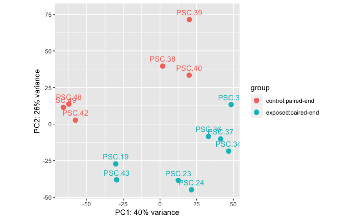
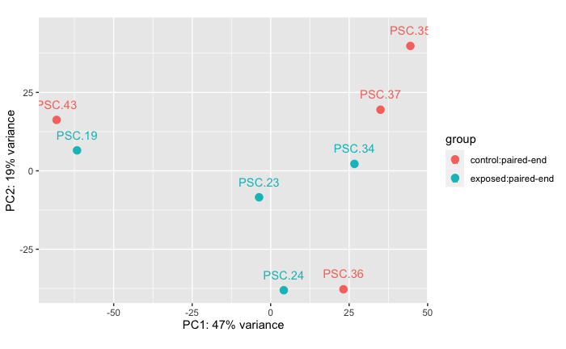
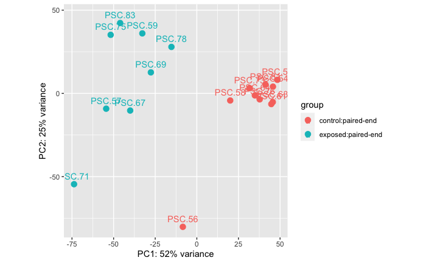
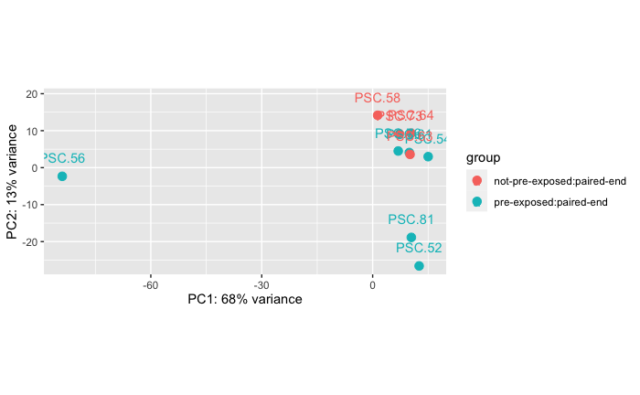

I didn't post ANYTHING in January 2024, so here's a summary post about what I did! The first 5 weeks of 2024 summarized briefly below.

# Week 1: January 1-5
## Conference: Society for Integrative and Comparative Biology, Seattle, Jan 2-6, 2024

This was my first time attending SICB and it was AMAZING and overwhelming. There were so many concurrent sessions and so many cool talks that I found myself feeling a bit stressed when I realized there was no way I'd get to see everything I wanted to. But I still had a great time and learned a lot. I hope I get to go to the next one in January 2025 in Atlanta, and if I do, I'll plan my days out a bit better to get the most out of it now that I know how big it is.

I presented on the Thursday, January 4th at 8:30am. At first I was glad for that time slot because I'd be able to get it out of the way and relax and learn and listen the rest of the day, but when it came time to present I was a little bummed because not many folks made it to the early morning talks. I still had a good time and it was great practice.

Here's a link to my slides that I presented: [grace-ac/presentations/2024/Crandall_SICB_2024.pdf](https://github.com/grace-ac/presentations/blob/main/2024/Crandall_SICB_2024.pdf). I shared newer results from Summer 2022 experiments and with the gene list FASTA from the recently published _Pycnopodia helianthoides_ genome ([Schiebelhut _et al_ , 2024](https://watermark.silverchair.com/esad054.pdf?token=AQECAHi208BE49Ooan9kkhW_Ercy7Dm3ZL_9Cf3qfKAc485ysgAAA28wggNrBgkqhkiG9w0BBwagggNcMIIDWAIBADCCA1EGCSqGSIb3DQEHATAeBglghkgBZQMEAS4wEQQMoONq6Uno6lY3XYfIAgEQgIIDImg2eAQS0Zr1gpMZfiBhIHDgVPyLXLlSN5IbLCzumMGCnEIfLzIAqHYruOU8GusGviPmpjp3WhCiLgG_h6wJBdrKUerJdvAda1x_2juNi8CDbLVDjp5HcXTu1oszxDC78NHvGNcz20SEfB3B1m8Q-fs5LhhdBILQNbnChCqjmgSgnfwqHAE_BtjFowSfDv0YvBrVAql81Tq9HmzuV__s6K8Kkv8qk4PuIRUiiLdYV7yjL2pgt12ALnx98rsUxqfTw_crLSDUNrqXhNULg7H3pAmxrvrirhvQO2gudi_WaYME9RB6se3tzxUAumgjGbN0-U2qDRqfyjP9XJ43F-IQ0lTR0BBzqd7rrcka0QxGEjfFE8ZNVKtO0NormlkRivWimc3KEWwi2Or4_w5h9ziaGiXNxriI2JQNJzDpAvWTCq-JlX1h4bZYEeiQQ0K4HZonvUHmqYKpez_hJ-eNAfLmFO2iBcTw2U38A79vzf5ekckN2eH6bsncsArp3GEhL16ofUaWvLyztjz0-A4v6TblGaQiM22o9CpuoqBENXqQ6l4G_u8KB8pvaF0V8KJZ3OZzfnuttyOoJToDrtbmxGCtrupEmfRzeSDKHvBpw6FEgFbQ4G1QQmKgoCBrWaoZPww8Hc4srZOruwWldmwawCX4z1B3T6xzjGjK3sbGpsvLd0XLAa5AQMIQ5wLdpYGNWh7iyHfBnSJ1CtBjRONfjZ5_ZD_FeB-p9fzwl63PJ1oldWlYjNjZbOozoxOBkYV9IbejTLdnRVdng42UDorbL6vaRZw86FoDIFUYoAvGw1J7P0vrly-f3wAUKm-avWxO141x90ZQMy3la7D7O1Rps5cBjac2m99j9NSbOwBCDbvAvZtuFyICHY_7vI2cCfI2Cg4BCqwzMEiXpMZ7B3QuCyWuTAKuSQgKCnTwhhhBySxIDz0w1oFTTUAjd0EimxHdIssaBFzImJ2kPl5IqgImbt3aXC_XDfTbV_cuaSYTgtUjXE3qmGY6SCAI8em_QWv9ZS588ZS_Dcb4X6CxOeHFThmQ11lWSfxb0D6quv25z1Bh27J7d8k) - note, access to the genome was available September 2023 ahead of the publication).

# Week 2: January 8-12
## Prep for _Pycnopodia_ Recovery Working Group Meeting Jan 12th

This week was back to a bit of normal, with an added component of preparing for the _Pycnopodia_ Recovery Working Group meeting on January 12th. Melanie and I got slots to share our updates during the 1 hour big team meeting, so we both worked hard to condense everything we'd done and all the cool next steps into 7 minutes, which was daunting, but we did it!

Some other things I did that weren't directly related to analyses and prep for the Friday meeting were:     
- Image organization and labeling from Summer 2023 sea star wasting disease experiments (we took photos at least once/day of each star over the entire summer, and we have close to 200 stars...)
- Class attendance and reading - Ocean 530 - Oceanography course taught by Bob Morris from the Oceanography department on Marine Viruses, Archaea, and Bacteria

# Week 3: January 15-19
This week was all about organization and making sure my workflows are correct and clean.

I went through metadata logs for samples taken over the past three summers and corrected issues. I continued image organization and labeling. I created GitHub repositories for the different sea star wasting disease project datasets I am and will be working with:

[project-pycno-sswd-2021](https://github.com/grace-ac/project-pycno-sswd-2021)      
Comparing adult exposed and adult control _Pycnopodia helianthoides_ gene expression when exposed to tissue homogenate from a sick adult _Pycnopodia helianthoides_

[project-pycno-sizeclass-2022](https://github.com/grace-ac/project-pycno-sizeclass-2022)    
Comparing adult exposed and control _Pycnopodia helianthoides_ and juvenile exposed and control _Pycnopodia helainthoides_. Reason for adding in juveniles is because of anecdotal field-based observations that they might be resistant as they are never or rarely seen wasting... and if there isn't a difference between adults and juveniles, we'd be able to use juveniles in future experiments and increase our replication to create more robust comparisons.

[project-pycno-FHW-2023](https://github.com/grace-ac/project-pycno-FHW-2023)      
Comparing the response to exposure to wasting disease between Friday Harbor reared juvenile _Pycnopodia helianthoides_ and wild juvenile _Pycnopodia helianthoides_

[project-pycno-multispecies-2023](https://github.com/grace-ac/project-pycno-multispecies-2023)    
Comparing the response to exposure to wasting disease between wild juvenile _Pycnopodia helianthoides_, wild _Pisaster ochraceus_, and wild _Dermasterias imbricata_.

[project-pycno-REX-2023](https://github.com/grace-ac/project-pycno-REX-2023)    
Comparing the response to exposure to wasting disease in juvenile _Pycnopodia helianthoides_ who initially didn't waste in their previous experiments, so we re-exposed them with higher dosage to see if they were resistant or if perhaps a titer issue was responsible.

# Week 4: January 22-26
This week is a bit of a continuation of last week's themes of organization and confirming accuracy of datasheets and metadata.

I also attended a meeting of a new group I'm going to be a part of: the disease team for SAFE (Saving Animals From Extinction). I'm really excited to be part of this collaborative group. Our current main goals are to create a case definition for Sea Star Wasting Disease and to create a protocol for assessing health in sea stars. A lot of zoos and aquaria and researchers have different protocols and definitions, so collaborating and working to create something everyone can refer to consistently across groups and organizations seems like a cool idea! I'm excited to be part of this process.

## Eelgrass Spring Work Prep Meeting January 24th
I'll be helping with some field work and experiments up at Friday Harbor for the eelgrass team I'm part of! During this meeting and a meeting I had with post-doc Becca Maher afterwards was all about solidifying goals and dates for my travel up there and the experiments and field work we're hoping to accomplish.

We'll be doing some eelgrass microbiome work both in lab and in the field. I'm excited to get back up there!

# Week 5: January 29- February 2
This week was about even MORE organization and preparation for my February goals (see February Goals post).

## Summer 2021 Work
I shared my metadata for my summer 2021 sea star wasting disease rna sequence libraries to the Roberts Lab to get input on what the best way forward is to make sure I'm looking for the most interesting things as I prepare to write a paper on the work. Slide I shared: [here](https://docs.google.com/presentation/d/14_FHP4g11N_MoNXPvWozMNo9G3oE1h81SFM6mrbOlD8/edit#slide=id.g26740bc1777_0_11), metadata sheet of the libraries: [paper-pycno-sswd-2021/data/sample_metadata.csv](https://github.com/grace-ac/paper-pycno-sswd-2021/blob/main/data/sample_metadata.csv).

As a note moving forward with this data set, there are two experiments: Experiment A, and Experiment B. Experiment A had a start date (and inoculation date) of September 23, 2021. The treatment groups were control (heat-killed tissue homogenate), raw exposed (centrifuged but unfiltered raw tissue homogenate from wasting adult _Pycnopodia helianthoides_), and 0.45um filtered tissue homogenate from that same wasting adult _Pycnopodia helianthoides_. We had trouble with getting any signs of wasting from the 0.45um filtered homogenate treatment, so Experiment B was just comparing control (heat-killed tissue homogenate from a wasting adult _Pycnopodia helianthoides_) and centrifuged but unfiltered raw tissue homogenate from the same wasting adult _Pycnopodia helianthoides_ and that start date (and inoculation) was October 5, 2021.

I made a bunch of PCA plots comparing the different groupings of libraries:       
Code: [paper-pycno-sswd-2021/code/04-PCAplots.Rmd](https://github.com/grace-ac/paper-pycno-sswd-2021/blob/main/code/04-PCAplots.Rmd).

### Experiment A: Stars at Arm Drop Disease Sign vs Healthy   
   

This comparison is between stars that were part of Experiment A. There is an asterisk for these treatment groups because a subset of those stars were exposed to a wasting star on accident in a cohousing situation before the experimental start. So this comparison is ignoring treatment designations and just comparing disease status signs.
Exposed (arm drop): n = 8 samples from 8 stars     
Control (no disease sign): n = 6 samples from 6 stars     
Permanova: 0.001    
**Takeaway**: There is a difference in RNAseq data between stars that have dropped arms/disease signs vs healthy stars.

### Experiment A: Stars that were exposed to a wasting star from the field VS stars injected with raw tissue homogenate     
   

This comparison is between the stars that were part of Experiment A, some of which were accidentally co-housed with a star wasting from our field collection before we understood that that was a problem! This comparison is to see if there's a difference in RANseq data between sort of field-exposed stars vs lab-exposed stars. The "control" stars are stars that had the same disease sign (arm drop) as the co-housed exposed stars, but were injected with unfiltered tissue homogenate from sick _Pycnopodia helianthoides_.

Exposed: n = 4 samples from 4 stars     
Control: n = 4 samples from 4 stars    
Permanova: 0.408   
**Takeaway** There is no significant difference between the RNAseq data from stars wasting from exposure to co-housing with a wasting _Pycnopodia helianthoides_ collected from the field vs stars wasting from exposed to injection with an unfiltered tissue homogenate from a wasting adult _Pycnopodia helianthoides_.

### Experiment B: Controls vs Exposed

Controls: n = 10 (10 samples from 8 stars, 2 stars have two sample time points)     
Exposed: n = 8 ( samples from 8 stars)    
Permanova: 0.001
**Takeaway**: There is a significant difference in RNAseq data between control adult _Pycnopodia helianthoides_ and adult _Pycnopodia helianthoides_ exposed to sea star wasting disease.

### Experiment B: Controls - Microbial Fraction Exposed (0.45um) vs Not
   

This is comparing the controls from Experiment B. There are two groupings, one set (n=6) that were injected with microbial size fraction 0.45um filtered tissue homogenate from a wasting adult _Pycnopodia helianthoides_ in experiment A that never showed disease signs, and another set (n=2 stars, but 4 RNAseq libraries because the stars were each sampled twice) that were not "pre-exposed" to a microbial size fraction.      
Permanova: 0.016     
**Takeaway**: There is kind of a difference... but I don't know what to really make of it because the not "pre-exposed" stars had an n of 2 stars, but 4 libraries... so the imbalance of this comparison makes me wonder what's really driving the differences here. I can still easily run through the `DESeq2` pipeline and get some gene lists to annotate, but I'm not sure how interesting this comparison is or how statistically sound it is.
