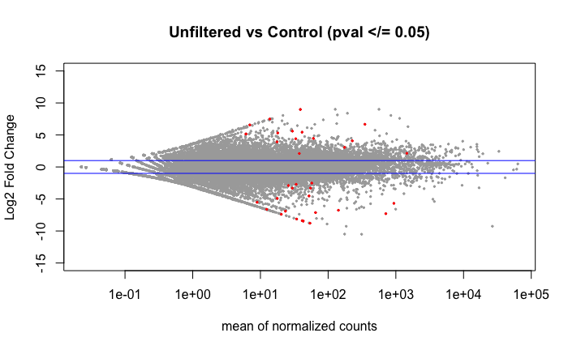

Post with little updates on what I did last week!

# Summer 2021 Work
Did some more PCAs, and `DESeq2` analyses - nothing is annotated yet, though, so this is just looking into differences between treatment groups and disease sign groups preliminarily.

Note:         
For summer 2021 work, we did a bunch of experiments, but I was only able to get enough RNA for sequencing for some samples.

I have RNAseq data for samples that are part of Experiment A and Experiment B. Datasheet for all library metadata from Summer 2021: [grace-ac/paper-pycno-sswd-2021/data/sample_metadata.csv](https://github.com/grace-ac/paper-pycno-sswd-2021/blob/main/data/sample_metadata.csv).

**Experiment A** began on 9/23/2021. Stars were injected with either 0.45micron filtered live tissue homogenate from a wasting star (microbial group), heat-killed tissue homogenate from a wasting star (control group), or unfiltered live tissue homogenate from a wasting star (exposed group). Stars were observed 2x daily and sampled at disease sign along with control pair. The RNAseq data timeline control and exposed groups are not balanced due to lack of sufficient RNA for sequencing for some samples. Comparisons made for those libraries are shared below under the title "Experiment A".

**Experiment B** began on 10/05/2021. Stars were injected with heat-killed tissue homogenate from a wasting star (control group) or unfiltered live tissue homogenate from a wasting star (exposed group). Some of the control stars in this experiment were previously injected with the 0.45micron filtered live tissue homogenate in Experiment A but never showed any disease signs, and so they became part of the control group. They continued to remain disease-sign free throughout the remainder of Experiment B. Comparisons made between libraries from Experiment B are shared below under the title "Experiment B".

## Experiment A:

| library_ID | star_ID | previous_exposure | treatment      | sample_date | experiment_day | disease_sign |
|------------|---------|-------------------|----------------|-------------|----------------|--------------|
| PSC.19     | H16     | tank_exposure     | na             | 9/23/21     | na             | armdrop      |
| PSC.23     | H15     | tank_exposure     | control        | 9/26/21     | 3              | armdrop      |
| PSC.24     | E13     | tank_exposure     | 0.45live       | 9/27/21     | 4              | armdrop      |
| PSC.34     | H12     | tank_exposure     | 0.45live       | 10/2/21     | 9              | armtwist     |
| PSC.35     | E05     | na                | unfilteredlive | 10/2/21     | 9              | armdrop      |
| PSC.36     | E04     | na                | unfilteredlive | 10/2/21     | 9              | armdrop      |
| PSC.37     | E01     | na                | unfilteredlive | 10/2/21     | 9              | armdrop      |
| PSC.38     | E12     | na                | 0.45live       | 10/2/21     | 9              | na           |
| PSC.39     | H05     | na                | control        | 10/2/21     | 9              | na           |
| PSC.40     | H04     | na                | control        | 10/2/21     | 9              | na           |
| PSC.42     | H03     | na                | control        | 10/3/21     | 9              | na           |
| PSC.43     | E02     | na                | unfilteredlive | 10/3/21     | 10             | armdrop      |
| PSC.48     | E14     | na                | 0.45live       | 10/7/21     | 12             | na           |
| PSC.49     | E16     | na                | 0.45live       | 10/7/21     | 12             | na           |

### Armdrop Vs. Healthy
Library PSC.19 is from a star that had a shared exposure in a co-housing tank situation with PSC.23, PSc.24, and PSC.34... it did not survive to make it to Experiment A, but because it has the same exposure history as those three libraries that WERE included in Experiment A... I perhaps weirdly decided to include this library in the below preliminary comparison.

    

PERMANOVA: 0.001.
PCA showing significant difference in RNAseq data between stars that were sampled at arm drop disease sign compared to stars that were healthy at sampling.

Note: PERMANOVA performed in R code: [grace-ac/paper-pycno-sswd-2021/code/04-PCAplots.Rmd](https://github.com/grace-ac/paper-pycno-sswd-2021/blob/main/code/04-PCAplots.Rmd), lines 240-274.

      

Volcano plot of the 4,093 DEGs found using `DESeq2` when comparing the libraries shown above in the PCA.

### Control Vs. Unfiltered Live

      

PERMANOVA: 0.222
PCA showing that there is no difference in RNAseq data between stars in treatment of heat-killed tissue homogenate compared to stars injected with unfiltered live tissue homogenate. I don't think this result is due to the treatment groups, but rather due to their exposure history where PSC.23 was cohoused with the tank outbreak.

Note: PERMANVA performed in R code: [grace-ac/paper-pycno-sswd-2021/code/04-PCAplots.Rmd](https://github.com/grace-ac/paper-pycno-sswd-2021/blob/main/code/04-PCAplots.Rmd), lines 319-348.

     

Volcano plot of the 36 DEGs found using `DESeq2` when comparing the libraries by treatment group as shown in the above PCA.

### Control Vs. 0.45 micron filtered (microbial fraction)

     

PERMANOVA: 0.846.     
PCA showing that there is no significant difference in RNAseq data between libraries that are from stars treated with a 0.45 micron filtered live tissue homogenate and the control group (heat-killed tissue homogenate).

     
Volcano plot of the 4 DEGs found using `DESeq2` when comparing the libraries by treatment group as shown in above PCA.

### Unfiltered live sick tissue homogenate Vs. 0.45 micron filtered sick tissue homogenate (microbial fraction)

     

PERMANOVA: 0.367.   
PCA showing that there is no significant differences in RNAseq data between libraries from stars injected with unfiltered tissue homogenate from a sick star when compared to stars injected with 0.45 micron filtered tissue homogenate from a sick star. Note: I don't know that the treatment groups are driving these results, but more likely the fact that TWO of the five stars in the 0.45 micron treatment were cohoused in an accidental exposure event to a wasting star from the field.

    

No significant DEGs were found. Again, I think this is due to the cohousing tank exposure that occurred for 2/5 of the 0.45 micron filtered treatment group.

## Take-aways from **Experiment A** Comparisons:

I think the previous tank exposure that occurred for several of these stars makes it so that we can't say much about how the experimental treatment impacted their gene expression. But, I do think that comparing based on disease sign and how that gene expression compares to Experiment B could be interesting.

## Experiment B:
| library_ID | star_ID | previous_exposure           | treatment         | sample_date | experiment_day | disease_sign |
|------------|---------|-----------------------------|-------------------|-------------|----------------|--------------|
| PSC.56     | E06     | 0.45 live inoculate 9/23/21 | control (10/5/21) | 10/14/21    | 9              | NA           |
| PSC.52     | E11     | 0.45 live inoculate 9/23/21 | control (10/5/21) | 10/14/21    | 9              | NA           |
| PSC.54     | E18     | 0.45 live inoculate 9/23/21 | control (10/5/21) | 10/14/21    | 9              | NA           |
| PSC.61     | E09     | 0.45 live inoculate 9/23/21 | control (10/5/21) | 10/15/21    | 10             | NA           |
| PSC.64     | H05     | NA                          | control (10/5/21) | 10/15/21    | 10             | NA           |
| PSC.73     | H03     | NA                          | control (10/5/21) | 10/16/21    | 11             | NA           |
| PSC.76     | E10     | 0.45 live inoculate 9/23/21 | control (10/5/21) | 10/17/21    | 12             | NA           |
| PSC.81     | E07     | 0.45 live inoculate 9/23/21 | control (10/5/21) | 10/18/21    | 13             | NA           |
| PSC.59     | H01     | NA                          | exposed (10/5/21) | 10/14/21    | 9              | armtwist     |
| PSC.57     | H06     | NA                          | exposed (10/5/21) | 10/14/21    | 9              | armdrop      |
| PSC.69     | H04     | NA                          | exposed (10/5/21) | 10/15/21    | 10             | armdrop      |
| PSC.67     | H09     | NA                          | exposed (10/5/21) | 10/15/21    | 10             | armdrop      |
| PSC.71     | H18     | NA                          | exposed (10/5/21) | 10/15/21    | 10             | armdrop      |
| PSC.75     | H08     | NA                          | exposed (10/5/21) | 10/16/21    | 11             | armdrop      |
| PSC.78     | H10     | NA                          | exposed (10/5/21) | 10/17/21    | 12             | armdrop      |
| PSC.83     | H07     | NA                          | exposed (10/5/21) | 10/18/21    | 13             | armcross     |

# Summer 2023 Multi-Species Planning
I'll be extracting RNA from samples from the 6 exposed bins, each with a wild juvenile _Pycnopodia helianthoides_, wild _Pisaster ochraceus_ and wild _Dermasterias imbricata_, from Day 12 of the multi-species experiment. That will be n=18 samples that will (provided there's enough RNA) be sent of for total RNA-sequencing.

This time point was selected because it will be a good starting point that will capture a lot of information that will help answer multiple questions.

# Summer 2023 Image Organization
I finally finished uploading, labelling, and organizing all the photos I took of the stars from Summer 2023 experiments! Woo!

# Other
Starting the process of re-vamping my website/notebook! Making it pretty, updating project details, links, etc.
