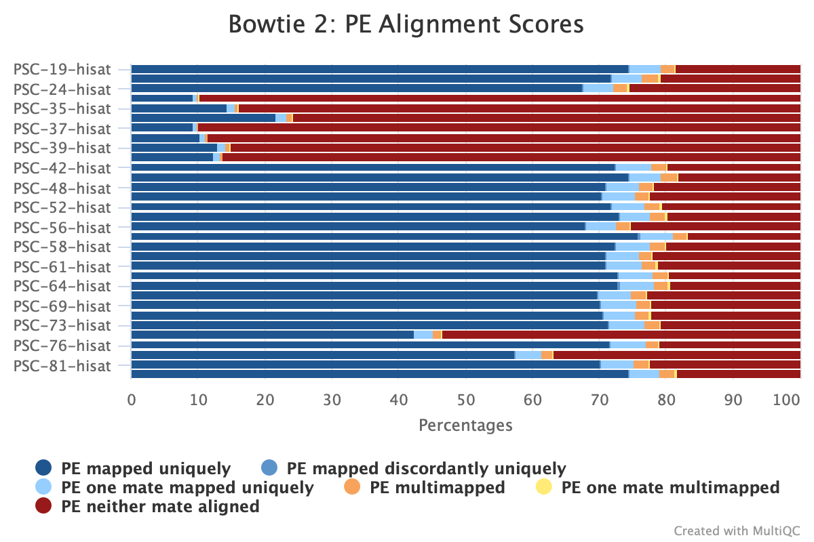
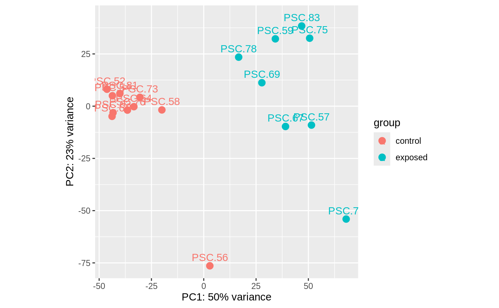
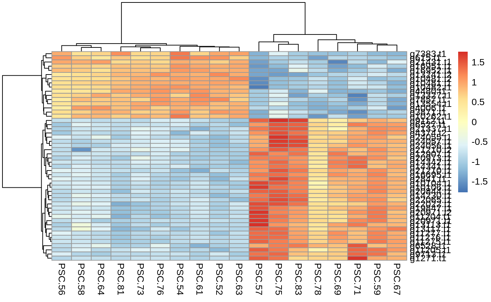
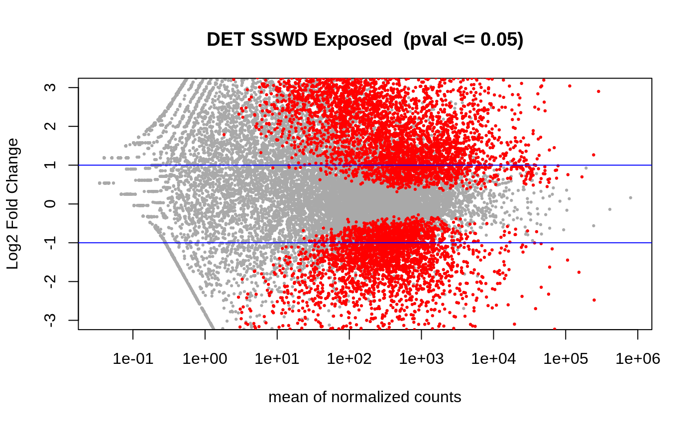
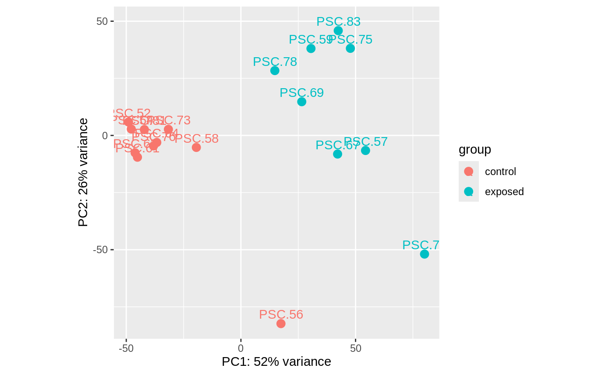
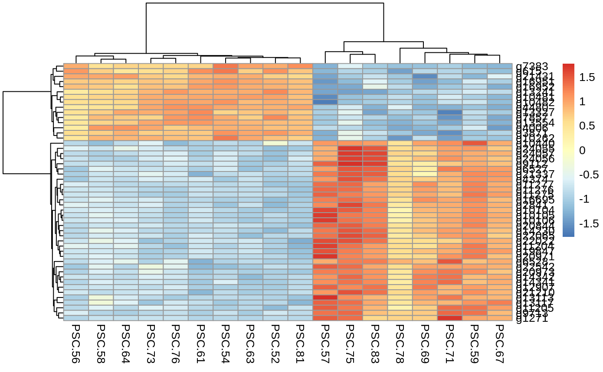
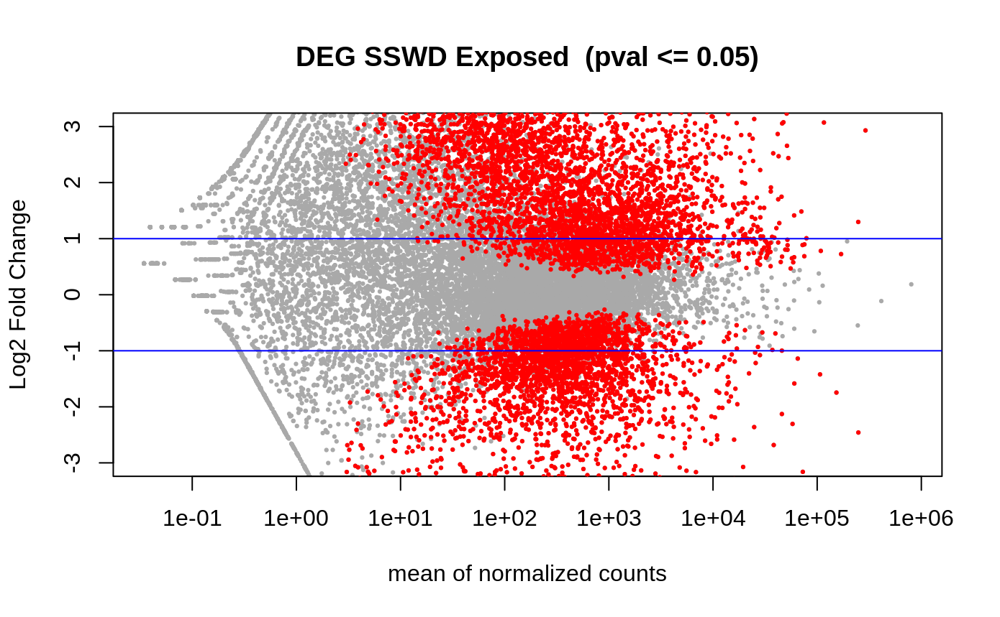

Details about the process of taking raw RNAseq data to differentially expressed gene and transcript lists for Summer 2021 Experiment B.

# Experiment B Background
Summer of 2021, wild caught adult sunflower stars (_Pycnopodia helianthoides_) were placed in individual bins, each with their own flow through water (11C) and air bubbler. They were quarantined, and the ones that remained disease-sign free were used in the experiment.

One adult _P. helianthoides_ that was wasting was collected from the wild to act as our disease source.

On October 5, 2021, a tissue homogenate was made of the wasting _P. helianthoides_ by blending with an emersion blender several different tissue types and seawater from its tank. The homogenate was spun down to pellet larger tissue debris, and the supernatant was used as an inoculate.

Half of that homogenate was injected into our exposed stars (n=8), and then the other half was heat-killed in a boiling water bath, and then injected in our control stars (n=8).

At the sign of arm-drop for 6/8 of the exposed stars, the star was sampled for coelomocytes along with it's control pair. There were two exposed stars that were sampled pre-arm drop, one at arm twist, and one at arm cross. THere were two control stars that were sampled at two time points.

The coelomocytes were collected using a 1ml syringe and 26G needle, then spun down to pellet the cells. The supernatant was removed, and the cells were preserved with RNAlater and stored in -80C until processing.

## Sample processing
RNA was extracted from the cells using Zymo Research Quick DNA/RNA Microprep Plus Kit (D7005). The RNA was sent off for total RNA poly-A tail RNAseq at Azenta (fka Genewiz), and raw reads were sent to us.

# Raw RNAseq Data Processing
Goal: Get a list of differentially expressed genes and transcripts comparing the exposed and control stars.

## Repository:     
[grace-ac/paper-pycno-sswd-2021-2022](https://github.com/grace-ac/paper-pycno-sswd-2021-2022)

## Code:     
[paper-pycno-sswd-2021-2022/code/03-hisat2-summer_2021_2022.Rmd](https://github.com/grace-ac/paper-pycno-sswd-2021-2022/blob/main/code/03-hisat2-summer_2021_2022.Rmd)   
Note: this code is gross and messy and I don't really like it even though it works... so I'll probably re-do this whole process in a new R markdown file and will come back and link it in this section.

Code is based on examples that Steven Roberts has done:     
- [https://sr320.github.io/tumbling-oysters/posts/sr320-20-seastar/](https://sr320.github.io/tumbling-oysters/posts/sr320-20-seastar/)   
- [https://sr320.github.io/tumbling-oysters/posts/sr320-14-coddet/](https://sr320.github.io/tumbling-oysters/posts/sr320-14-coddet/)  

## Analyses output:     
... Due to a wild number of files... I ended up putting the whole `analyses/03-hisat2` folder into gitignore... which was maybe a bad idea... but they're in there... I'll figure that out.

# Overall procedure:

# Raw Data QC and Trim
## 1. Transfer the raw RNAseq data from the sequencer's servers to Roberts Lab
### Download all RNAseq and checksum files

### Move data to OWL        

#### A. `rsync` data to `owl/nightingales/P_helianthoides`


```
rsync --archive --progress --verbose PSC*.fastq.gz <owl username>@128.95.149.83:/volume1/web/nightingales/P_helianthoides/
```      
Replace <owl_username_> with whatever username you use to login to owl (even replace the < and the >).

#### B. `rsync` checksums to OWL on commandine:    

##### B.1 `ssh` into owl:

```
ssh username@owl.fish.washington.edu
```

Will be prompted for password

##### B.2 Navigate to folder you want to work in, in my case: `owl/nightingales/P_helianthoides`

##### B.3 Put below code in and hit ENTER:
```
for fastq in PSC*.fastq.gz
do
  md5sum "${fastq}" >> checksums.md5
  echo "Generated checksum for ${file}."
  echo ""
done
```

All RNAseq data and checksums are now in [`owl/nightingales/P_Helianthoides`](http://owl.fish.washington.edu/nightingales/P_helianthoides/)     

# 2. QC Untrimmed Data
## Untrimmed Data Quality Check Part I: FASTQC
### A. Get FastQC if you want to run on your laptop
https://www.bioinformatics.babraham.ac.uk/projects/download.html#fastqc

### B. Get .fastq.gz files from OWL onto Raven
i. `ssh` into Raven using credentials in command line
ii. Make a directory for all PSC .fastq.gz files (made one called `pycnornaseq` in my `graceac9@raven`)

### C. Then move files from OWL to `pycnornaseq` directory in Raven:

a. Have Husky OnNet App (BIG-IP Edge Client in Applications folder after downloaded)        
b. Log in with UW credentials         
c. Put RStudio IP into browser         
d. Log in using Raven Credentials         
e. `cd` into `pycnornaseq/` and run:        
```
wget -r --no-directories --no-parent  -A "PSC*" https://owl.fish.washington.edu/nightingales/P_helianthoides
```

### D. Get into RStudio on Raven to run FASTQC:
Follow the steps a-d in Step 3 above.

Then, follow the code outlined in this script: [scripts/01-FastQC_pre-trim.Rmd](https://github.com/grace-ac/project_pycno/blob/main/scripts/01-FastQC_pre-trim.Rmd)      

The FASTQC files are saved on Raven: `/home/shared/8TB_HDD_02/graceac9/analyses/pycno/`


## Untrimmed Data Quality Check Part II: MultiQC
In the terminal of the same RSstudio project used in part C of section 3, run:     
```
eval "$(/opt/anaconda/anaconda3/bin/conda shell.bash hook)"
conda activate
```

Then navigate into the directory where the FASTQC output lives, in this case: graceac9@raven:~/analyses/pycno$, then run:    
```
multiqc .
```
To view the report, transfer the .html report to Gannet or Owl, then you can view the .html report on your own browser.

I moved the untrimmed MultiQC report to Owl:     
REPORT: [pycno_2021/multiqc/multiqc_report.html](http://owl.fish.washington.edu/scaphapoda/grace/pycno_2021/multiqc/multiqc_report.html)


# 3. Trim RNAseq Data
## A. `rsync` RNAseq data (fastq.gz) from `nightingales` to `/gscratch/srlab/graceac9/data/pycno/RNAseq`        
i. navigate into `/nightingales/P_helianthoides` in command line on Owl       
ii. Copy in code: `rsync —archive —progress —verbose PSC*.fastq.gz  graceac9@mox.hyak.uw.edu:/gscratch/srlab/graceac9/data/pycno/RNAseq`         
iii. You'll be prompted for Mox password and then a second authentification, then you'll be good to go.     

Takes ~ 2 hours for 32 libraries.

## B. Add .sh script to my /gscratch/srlab/graceac9/jobs directory on Mox --> here's what I have based on [Sam's script](https://raw.githubusercontent.com/RobertsLab/sams-notebook/master/sbatch_scripts/20210714_cvir_gonad_RNAseq_fastp_trimming.sh): [code/02-20220809_pycno_fastp.sh](https://raw.githubusercontent.com/grace-ac/project_pycno/main/code/02-20220809_pycno_fastp.sh?token=GHSAT0AAAAAABWSNKWLMPAMQE4VEQ3JGB5IYXT5RBQ)     
i. navigate to `/gscratch/graceac9/jobs`, type `nano 20220810_pycno_fastp.sh`, then paste in code for 20220810_pycno_fastp.sh, and save. Typing `nano 20220810_pycno_fastp.sh` creates the .sh file and allows you to name it at the same time.

## C. Run the job. Navigate into `/gscratch/srlab/graceac9/jobs`, then run `sbatch 20220810_pycno_fastp.sh` and it will put output into `/gscratch/srlab/graceac9/analyses/pycno/20220810_PSC2021_trimming`  
job submitted at 17:35, 20220810         
Check job status by running: `squeue | grep "srlab"`          
Also, you should get an email at start time and end, as well as any errors occur.      
Run time: 2:21:56

The output will be that each library has 4 files:      
PSC-##_R1_001.fastq.gz.fastp-trim.20220810.fq.gz        
PSC-##_R1_001.fastq.gz.fastp-trim.20220810.report.html       
PSC-##_R1_001.fastq.gz.fastp-trim.20220810.report.json        
PSC-##_R2_001.fastq.gz.fastp-trim.20220810.fq.gz

Where `##` is the library number. Since they're paired end, the reports (report.html and report.json) contain info for both sets of reads (note from Sam White).

# 4. QC Trimmed Data
Move the multiqc report to OWL where the other one lives, but add the date and that it's for trimmed data.

REPORT for trimmed data: [scaphapoda/grace/pycno_2021/multiqc/trimmed/multiqc_report.html](http://owl.fish.washington.edu/scaphapoda/grace/pycno_2021/multiqc/trimmed/multiqc_report.html)

# Alignment (`HISAT2`) ([code](https://github.com/grace-ac/paper-pycno-sswd-2021-2022/blob/main/code/03-hisat2-summer_2021_2022.Rmd))  
1. Get all the files you need
  a. Genome
  b. Genome annotation files
  c. Trimmed and QC'ed sequence reads
2. Get exon and splice sites from the gtf of the genome
3. Create index
4. Align reads to genome
5. Result --> a bunch of sam files

# Count Matrices (`STRINGTIE`) ([code](https://github.com/grace-ac/paper-pycno-sswd-2021-2022/blob/main/code/03-hisat2-summer_2021_2022.Rmd))
1. Convert sam files to bam files
2. Use a python code chunk to run `stringtie` to get a gene count matrix and a transcript count matrix
  2a. Gene count matrix: [paper-pycno-sswd-2021-2022/data/gene_count_matrix.csv](https://github.com/grace-ac/paper-pycno-sswd-2021-2022/blob/main/data/gene_count_matrix.csv)    
  2b. Transcript count matrix: [paper-pycno-sswd-2021-2022/data/transcript_count_matrix.csv](https://github.com/grace-ac/paper-pycno-sswd-2021-2022/blob/main/data/transcript_count_matrix.csv)


Here's a MuliQC report figure of the alignment of the 32 libraries to the _P. helianthoides_ genome:    

  


# Differential Expression of Genes and Transcripts (`DESEQ2`)([code](https://github.com/grace-ac/paper-pycno-sswd-2021-2022/blob/main/code/03-hisat2-summer_2021_2022.Rmd))  

Figure descriptions:   

1. PCAs --> show relation of data to each other. Grouped by control or exposed status. If no overlap, then the two treatments create a difference in the animals.
2. Heatmaps --> of the top 50 differentially expressed transcripts or genes. each row is a gene or transcript, each column is one of the samples. The more red the gene or transcript, the more highly expressed it is, the more blue, the less expressed. The cladograms group genes/transcripts and samples by relatedness.
3. Volcano plots --> plot the differentially expressed genes/transcripts. THe lines are the fold change, and the red means they are differentially expressed.

## Transcripts of Experiment B   

### PCA of the transcript counts for all libraries from Experiment B:    
     

### Heatmap of the top 50 differentially expressed transcripts
normalized    




### Volcano plot of the differentially expressed transcripts (n=7849 DETs)  


## Genes of Experiment B   

### PCA of the gene counts for all libraries from Experiment B:



### Heatmap of the top 50 differentially expressed genes    
normalized    



### Volcano plot of the differentially expresssed genes (n=7661 DEGs)   




## Notes on the samples in Experiment B:   
In the PCAs, all controls are in same clump except 56, no clue why.
But, since the repeat control star samples are in the same clump, I guess it doesn't really matter which ones I remove to balance the analyses.

also.... for exposed, two stars were sampled pre arm drop. 59 was at arm twist on day 9, and 83 was at arm cross on day 13. so maybe i'll drop those two as well and just do 6 arm drop vs 6 control.

here are the n=6 control vs n=6 exposed libraries i'll perhaps continue with...? :

| library_ID | treatment_group | experiment_day | disease_sign |
|------------|-----------------|----------------|--------------|
| PSC-52     | control         | 9              | NA           |
| PSC-54     | control         | 9              | NA           |
| PSC-57     | exposed         | 9              | armdrop      |
| PSC-61     | control         | 10             | NA           |
| PSC-64     | control         | 10             | NA           |
| PSC-67     | exposed         | 10             | armdrop      |
| PSC-69     | exposed         | 10             | armdrop      |
| PSC-71     | exposed         | 10             | armdrop      |
| PSC-73     | control         | 11             | NA           |
| PSC-75     | exposed         | 11             | armdrop      |
| PSC-76     | control         | 12             | NA           |
| PSC-78     | exposed         | 12             | armdrop      |


# Next Steps: Annotation and Enrichment
Check back in for my next post soon!
