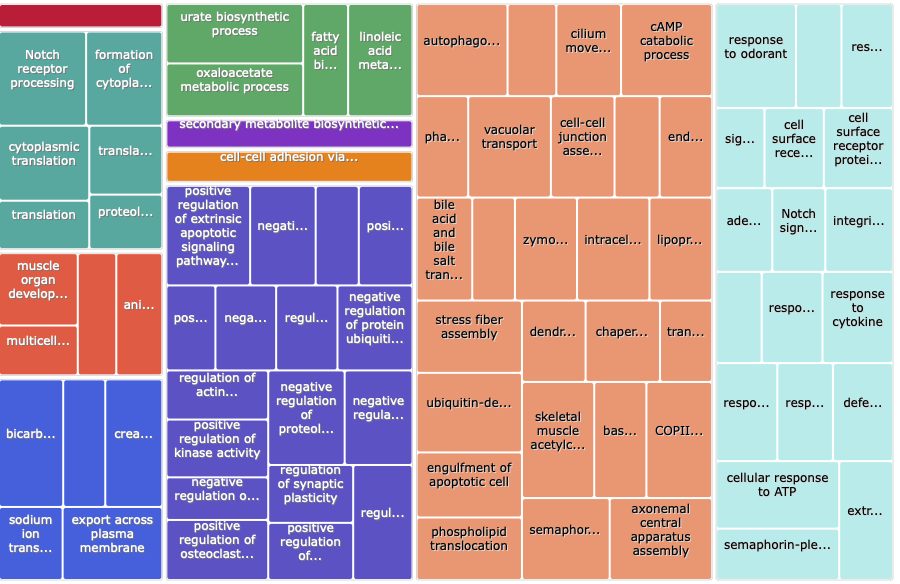
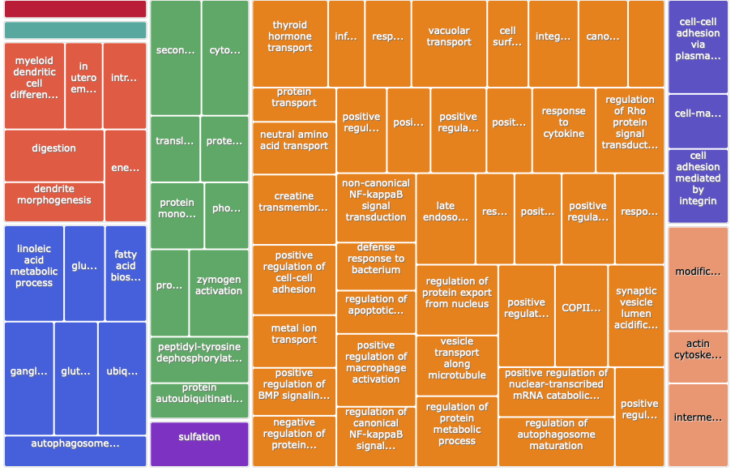

Building off of Wednesday's post: [Sep 18, 2024: Summer 2021 and Summer 2022 Analyses Status](https://grace-ac.github.io/summers2021-2022-analyses-update/). Taking the DEG lists through enrichment (DAVID) and visualization (REVIGO).

# DEG lists    

## Summer 2021 Annotated List:    
[paper-pycno-sswd-2021-2022/data/expB_DEG_DET_lists/DEGlist_8v8_2021_exposedVcontrol_counts_BLAST.tab](https://github.com/grace-ac/paper-pycno-sswd-2021-2022/blob/main/data/expB_DEG_DET_lists/DEGlist_8v8_2021_exposedVcontrol_counts_BLAST.tab)

```
head -3 DEGlist_8v8_2021_exposedVcontrol_counts_BLAST.tab
transcriptID	baseMean	log2FoldChange	lfcSE	stat	pvalue	padj	V2	uniprot_accession_ID	gene	V5	V6	V7	V8	V9	V10	V11	V12	V13	V14	PSC.56	PSC.52	PSC.54	PSC.61	PSC.64	PSC.73	PSC.76	PSC.81	PSC.59	PSC.57	PSC.69	PSC.67	PSC.71	PSC.75	PSC.78	PSC.83
g1746.t1	21.2778018566982	3.21964498222215	0.690679480502186	4.66156165502583	3.13819025114299e-06	3.3222665633176e-05	NA	NA	NA	NA	NA	NA	NA	NA	NA	NA	NA	NA	NA	3	2	2	4	9	10	10	3	5	11	8	30	13	26	12	77
g16359.t1	145.39071642552	-1.29337645882768	0.374317608050989	-3.45529152518921	0.000549698112215063	0.00274886552568119	sp	Q8QGX4	PRKDC_CHICK	41.411	3557	1921	48	106	10569	347	3809	0	2622	371	223	334	161	191	231	355	411	60	30	34	312	87	7	126	30

```

## Summer 2022 Annotated List:    

[paper-pycno-sswd-2021-2022/data/2022_DEG_DET_lists/DEGlist_2022_noage_contrast_counts_BLAST.tab](https://github.com/grace-ac/paper-pycno-sswd-2021-2022/blob/main/data/2022_DEG_DET_lists/DEGlist_2022_noage_contrast_counts_BLAST.tab)

```
head -3 DEGlist_2022_noage_contrast_counts_BLAST.tab
transcriptID	baseMean	log2FoldChange	lfcSE	stat	pvalue	padj	V2	uniprot_accession_ID	gene	V5	V6	V7	V8	V9	V10	V11	V12	V13	V14	PSC.0228	PSC.0187	PSC.0188	PSC.0174	PSC.0190	PSC.0231	PSC.0230	PSC.0219	PSC.0177	PSC.0186	PSC.0209	PSC.0203
g16359.t1	99.1727692502009	-0.907015523910786	0.317377350886998	-2.85784578318486	0.00426527631352983	0.016532402993508	sp	Q8QGX4	PRKDC_CHICK	41.411	3557	1921	48	106	10569	347	3809	0	2622	43	81	83	46	29	72	291	92	83	193	166	173
g21290.t1	9.66291541993617	2.48401700624149	0.954169968115785	2.60332759282575	0.00923236895244479	0.0311189161798707	NA	NA	NA	NA	NA	NA	NA	NA	NA	NA	NA	NA	NA	60	13	6	0	6	8	13	4	7	0	0	3

```

# [DAVID](https://david.ncifcrf.gov)
Background for both analyses is the list of uniprot accession IDs from the blast output of the genome gene list. [paper-pycno-sswd-2021-2022/analyses/16-blast-annotation/blast_out_sep.tab](https://github.com/grace-ac/paper-pycno-sswd-2021-2022/blob/main/analyses/16-blast-annotation/blast_out_sep.tab)

## Summer 2021
GO_BP_DIRECT list:  
[paper-pycno-sswd-2021-2022/analyses/09-DAVID/2021_DAVID_output](https://github.com/grace-ac/paper-pycno-sswd-2021-2022/blob/main/analyses/09-DAVID/2021_DAVID_output)

## Summer 2022
GO_BP_DIRECT list:     
[paper-pycno-sswd-2021-2022/analyses/09-DAVID/2022-DAVID_output_noage_contrast](https://github.com/grace-ac/paper-pycno-sswd-2021-2022/blob/main/analyses/09-DAVID/2022-DAVID_output_noage_contrast)

# [REVIGO](http://revigo.irb.hr)

## Summer 2021
Input was the GO IDs from the [2021 DAVID output](https://github.com/grace-ac/paper-pycno-sswd-2021-2022/blob/main/analyses/09-DAVID/2021_DAVID_output), and the values was the fold enrichment values for all terms that had a p-value less than 0.05.

Treemap:    


Treemap .tsv:   
[paper-pycno-sswd-2021-2022/analyses/revigo/2021_Revigo_BP_TreeMap.tsv](https://github.com/grace-ac/paper-pycno-sswd-2021-2022/blob/main/analyses/revigo/2021_Revigo_BP_TreeMap.tsv)

R code for the tree map downloaded from REVIGO:   
[paper-pycno-sswd-2021-2022/analyses/revigo/2021_Revigo_BP_TreeMap.R](https://github.com/grace-ac/paper-pycno-sswd-2021-2022/blob/main/analyses/revigo/2021_Revigo_BP_TreeMap.R)

## Summer 2022   
Input is the GO IDs from the [2022 DAVID output](https://github.com/grace-ac/paper-pycno-sswd-2021-2022/blob/main/analyses/09-DAVID/2022-DAVID_output_noage_contrast)

Treemap:   


Treemap .tsv:   
[paper-pycno-sswd-2021-2022/analyses/revigo/2022_Revigo_BP_TreeMap.tsv](https://github.com/grace-ac/paper-pycno-sswd-2021-2022/blob/main/analyses/revigo/2022_Revigo_BP_TreeMap.tsv)

R code for the tree map downloaded from REVIGO:   
[paper-pycno-sswd-2021-2022/analyses/revigo/2022_Revigo_BP_TreeMap.R](https://github.com/grace-ac/paper-pycno-sswd-2021-2022/blob/main/analyses/revigo/2022_Revigo_BP_TreeMap.R)


# Find out what DEGs are the same between the two datasets:   
At the end of this Rmd: [paper-pycno-sswd-2021-2022/code/18-deseq2_2021_2022.Rmd](https://github.com/grace-ac/paper-pycno-sswd-2021-2022/blob/main/code/18-deseq2_2021_2022.Rmd), I ran:   

```{r}
library(dplyr)
matchdegs <- inner_join(blastdeg2021counts, blastdeg2022counts, by = "transcriptID")
head(matchdegs)
```
4386 DEGs match between the two

DEG list of those that match between the two lists:    
[paper-pycno-sswd-2021-2022/data/DEGlist_2021-2022-matching.tab](https://github.com/grace-ac/paper-pycno-sswd-2021-2022/blob/main/data/DEGlist_2021-2022-matching.tab)

There's a ton of extra columns.... so it's kinda messy.

### DAVID   
DAVID output of the 2021-2022 matching DEGs list with the genome gene list BLAST output uniprot accession IDs as the background: [paper-pycno-sswd-2021-2022/analyses/09-DAVID/2021-2022-matched-DEGs_DAVID_output](https://github.com/grace-ac/paper-pycno-sswd-2021-2022/blob/main/analyses/09-DAVID/2021-2022-matched-DEGs_DAVID_output)


### REVIGO  
Made with GO terms and Fold Enrichment values for all terms with p-value less than 0.05.

Treemap .tsv: [paper-pycno-sswd-2021-2022/analyses/revigo/2021-2022-matchedDEGs_Revigo_BP_TreeMap.tsv](https://github.com/grace-ac/paper-pycno-sswd-2021-2022/blob/main/analyses/revigo/2021-2022-matchedDEGs_Revigo_BP_TreeMap.tsv)

Treemap:   
[here](https://github.com/grace-ac/paper-pycno-sswd-2021-2022/blob/main/analyses/revigo/2021-2022-matchedDEGs-treemap.png)

# Get GO IDs for the DEGs

In uniprot.org tool for ID/Mapping, I pasted the uniprot accession IDs for the genome transcript list blast output. I added a column in the results for GO IDs, and downloaded the file to `join` and annotated the DEG lists. Downloaded as a .tsv: [paper-pycno-sswd-2021-2022/data/genome_uniprot_GOIDs_2024_09_20.tsv](https://github.com/grace-ac/paper-pycno-sswd-2021-2022/blob/main/data/genome_uniprot_GOIDs_2024_09_20.tsv)

### Summer 2021
Annotated DEG list: [paper-pycno-sswd-2021-2022/data/expB_DEG_DET_lists/DEGlist_8v8_exVco_GOIDs.tab](https://github.com/grace-ac/paper-pycno-sswd-2021-2022/blob/main/data/expB_DEG_DET_lists/DEGlist_8v8_exVco_GOIDs.tab)

### Summer 2022
Annotated DEG list: [paper-pycno-sswd-2021-2022/data/2022_DEG_DET_lists/DEGlist_2022_exVco_noagecontrast_GOID.tab](https://github.com/grace-ac/paper-pycno-sswd-2021-2022/blob/main/data/2022_DEG_DET_lists/DEGlist_2022_exVco_noagecontrast_GOID.tab)
