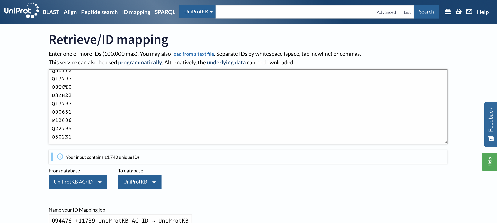
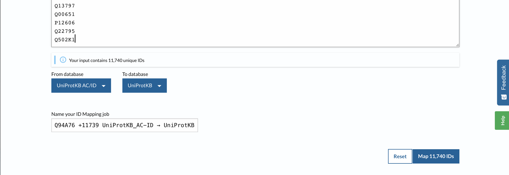
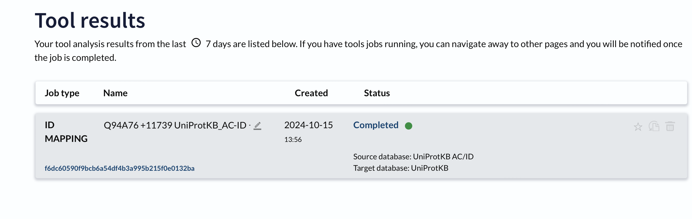
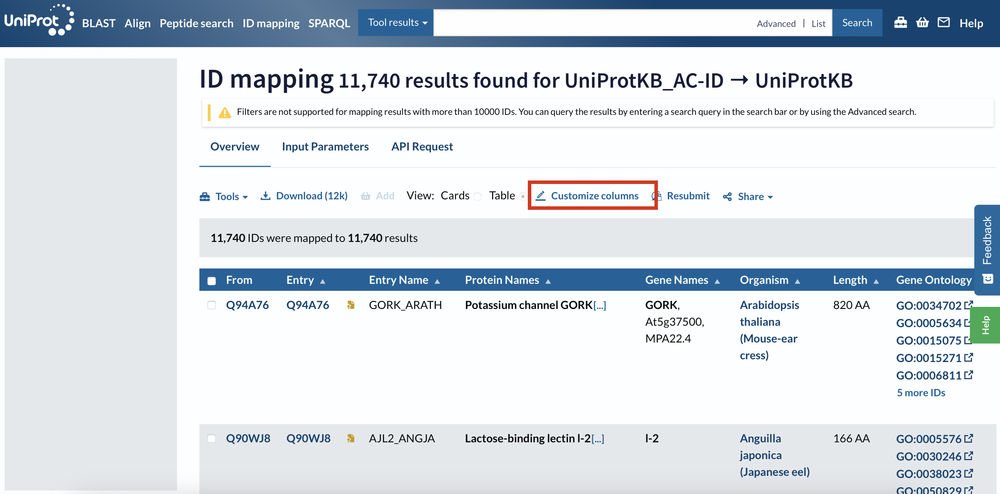
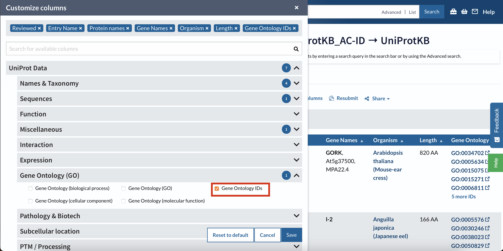
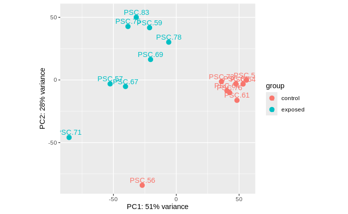
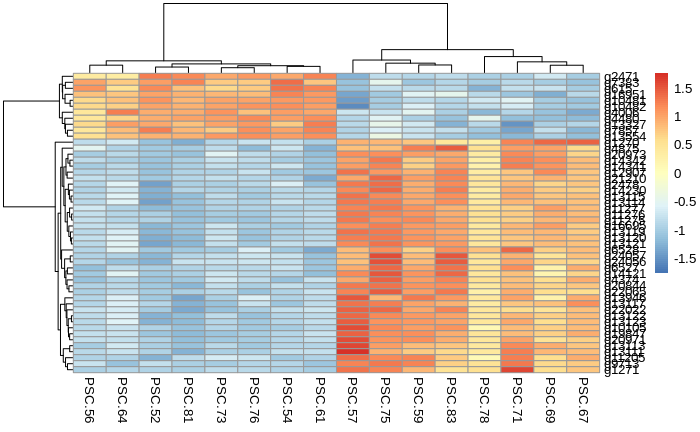
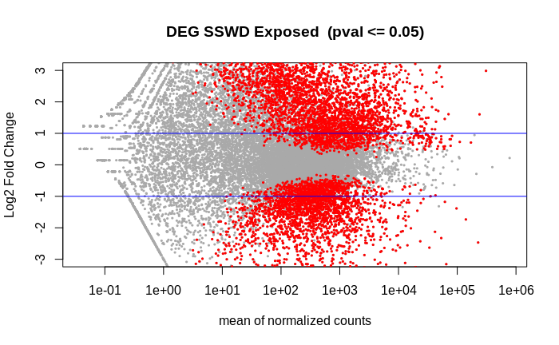

Got through to enriched biological processes for the 2021 data set. I also have some short-term goals of what I hope to have done before leaving for our sea star team writing retreat on Quadra on Saturday!

# `BLAST` -ed Genome
I ran `BLAST` a while ago, but the output genes are transcripts (have the .t# suffix).

Code: [paper-pycno-sswd-2021-2022/code/16-blast-genome-annotation.Rmd](https://github.com/grace-ac/paper-pycno-sswd-2021-2022/blob/main/code/16-blast-genome-annotation.Rmd)

`BLAST` output: [paper-pycno-sswd-2021-2022/analyses/16-blast-annotation/blast_out_sep.tab](https://github.com/grace-ac/paper-pycno-sswd-2021-2022/blob/main/analyses/16-blast-annotation/blast_out_sep.tab)

```
head blast_out_sep.tab
g3452.t1	sp	Q9Y6A2	CP46A_HUMAN	36.842	380	201	6	73	1119	16	387	6.38e-73	238
g3453.t1	sp	Q9Y6A2	CP46A_HUMAN	39.574	470	267	7	79	1470	20	478	2.82e-111	342
g3454.t1	sp	Q9H4F8	SMOC1_HUMAN	41.026	156	80	3	43	504	21	166	3.34e-31	129
g3455.t1	sp	Q9D844	DNJC4_MOUSE	35.028	177	100	3	100	618	37	202	1.38e-22	95.9
g3456.t1	sp	P80018	GLBC_MOLAR	27.559	127	91	1	115	495	17	142	1.81e-08	54.7
g3457.t1	sp	Q9NRC6	SPTN5_HUMAN	31.110	1649	1112	11	1	4926	1850	3481	0.0	758
g3458.t1	sp	P16546	SPTN1_MOUSE	36.947	655	411	2	67	2028	300	953	1.10e-123	414
g3459.t1	sp	Q00963	SPTCB_DROME	45.908	782	414	4	40	2361	36	816	0.0	691
g3460.t1	sp	Q9WVK8	CP46A_MOUSE	38.248	468	266	9	103	1470	22	478	2.16e-106	329
g3461.t1	sp	Q9Y6A2	CP46A_HUMAN	37.681	414	218	9	79	1254	22	417	2.44e-86	275
```

I asked in a [GitHub issue](https://github.com/RobertsLab/resources/issues/1965) what to do about this because I want to `join` the BLAST output with the DEG list for 2021 (listed below), but the files won't have anything to `join` over, since the DEG list is genes (no .t# suffix).

So I'll follow Sam's advice:
---
Use existing BLAST output, but strip the .t1 from the first column and then sort for uniques just on the first column.
```
sed 's/\.t1//' blast_out_sep.tab | sort --unique -k1,1
```
This is probably fine, since it's unlikely that multiple transcripts for a given gene would get annotated as a different protein.

Then, join with DEG list.
---

Fixed in the same R code file: [paper-pycno-sswd-2021-2022/code/16-blast-genome-annotation.Rmd](https://github.com/grace-ac/paper-pycno-sswd-2021-2022/blob/main/code/16-blast-genome-annotation.Rmd).

Here's the new [BLAST output](https://github.com/grace-ac/paper-pycno-sswd-2021-2022/blob/main/analyses/16-blast-annotation/blast_out_sep_genes.tab):
```
head blast_out_sep_genes.tab
g10	sp	Q94A76	GORK_ARATH	42.667	75	40	1	31	255	537	608	8.11e-07	49.7
g100	sp	Q90WJ8	AJL2_ANGJA	29.861	144	92	4	70	474	20	163	3.68e-11	61.6
g1000	sp	Q6AY85	ALG14_RAT	53.846	182	81	1	130	666	35	216	1.86e-73	224
g10000	sp	Q8C163	EXOG_MOUSE	38.281	256	150	5	34	792	16	266	1.39e-52	178
g10002	sp	Q9D1J3	SARNP_MOUSE	37.113	97	54	1	286	576	101	190	1.33e-12	67.8
g10003	sp	Q4PJW3	CP51A_BOVIN	64.189	444	138	4	166	1443	60	500	0.0	604
g10004	sp	P48449	LSS_HUMAN	63.800	721	260	1	13	2175	8	727	0.0	984
g10005	sp	Q99996	AKAP9_HUMAN	36.364	418	191	10	1243	2463	3543	3896	6.97e-54	207
g10006	sp	Q70FJ1	AKAP9_MOUSE	29.651	688	378	19	8368	10404	1678	2268	1.69e-36	157
g10007	sp	Q6PB06	HYKK_XENLA	32.181	376	221	12	43	1140	12	363	4.38e-45	162
```

YAY!!!


## Get Gene Ontology for BLAST Output
Following Steven's class FISH 546 tutorial: [here](https://robertslab.github.io/tusk/modules/04-blast.html)

I used the [uniprot.org](https://www.uniprot.org/id-mapping) ID Mapping feature to get the Gene Ontology annotations.

I opened the BLAST output above in excel locally, copied all the uniprot accession IDs, and pasted them in the ID Mapping tool:



Select the start map button:


Mapping is complete, click on the word "complete":   



Select Customize Column option:    


Select GO IDs:   


Then download the file as a .tsv.

Then copy and paste from downloads into [paper-pycno-sswd-2021-2022/analyses/23-annotating-deg-lists](https://github.com/grace-ac/paper-pycno-sswd-2021-2022/tree/main/analyses/23-annotating-deg-lists). And push to GitHub.


# 2021 DEG list Annotation --> Enrichment

## Summer 2021 DEG List Annotation
Ran `DESeq2` to compare the 8 control star RNAseq libraries to the 8 exposed star RNAseq libraries. Got a list of DEGs (6,938), and annotated them by `join`-ing with the BLAST output from above.


Code using `DESeq2`: [paper-pycno-sswd-2021-2022/code/21-deseq2-2021.Rmd](https://github.com/grace-ac/paper-pycno-sswd-2021-2022/blob/main/code/21-deseq2-2021.Rmd)

PCA of the libraries compared:


Heatmap of the top 50 DEGs from the comparison:     


Volcano of the 6938 DEGs:    


DEG list: [paper-pycno-sswd-2021-2022/analyses/21-deseq2-2021/DEGlist_2021_exposedVcontrol.tab](https://github.com/grace-ac/paper-pycno-sswd-2021-2022/blob/main/analyses/21-deseq2-2021/DEGlist_2021_exposedVcontrol.tab)

```
head DEGlist_2021_exposedVcontrol.tab
baseMean	log2FoldChange	lfcSE	stat	pvalue	padj
g21712	15506.8006860189	-0.686001394104519	0.279769093821729	-2.45202707966608	0.0142053971059541	0.04104326062556
g21713	931.361342578574	0.765760120416294	0.279988740054853	2.73496755714631	0.00623864245462093	0.0207814457271467
g21711	12883.0935253533	-0.709970512692711	0.228673239474894	-3.10473807220743	0.00190447593029036	0.00763473087082639
g21769	95.2608451733162	3.6958184007692	1.00771829984027	3.66751144774787	0.000244922588350467	0.00136039062124746
g15181	7362.04249036577	2.13117880973538	0.606155663157497	3.5158935885115	0.000438276606665117	0.00222160900619904
g15182	848.103634775757	1.44107523921733	0.603474139884921	2.38796519017722	0.0169419463881676	0.047565397521059
g15183	916.675431757199	-0.700558231713056	0.24491415606803	-2.86042359886482	0.00423075479942892	0.0149434418878582
g7651	625.045813674949	1.17515444248357	0.338850532449784	3.46806137203791	0.000524227551336494	0.00257724022366272
g7656	369.553524158447	1.34279754324671	0.359840419468955	3.73164733752917	0.000190231694582979	0.00109975735292238
```

Code to annotate DEG list: [paper-pycno-sswd-2021-2022/code/23-annotating-deg-lists.Rmd](https://github.com/grace-ac/paper-pycno-sswd-2021-2022/blob/main/code/23-annotating-deg-lists.Rmd)

Annotated DEG list: [paper-pycno-sswd-2021-2022/analyses/23-annotating-deg-lists/DEGlist_2021_exposedVcontrol_annotated.tab](https://github.com/grace-ac/paper-pycno-sswd-2021-2022/blob/main/analyses/23-annotating-deg-lists/DEGlist_2021_exposedVcontrol_annotated.tab)

```
head -3 DEGlist_2021_exposedVcontrol_annotated.tab
gene_id	baseMean	log2FoldChange	lfcSE	stat	pvalue	padj	PSC.56	PSC.52	PSC.54	PSC.61	PSC.64	PSC.73	PSC.76	PSC.81	PSC.59	PSC.57	PSC.69	PSC.67	PSC.71	PSC.75	PSC.78	PSC.83	Vuniprot_accession	gene_name	V5	V6	V7	V8	V9	V10	V11	V12	V13	V14	Entry	Reviewed	Entry.Name	Protein.names	Gene.Names	Organism	Length	Gene.Ontology.IDs
1	g21712	15506.8006860189	-0.686001394104519	0.279769093821729	-2.45202707966608	0.0142053971059541	0.04104326062556	16897	26645	32348	20860	32914	28245	21628	26422	10051	7784	7655	8444	8324	2531	22624	6679	sp	P54985	PPIA_BLAGE	73.171	164	44	0	1	492	1	164	2.17e-88	258	P54985	reviewed	PPIA_BLAGE	Peptidyl-prolyl cis-trans isomerase (PPIase) (EC 5.2.1.8) (Cyclophilin) (Cyclosporin A-binding protein) (Rotamase)	CYPA	Blattella germanica (German cockroach) (Blatta germanica)	164	GO:0003755; GO:0005737; GO:0006457; GO:0043231
2	g21713	931.361342578574	0.765760120416294	0.279988740054853	2.73496755714631	0.00623864245462093	0.0207814457271467	1025	718	596	910	905	905	1269	1044	1602	1167	479	2113	1073	128	584	1016	sp	Q8TDM6	DLG5_HUMAN	34.563	732	353	15	310	2409	158	795	1.74e-107	387	Q8TDM6	reviewed	DLG5_HUMAN	Disks large homolog 5 (Discs large protein P-dlg) (Placenta and prostate DLG)	DLG5 KIAA0583 PDLG	Homo sapiens (Human)	1919	GO:0001837; GO:0005737; GO:0005886; GO:0005912; GO:0007165; GO:0008013; GO:0008092; GO:0008285; GO:0014069; GO:0030011; GO:0030054; GO:0030159; GO:0030336; GO:0030859; GO:0030901; GO:0035331; GO:0035332; GO:0035556; GO:0036064; GO:0042130; GO:0042981; GO:0045176; GO:0045186; GO:0045197; GO:0045880; GO:0051965; GO:0060441; GO:0060563; GO:0060999; GO:0065003; GO:0071896; GO:0072205; GO:0098609; GO:0098978; GO:0099173
```
## Summer 2021 Enrichment


# Short-term Goals
