Taking 2022 gene count matrix through `DESeq2` to enrichment with DAVID and revigo. Also, compared 2021 control vs exposed DEG list to the 2022 control vs exposed DEG list through to Revigo.

# Notes
Some notes before getting into the details.

Something I'm unsure of is which result metric from DAVID to use to identify significantly enriched biological processes. Here's the documentation from the DAVID webpage: [https://david.ncifcrf.gov/content.jsp?file=functional_annotation.html#bonfer](https://david.ncifcrf.gov/content.jsp?file=functional_annotation.html#bonfer)

# 2022 DEG lists Annotation --> Enrichment

R Code for `DESeq2`: [paper-pycno-sswd-2021-2022/code/22-deseq2-2022.Rmd](https://github.com/grace-ac/paper-pycno-sswd-2021-2022/blob/main/code/22-deseq2-2022.Rmd)

R Code for Annotation: [paper-pycno-sswd-2021-2022/code/23-annotating-deg-lists.Rmd](https://github.com/grace-ac/paper-pycno-sswd-2021-2022/blob/main/code/23-annotating-deg-lists.Rmd)

# Control 6 vs exposed 6
6 controls (3 adults and 3 juveniles) vs 6 exposed (3 adults and 3 juveniles).

DEG list: [paper-pycno-sswd-2021-2022/analyses/22-deseq2-2022/DEGlist_2022_controlVexposed.tab](https://github.com/grace-ac/paper-pycno-sswd-2021-2022/blob/main/analyses/22-deseq2-2022/DEGlist_2022_controlVexposed.tab)  

6,237 DEGs.

PCA:
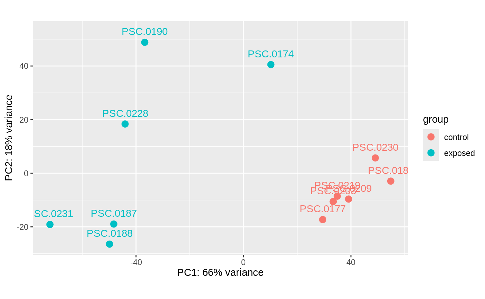

Volcano:
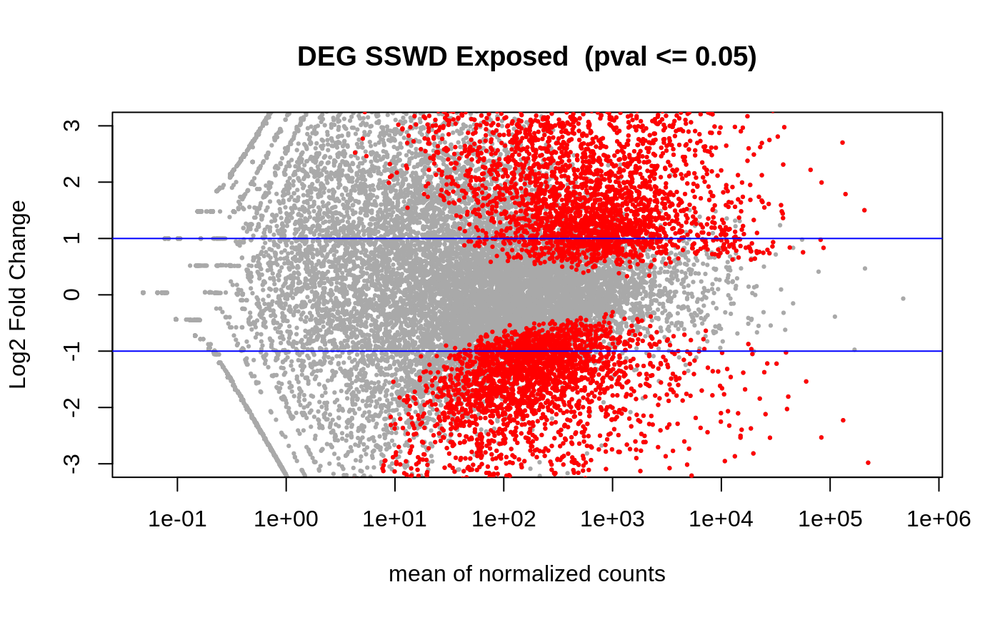

Heatmap of top 50 DEGs:
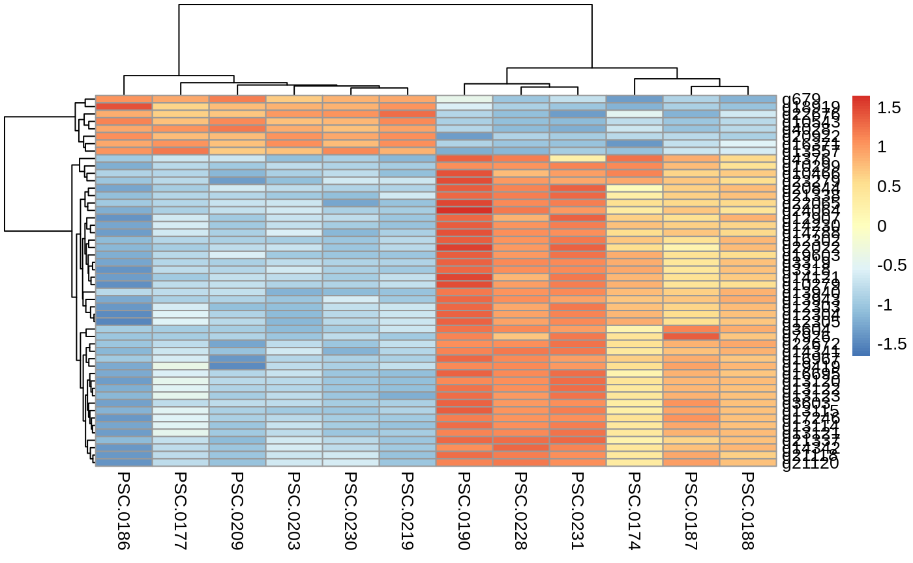

## Annotation
DEG annotated list: [paper-pycno-sswd-2021-2022/analyses/23-annotating-deg-lists/DEGlist_2022_exposedVcontrol_annotated.tab](https://github.com/grace-ac/paper-pycno-sswd-2021-2022/blob/main/analyses/23-annotating-deg-lists/DEGlist_2022_exposedVcontrol_annotated.tab)

## Enrichment
### DAVID output (with [genome blast uniprot accession IDs](https://github.com/grace-ac/paper-pycno-sswd-2021-2022/blob/main/analyses/24-2021-2022-enrichment/blast_uniprotAccession_forDAVID.txt) as background):       
[paper-pycno-sswd-2021-2022/analyses/24-2021-2022-enrichment/DAVID-2022-controlVexposed.txt](https://github.com/grace-ac/paper-pycno-sswd-2021-2022/blob/main/analyses/24-2021-2022-enrichment/DAVID-2022-controlVexposed.txt)

Here's the significantly enriched processes:    
Are they most significant?? I did it based on Bonferroni/Fold Enrichment.

| Term                                                     | Count | %          | PValue   | List Total | Pop Hits | Pop Total | Fold Enrichment | Bonferroni | Benjamini | FDR      |
|----------------------------------------------------------|-------|------------|----------|------------|----------|-----------|-----------------|------------|-----------|----------|
| GO:0006511~ubiquitin-dependent protein catabolic process | 94    | 2.14758967 | 4.19E-08 | 4107       | 156      | 10742     | 1.57602717      | 2.97E-04   | 2.29E-04  | 2.29E-04 |
| GO:0016567~protein ubiquitination                        | 167   | 3.81539867 | 6.47E-08 | 4107       | 314      | 10742     | 1.3910645       | 4.58E-04   | 2.29E-04  | 2.29E-04 |
| GO:0002181~cytoplasmic translation                       | 32    | 0.73109436 | 4.64E-07 | 4107       | 40       | 10742     | 2.09242756      | 0.00328165 | 9.83E-04  | 9.82E-04 |
| GO:0006508~proteolysis                                   | 194   | 4.43225954 | 5.55E-07 | 4107       | 383      | 10742     | 1.32483991      | 0.00392559 | 9.83E-04  | 9.82E-04 |

### REVIGO   
Here's what I put into REVIGO: [paper-pycno-sswd-2021-2022/analyses/24-2021-2022-enrichment/2022-controlVexposed-forREVIGO.txt](https://github.com/grace-ac/paper-pycno-sswd-2021-2022/blob/main/analyses/24-2021-2022-enrichment/2022-controlVexposed-forREVIGO.txt). GO terms and p-values for those with p-value <0.05. 89 terms.

Treemap list:  
[paper-pycno-sswd-2021-2022/analyses/24-2021-2022-enrichment/2022-controlVexposed_Revigo_BP_TreeMap.tsv](https://github.com/grace-ac/paper-pycno-sswd-2021-2022/blob/main/analyses/24-2021-2022-enrichment/2022-controlVexposed_Revigo_BP_TreeMap.tsv)

Treemap:    
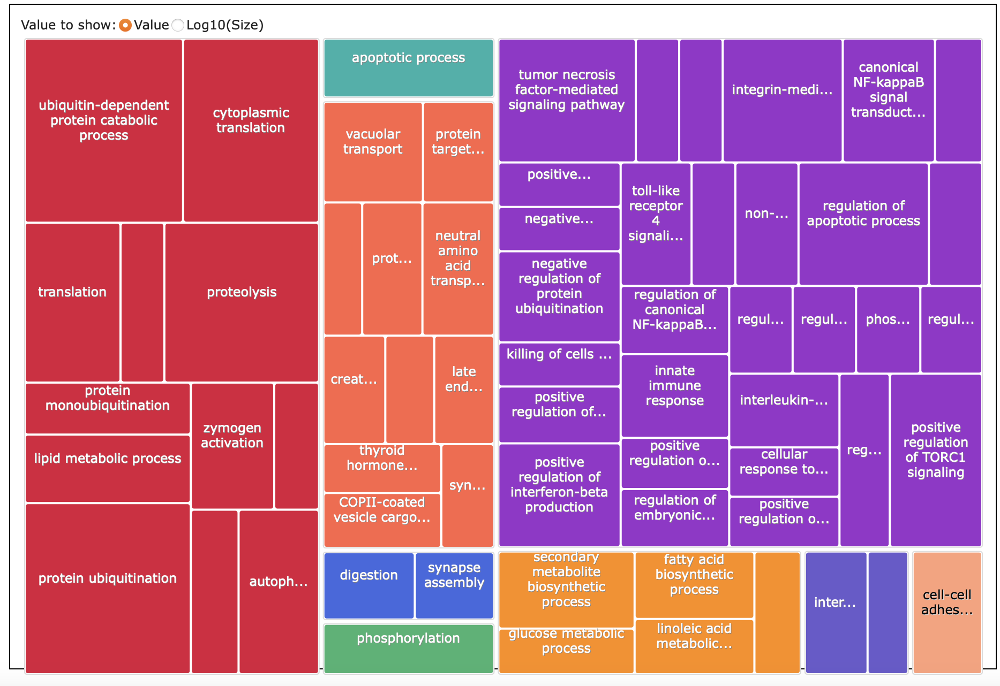

# Control vs Exposed taking Age into account
Control Adults (n=3)      
Control Juveniles (n=3)     
Exposed Adults (n=3)     
Exposed Juveniles (n=3)     

DEG list: [paper-pycno-sswd-2021-2022/analyses/22-deseq2-2022/DEGlist_2022_controlVexposed_withAge.tab](https://github.com/grace-ac/paper-pycno-sswd-2021-2022/blob/main/analyses/22-deseq2-2022/DEGlist_2022_controlVexposed_withAge.tab)

6,202 DEGs.

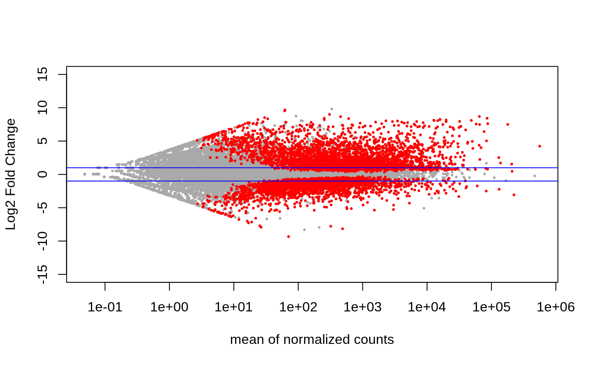

## Annotation  
DEG annotated list: [paper-pycno-sswd-2021-2022/analyses/23-annotating-deg-lists/DEGlist_2022_exposedVcontrol_withAge_annotated.tab](https://github.com/grace-ac/paper-pycno-sswd-2021-2022/blob/main/analyses/23-annotating-deg-lists/DEGlist_2022_exposedVcontrol_withAge_annotated.tab)

## Enrichment
### DAVID output with [genome blast uniprot accession IDs](https://github.com/grace-ac/paper-pycno-sswd-2021-2022/blob/main/analyses/24-2021-2022-enrichment/blast_uniprotAccession_forDAVID.txt) as background):      
[paper-pycno-sswd-2021-2022/analyses/24-2021-2022-enrichment/DAVID-2022-controlVexposed-withage.txt](https://github.com/grace-ac/paper-pycno-sswd-2021-2022/blob/main/analyses/24-2021-2022-enrichment/DAVID-2022-controlVexposed-withage.txt)

Here's the significantly enriched processes:    
Are they most significant?? I did it based on Bonferroni/Fold Enrichment.

| Term                                                     | Count | %          | PValue   | List Total | Pop Hits | Pop Total | Fold Enrichment | Bonferroni | Benjamini  | FDR        |
|----------------------------------------------------------|-------|------------|----------|------------|----------|-----------|-----------------|------------|------------|------------|
| GO:0002181~cytoplasmic translation                       | 34    | 0.77237619 | 1.40E-08 | 4137       | 40       | 10742     | 2.20708243      | 9.96E-05   | 9.96E-05   | 9.96E-05   |
| GO:0006511~ubiquitin-dependent protein catabolic process | 93    | 2.11267606 | 1.51E-07 | 4137       | 156      | 10742     | 1.54795374      | 0.00106954 | 4.98E-04   | 4.98E-04   |
| GO:0016567~protein ubiquitination                        | 166   | 3.77101318 | 2.10E-07 | 4137       | 314      | 10742     | 1.37270769      | 0.00149374 | 4.98E-04   | 4.98E-04   |
| GO:0006508~proteolysis                                   | 193   | 4.38437074 | 1.66E-06 | 4137       | 383      | 10742     | 1.30845311      | 0.01172974 | 0.00294977 | 0.00294811 |
| GO:0006412~translation                                   | 100   | 2.27169468 | 1.56E-05 | 4137       | 184      | 10742     | 1.41117802      | 0.10520751 | 0.02223252 | 0.02222001 |

### REVIGO
What I put into REVIGO: [paper-pycno-sswd-2021-2022/analyses/24-2021-2022-enrichment/2022-controlVexposed-withage-for-REVIGO.txt](https://github.com/grace-ac/paper-pycno-sswd-2021-2022/blob/main/analyses/24-2021-2022-enrichment/2022-controlVexposed-withage-for-REVIGO.txt). GO terms with p-value <0.05. 97.

Treemap table:
[paper-pycno-sswd-2021-2022/analyses/24-2021-2022-enrichment/2022-controlVexposed-withage-Revigo_BP_TreeMap.tsv](https://github.com/grace-ac/paper-pycno-sswd-2021-2022/blob/main/analyses/24-2021-2022-enrichment/2022-controlVexposed-withage-Revigo_BP_TreeMap.tsv)

Treemap:
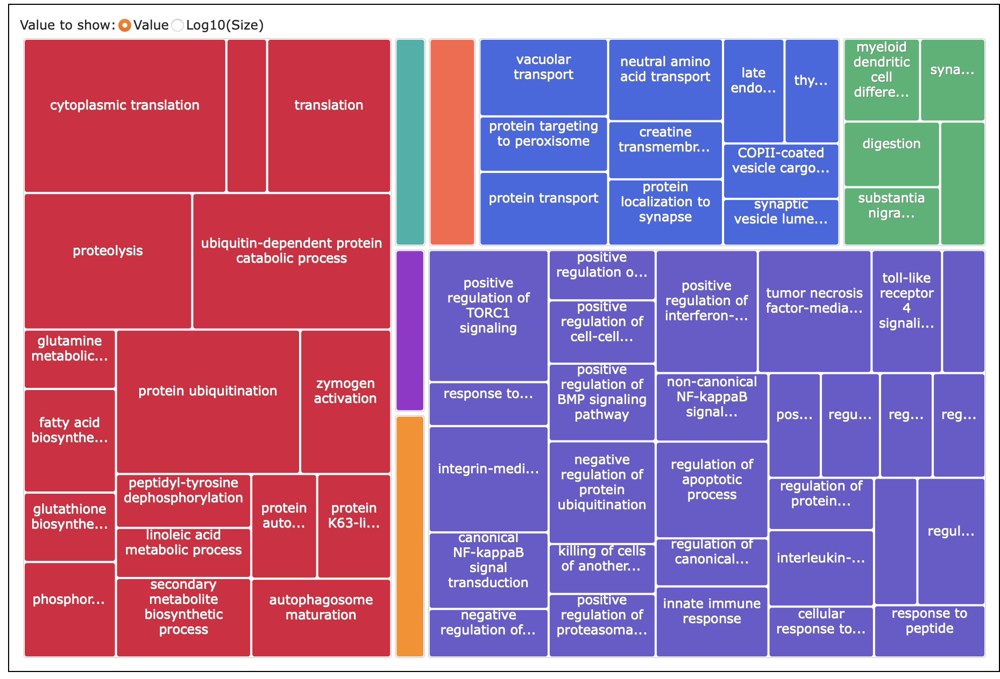

# Age contrast --> getting DEGs from above comparison that are related to age in the control vs exposed comparison

DEG list: [paper-pycno-sswd-2021-2022/blob/main/analyses/22-deseq2-2022/DEGlist_2022_controlVexposed_ageContrast.tab](https://github.com/grace-ac/paper-pycno-sswd-2021-2022/blob/main/analyses/22-deseq2-2022/DEGlist_2022_controlVexposed_ageContrast.tab)

82 DEGs.

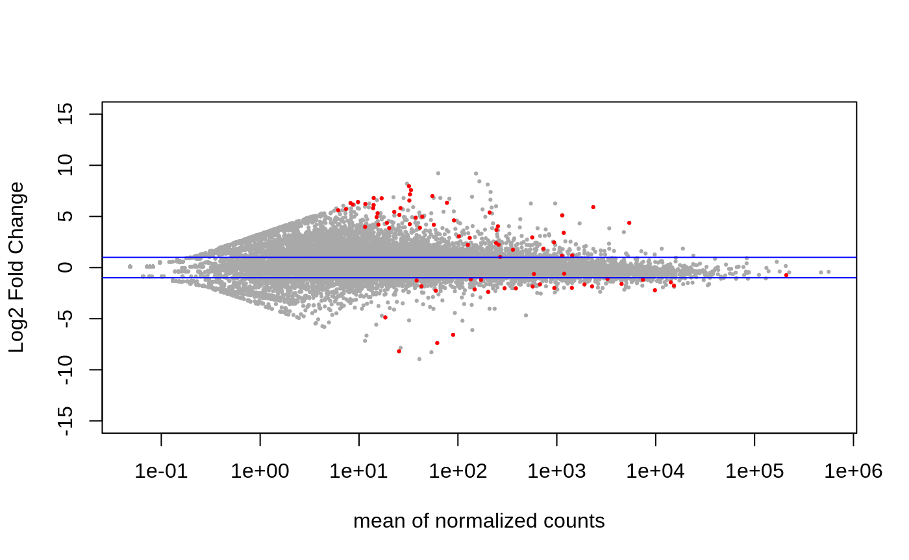

## Annotation
DEG list annotated: [paper-pycno-sswd-2021-2022/analyses/23-annotating-deg-lists/DEGlist_2022_exposedVcontrol_withAgeContrast_annotated.tab](https://github.com/grace-ac/paper-pycno-sswd-2021-2022/blob/main/analyses/23-annotating-deg-lists/DEGlist_2022_exposedVcontrol_withAgeContrast_annotated.tab)

## Enrichment     
### DAVID output with [genome blast uniprot accession IDs](https://github.com/grace-ac/paper-pycno-sswd-2021-2022/blob/main/analyses/24-2021-2022-enrichment/blast_uniprotAccession_forDAVID.txt) as background):    
[paper-pycno-sswd-2021-2022/analyses/24-2021-2022-enrichment/DAVID-2022-controlVexposed-agecontrast.txt](https://github.com/grace-ac/paper-pycno-sswd-2021-2022/blob/main/analyses/24-2021-2022-enrichment/DAVID-2022-controlVexposed-agecontrast.txt)

Significantly enriched processes:   
NONE. See table linked above, but the values that aren't p-values are too high.

### REVIGO
What I put into REVIGO: [paper-pycno-sswd-2021-2022/analyses/24-2021-2022-enrichment/2022-controlVexposed-agecontrast-forREVIGO.txt](https://github.com/grace-ac/paper-pycno-sswd-2021-2022/blob/main/analyses/24-2021-2022-enrichment/2022-controlVexposed-agecontrast-forREVIGO.txt). GO terms with p-value <0.05. 4.

Treemap table: [paper-pycno-sswd-2021-2022/analyses/24-2021-2022-enrichment/2022-controlVexposed-agecontrast-Revigo_BP_TreeMap.tsv](https://github.com/grace-ac/paper-pycno-sswd-2021-2022/blob/main/analyses/24-2021-2022-enrichment/2022-controlVexposed-agecontrast-Revigo_BP_TreeMap.tsv)

Silly treemap:    
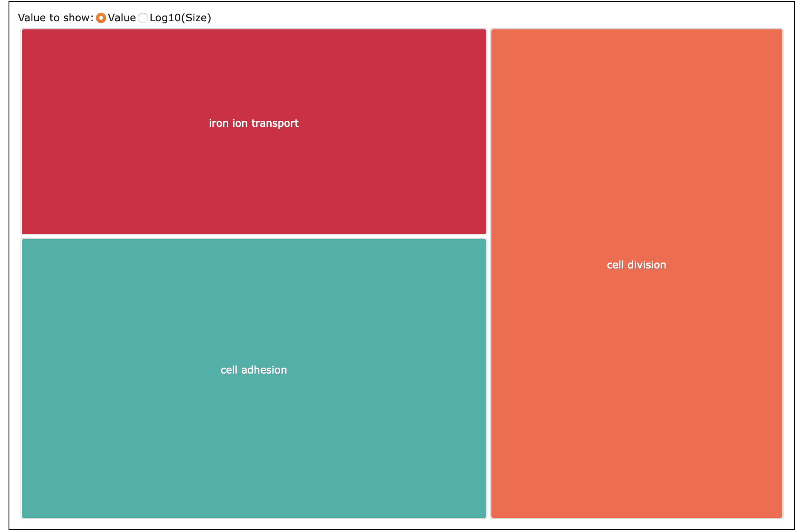

# Comparing 2021 Control V Exposed DEGs to 2022 Control V Exposed DEGs
R Code: [25-compare-2021-2022.Rmd](https://github.com/grace-ac/paper-pycno-sswd-2021-2022/blob/main/code/25-compare-2021-2022.Rmd)

Output folder: [analyses/25-compare-2021-2022](https://github.com/grace-ac/paper-pycno-sswd-2021-2022/tree/main/analyses/25-compare-2021-2022)

## DEGs unique to 2021
Used `anti_join` from `dplyr`:   
[DEGlist_unique_2021.tab](https://github.com/grace-ac/paper-pycno-sswd-2021-2022/blob/main/analyses/25-compare-2021-2022/DEGlist_unique_2021.tab)  

### Enrichment:
Unique 2021 DEG uniprot accession IDs put in DAVID: [analyses/24-2021-2022-enrichment/2021-DEGlist_uniprot_Accession_forDAVID.txt](https://github.com/grace-ac/paper-pycno-sswd-2021-2022/blob/main/analyses/24-2021-2022-enrichment/2021-DEGlist_uniprot_Accession_forDAVID.txt).

Background: [analyses/24-2021-2022-enrichment/blast_uniprotAccession_forDAVID.txt](https://github.com/grace-ac/paper-pycno-sswd-2021-2022/blob/main/analyses/24-2021-2022-enrichment/blast_uniprotAccession_forDAVID.txt)

DAVID output:     
[analyses/24-2021-2022-enrichment/2021-unique-DAVID.txt](https://github.com/grace-ac/paper-pycno-sswd-2021-2022/blob/main/analyses/24-2021-2022-enrichment/2021-unique-DAVID.txt). 98 GO terms.

KEGG Pathways:     
[analyses/24-2021-2022-enrichment/2021-unique-kegg-DAVID.txt](https://github.com/grace-ac/paper-pycno-sswd-2021-2022/blob/main/analyses/24-2021-2022-enrichment/2021-unique-kegg-DAVID.txt).

REVIGO:      
What I put into REVIGO: [analyses/24-2021-2022-enrichment/2021-unique-for-REVIGO-GOpval.txt](https://github.com/grace-ac/paper-pycno-sswd-2021-2022/blob/main/analyses/24-2021-2022-enrichment/2021-unique-for-REVIGO-GOpval.txt)

[Treemap table](https://github.com/grace-ac/paper-pycno-sswd-2021-2022/blob/main/analyses/24-2021-2022-enrichment/2021-unique-Revigo_BP_TreeMap.tsv)

Treemap:
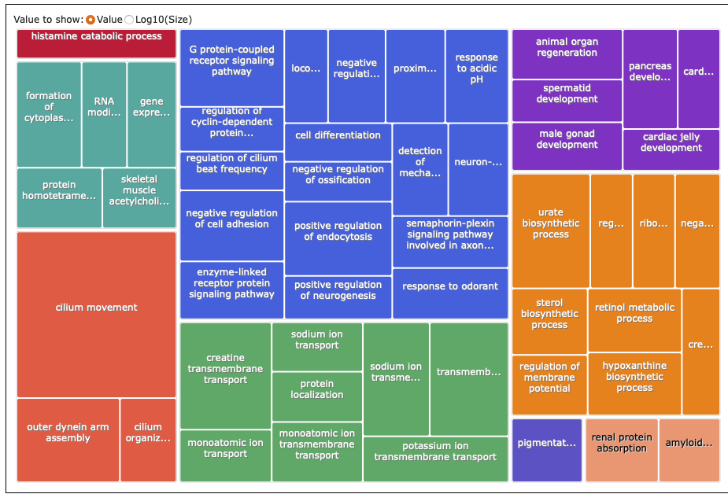

## DEGs unique to 2022   
Used `anti_join` from `dplyr`:   
[DEGlist_unique_2022.tab](https://github.com/grace-ac/paper-pycno-sswd-2021-2022/blob/main/analyses/25-compare-2021-2022/DEGlist_unique_2022.tab)

### Enrichment:   
Unique 2022 DEG uniprot accession IDs put in DAVID: [analyses/24-2021-2022-enrichment/2022-uniqueDEGs-uniprotacc-for-DAVID.txt](https://github.com/grace-ac/paper-pycno-sswd-2021-2022/blob/main/analyses/24-2021-2022-enrichment/2022-uniqueDEGs-uniprotacc-for-DAVID.txt)

Background: [analyses/24-2021-2022-enrichment/blast_uniprotAccession_forDAVID.txt](https://github.com/grace-ac/paper-pycno-sswd-2021-2022/blob/main/analyses/24-2021-2022-enrichment/blast_uniprotAccession_forDAVID.txt)

DAVID output:      
[analyses/24-2021-2022-enrichment/2022-unique-DAVID.txt](https://github.com/grace-ac/paper-pycno-sswd-2021-2022/blob/main/analyses/24-2021-2022-enrichment/2022-unique-DAVID.txt). 93 GO terms.

KEGG Pathway:   
[analyses/24-2021-2022-enrichment/2022-unique-kegg-DAVID.txt](https://github.com/grace-ac/paper-pycno-sswd-2021-2022/blob/main/analyses/24-2021-2022-enrichment/2022-unique-kegg-DAVID.txt).

REVIGO:    
What I put into REVIGO: [analyses/24-2021-2022-enrichment/2022-unique-forREVIGO.txt](https://github.com/grace-ac/paper-pycno-sswd-2021-2022/blob/main/analyses/24-2021-2022-enrichment/2022-unique-forREVIGO.txt)    

[Treemap table](https://github.com/grace-ac/paper-pycno-sswd-2021-2022/blob/main/analyses/24-2021-2022-enrichment/2022-unique-Revigo_BP_TreeMap.tsv)   

Treemap:    
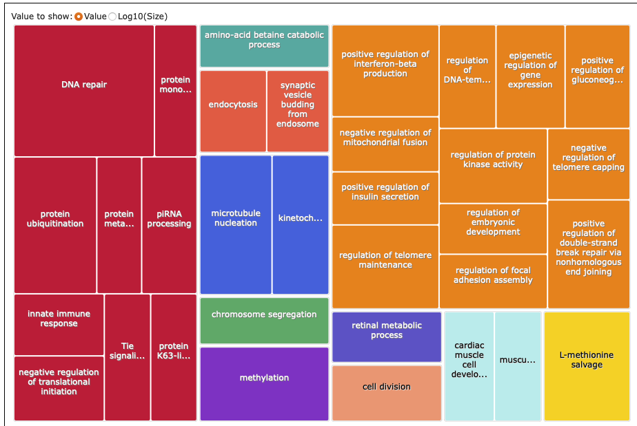

## DEGs same across 2021 and 2022:   
Used `inner_join` from `dplyr`:    
[DEGlist_same_2021-2022.tab](https://github.com/grace-ac/paper-pycno-sswd-2021-2022/blob/main/analyses/25-compare-2021-2022/DEGlist_same_2021-2022.tab).

### Enrichment:   
DEGs same across 2021 and 2022 uniprot accession IDs put into DAVID: [analyses/24-2021-2022-enrichment/2021-2022-same-degs-uniprot-acc-for-DAVID.txt](https://github.com/grace-ac/paper-pycno-sswd-2021-2022/blob/main/analyses/24-2021-2022-enrichment/2021-2022-same-degs-uniprot-acc-for-DAVID.txt).

Background: [analyses/24-2021-2022-enrichment/blast_uniprotAccession_forDAVID.txt](https://github.com/grace-ac/paper-pycno-sswd-2021-2022/blob/main/analyses/24-2021-2022-enrichment/blast_uniprotAccession_forDAVID.txt).

DAVID output:    
[analyses/24-2021-2022-enrichment/2021-2022-same-DAVID.txt](https://github.com/grace-ac/paper-pycno-sswd-2021-2022/blob/main/analyses/24-2021-2022-enrichment/2021-2022-same-DAVID.txt). 211 GO terms.

KEGG Pathway:     
[analyses/24-2021-2022-enrichment/2021-2022-same-kegg-DAVID.txt](https://github.com/grace-ac/paper-pycno-sswd-2021-2022/blob/main/analyses/24-2021-2022-enrichment/2021-2022-same-kegg-DAVID.txt).

REVIGO:  
What I put into REVIGO: [analyses/24-2021-2022-enrichment/2021-2022-same-forREVIGO.txt](https://github.com/grace-ac/paper-pycno-sswd-2021-2022/blob/main/analyses/24-2021-2022-enrichment/2021-2022-same-forREVIGO.txt)

[Treemap table](https://github.com/grace-ac/paper-pycno-sswd-2021-2022/blob/main/analyses/24-2021-2022-enrichment/2021-2022-same-Revigo_BP_TreeMap.tsv)    

Treemap   
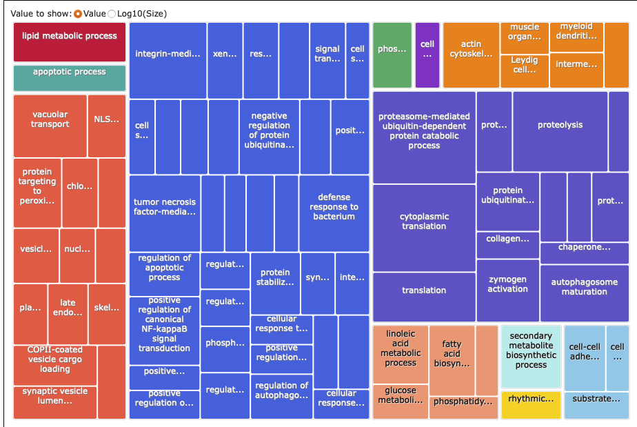
