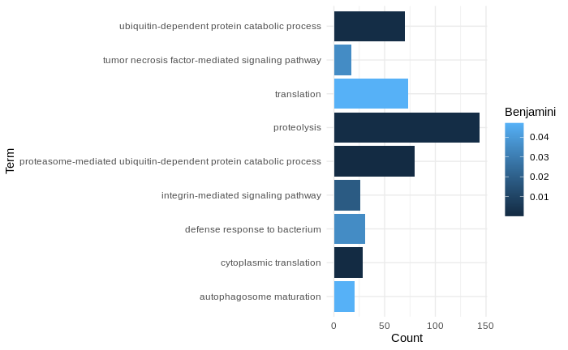
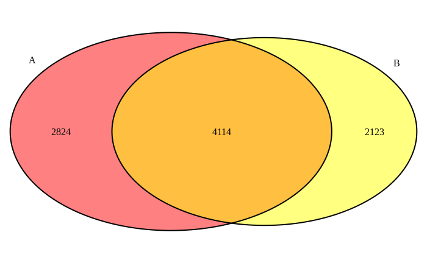
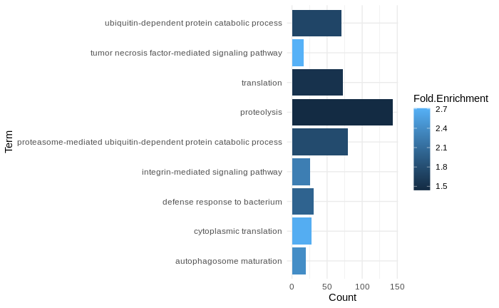
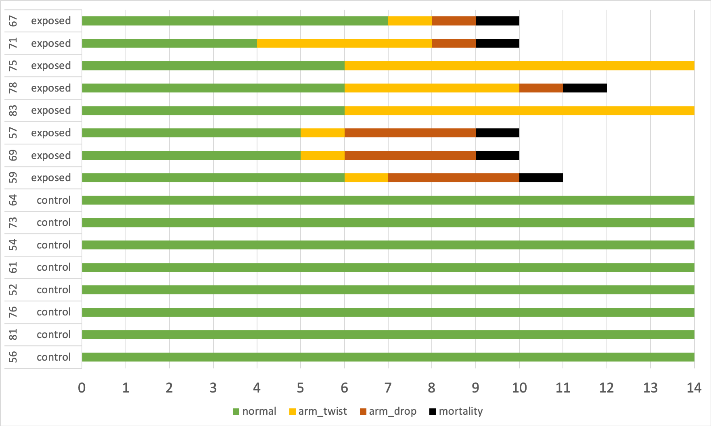

Recap of November things because I was bad and didn't post anything... BUT I do take daily notes for myself, so I know what I did - summary recaps on WSN, Pycno Paper Work, Graduate Student Symposium, etc. in post below

# WSN Recap

It was a great conference! I presented (slides: [here](https://github.com/grace-ac/presentations/blob/main/2024/Crandall_WSN_2024.pdf)) on the multi-species work, emphasizing the experimental results and sharing preliminary transcriptomic work.

Talked with a lot of people that I met at last year's WSN in Monterey and for our Pycnopodia Recovery Group meeting. Awesome to catch up with everyone. I also chatted with a bunch of undergrads about my work and I learned about their interests and it was overall a great time!

# Pycno Paper

## New visuals:
R Code: [paper-pycno-sswd-2021-2022/code/26-visualizations.Rmd](https://github.com/grace-ac/paper-pycno-sswd-2021-2022/blob/main/code/26-visualizations.Rmd)

Barplot of the top 9 enriched processes (Benjamini <0.05) from the 4,114 DEGs shared between 2021 (Experiment A) and 2022 (Experiment B). The colors relate to the Benjamini-Hochberg corrected p-value.

  

Venn Diagram of the DEGs unique to each experiment and shared between the two... not super interesting... not going to include in paper because it can be written as a sentence.

After I showed the barplot above to Alyssa and Melanie, Alyssa pointed out that she views p-values as a yes/no categorical thing... the colors aren't useful in this case, but a different metric like Fold Enrichment could be more interesting. So I re-made the figure for the top 9 (Benjamini-Hochberg P-val <0.05) with the colors related to the fold enrichment:   

I'm also going to make figures of disease sign for each experiment modeled off of what I made for the Multi-Species WSN talk (check out pdf link to slides above).

Here's where things stand currently for Experiment A:   

Some things I'm going to change in the above figure:   
- figure out how to make it in R (for reproducibility)
- have the treatment codes be just one large "Exposed" and one large "Control" that covers all 8 within each treatment
- Add time points of sampling for each star --> just a point on the timeline

I'll make a second figure in the same way for Experiment B, and adding in the extra labels of the age class - juvenile or adult.

## Writing
Got bogged down in the discussion - overthinking and getting overwhelmed by the literature... so I met with Steven often to come up with smaller chunks of goals for each week - more on this in my December posts.

# Graduate Student Symposium (GSS)
I co-coordinated GSS this year with Tessa Code, Bryan Briones-Ortiz, and Anna Simeon. It was super fun and a lot more work day-of than I anticipated, but it's one of my favorite events that our department hosts.

It's a chance for grad students to present previous, current, or research they hope to do in the form of conference talks (12 mins + 3 mins for Qs), 5 minute lightning talks, or posters. The poster session is also open to undergrads, and we had a ton of participation this year! 

# Other bits
- I set a date for my first committee meeting: January 9th at 3pm!
- Continued working on my paper - more info coming in the December posts
- Met with Drew to go over my progress and our thoughts on what we'd like to do for my collaboration with the Dept of Health for my One Health internship next Spring/Summer (we'll be meeting with Beth from DOH next week to go over our thoughts!)
- Met with Mike Dawson and Lauren Schiebelhut to talk about collaborating on the multi-species work and sharing our data in exchange for access to their genomic data for _Dermasterias imbricata_ and their expertise and insights
