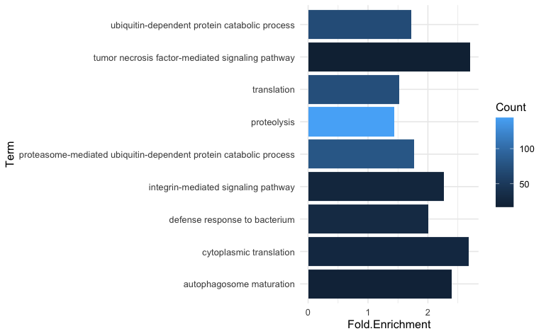
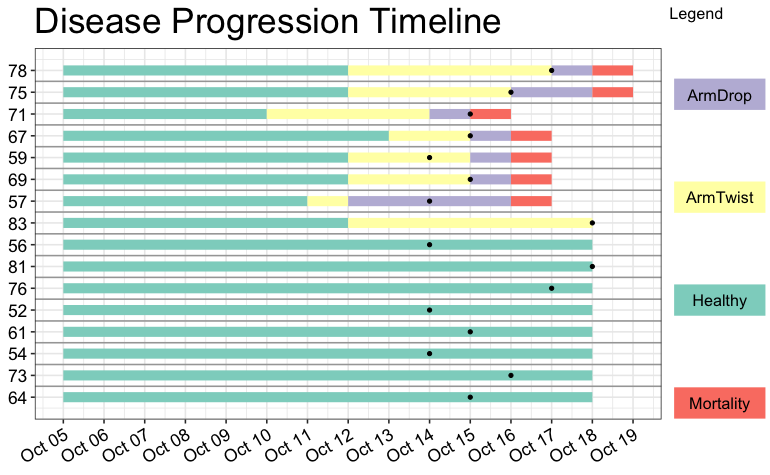

Updates on writing and figures and goals for this week!

# Writing
I got bogged down in overthinking and too many details for a while... and got stumped.

But, Steven and I meet once a week on Mondays to identify weekly goals for the paper, and that's been helping me a lot.

Last week, I focused on two discussion paragraphs and got them written down!

# Paper Figures Updates:
R code: 

## Top 9 Enriched Biological GO Terms Figure
These terms are enriched from the shared list of DEGs (4,114 DEGs) between the two years (exp A (2021) and exp B (2022)).   

  

X-axis is fold enrichment for the term, and color is the counts.

## Disease Progression Timeline
For Experiment A (Experiment B will be next - focusing on this one first to get formatting and labeling all good).

Used [this example](https://github.com/wlhamilton/Patient-ward-movement-timelines/blob/main/R%20script%20to%20generate%20example%20ward%20movement%20plot.R) to create my own timeline. 

It's almost where I want it... I just need to figure out how to add labels to y-axis... just two labels covering the samples that are Exposed (top 8 rows) and the Controls (bottom 8 rows).

# Paper goals for this week:

1. Discussion paragraph about what this study means in context of the disease.
2. Fix top9 enriched processes figure to be Fold Enrichment on x-axis, and color by counts (did this today and it's in the above section).
3. Introduction paragraph about the importance of this project - ecological importance of _Pycnopodia helianthoides_ - why do we care about them.
