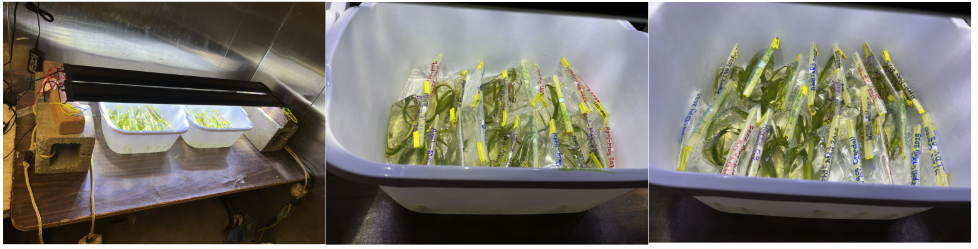

It's been a WHILE! See post for updates on some things I've done and my short-term and long-term summer goals!

# What I've been up to:

## Ran an experiment at Friday Harbor Laboratories
**Can eelgrass decrease bacteria counts in seawater?**    
I will share more once data is in hand, which won't be for a while because the qPCR test is in development, but I ran an experiment where eelgrass was kept in whirl pak bags of seawater and spiked with a _Vibrio_ species at two different concentrations. The bags were kept in a temperature-controlled room at 18C (ideal for the bacteria) for 5 days. At the end of the 5 days, the water was filtered and the filtered (0.45um) are saved in a -80C for future qPCR to detect if the _Vibrio_ amount is different between any of the treatments.

### Treatment groups:    

| Treatment                    | Number of bags (replicates) | Eelgrass in treatment? Yes/No |
|------------------------------|-----------------------------|-------------------------------|
| Low Dose Vibrio + Eelgrass   | 8                           | Yes                           |
| High Dose Vibrio + Eelgrass  | 8                           | Yes                           |
| Low Dose Vibrio              | 8                           | No                            |
| High Dose Vibrio             | 8                           | No                            |
| Eelgrass + Filtered seawater | 8                           | Yes                           |

### Experimental set-up:    
  
The bags are labeled with the treatment. They are in a temperature-controlled room set to 18C, and the lights are on 12 hr timers, turning on at 9am and off at 9pm.

Depending on qPCR results, I may do another iteration of this experiment in September with more replicates, other treatments, and with the room set to a temperature that is ideal for the eelgrass rather than the high temp of 18C which was ideal for the bacteria.

## Went out into the field with Dept of Health
I went on a field work day with my mentor from the WA State Dept of Health and we sampled shellfish at low-tide, 3 samples-worth inside an eelgrass bed and 3 samples-worth outside of an eelgrass bed at one site in the Hood Canal. We dropped off the shellfish at the FDA food processing lab that Dept of Health works with where they extracted DNA and ran qPCR targeting _Vibrio parahaemalyticus_ and _Vibrio vulnificus_, both of which can cause illness in humans if infected shellfish are eaten. All samples came back below the detection limit.

From here, I may go out to that same site and sample again later in the summer, or I might find another site that has a runoff or sewage nearby that might act as a source of bacteria.

## Resubmitted Paper to Philosophical Transactions B
I submitted my paper initially in early February 2025, and got back later that it had been "un-submitted" and that some revisions were needed in order to better fit with the special issue. I'm proud to say that I didn't take any of that personally (growth!!) and instead saw it as a great opportunity to make this paper even better, and I even got to learn how to make a cool new figure. News on the status of the paper won't happen for a while - it needs to be sent to reviewers and another round of revisions is likely.

# SUMMER GOALS

## Short-term goals
### Focus on Multispecies Work
1. Finish RNA extractions for controls from Day 12, and exposed and control from Day 6
2. Get back into analyses for the exposed Day 12 for each species data I do have
3. Present at WDA (Victoria BC, Canada, July 27-Aug 1)

### Guest Lecture at the FHL EIMD 2025 workshop on June 23, 2025
I'll join via zoom, and Drew and I will share a 1.5hour time slot where she'll present on the SSWD work, and I'll present what I've done so far for the immune response work. Should be low-key and fun! 

## Long-term goals
### Multispecies
1. Have a draft going on the work that I have been doing and will have completed
2. Once get additional data do:
    i. differential gene expression comparison for each species
    ii. compare between the two time points

### Degree Milestones
1. Finish PhD Proposal outline
2. Schedule another committee meeting
3. Schedule Quals (before Fall quarter starts?)
