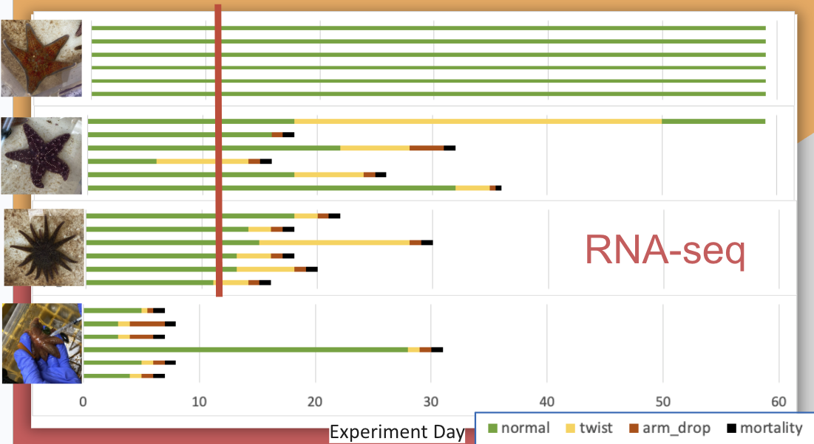

Post detailing the protocol for RNA extraction of the multispecies coelomocyte samples.

# Sample Info
The samples are coelomocytes pelleted and preserved in 300ul of DNA/RNA Shield from Zymo Research and stored in -80C.

Here's the protocol we used to sample and preserve the coelomocytes at Marrowstone - samples were later transferred to Roberts Lab -80 at SAFS:

**Supply needs**     
- 29G 3/10cc, 1/2" insulin needles - for juvenile star collection       
- Sterile, DNAse/RNAse-free microfuge tubes     
- Labeled PSC ### for coelomocytes        
- Labeled PSCS ### for coelomocyte supernatant    
- Centrifuge      
- DNA/RNA Shield      
- P1000 and sterile tips      
- Sample boxes - one for PSC samples, and one for PSCS samples        
- -80C storage space      
- Ice bucket with ice     
- 70% ETOH spray bottle     
- Paper towel     

**Protocol**
1. Collect coelomic fluid from the armpit using an insulin needle, wipe the needle with a paper towel sprayed with ETOH,  and place in labeled microfuge tube        
    i. If need to do multiple sites, use a new needle every time         
3. Collect as much volume as possible, with a max of 1mL (highly unlikely to collect this much)
4. Place immediately on ice
5. Bring to the dry lab
6. Centrifuge for 5 minutes at 1200 rpm to separate the coelomocytes
7. Remove the fluid using P1000 Pipette and tips and place in a labeled microfuge tube and store in -80C box for PSCS samples
    i. Note: will not be able to see a pellet, so act as though there is one at bottom of tube when removing supernatant
8. Add 300 ul of DNA/RNA Shield to the pellet containing coelomocytes.

Store in -80C box for PSC samples

# RNA Extraction
Kit: Zymo Research, Quick DNA/RNA Microprep Plus Kit ((Cat D7005)[https://www.zymoresearch.com/products/quick-dna-rna-microprep-plus-kit?srsltid=AfmBOoqbz4OOia6Gt3N81ntbBEpzRDfNY9JF21Ez587mK4QaWbmDZBTT])   

## Extraction Preparations - labeling, etc
Let thaw:
1. Proteinase K
2. DNAse I

Label:
1. 1 set of nuclease-free snap cap tube for each sample
2. 1 set of Zymo-Spin IC-XM Column (yellow) plus the collection tube
3. 1 set of Zymo=Spin IC Coolumn (clear) plus collection tube
4. 1 nuclease-free tube for DNAse treatment
5. 1 set of final labelled nuclease-free tube for eluted RNA.

## I. Sample Preparation
Get samples from -80, and let thaw on wet ice, **Mix well by vortex**.

1. Add **15ul Proteinase K** and **30ul PK Digestion Buffer** to each sample.
2. Pipet to mix and let thaw at room temp for 30mins or longer.
3. Vortex the sample after incubation and centrifuge at **max speed for 2 minutes** to pellet debris. Transfer **300ul of the cleared supernatant** to a new nuclease-free tube (labeled).
4. Add a 1:1 ratio (**300ul**) of **DNA/RNA Lysis Buffer** to the supernatant and mix well by pipetting.

## II. DNA/RNA Purification
Perform all steps at 16,000g for 30sec unless specified.

1. Transfer the sample (**~600ul**) to a Zymo-Spin IC-XM Column (yellow) in a collection tube and centrifuge at 16,000g for 30sec.
    i. FLOW-THROUGH HAS RNA!!! FILTER HAS DNA --> PUT IN -20C
    ii. Put DNA filter into a new collection tube and place in -20C freezer in FTR 213
2. Add 1 volume (**600ul**) of 95-100% EtOH to the flow-through and mix by pipetting.
    i. Transfer the sample into a Zymo-Spin IC Column (clear) with collection tube
    ii. Discard flow-through
3. **DNase I Treatment**
    i. Add **400ul DNA/RNA Wash Buffer** to the column and centrifuge at 16,000g for 30 sec. **Discard flow-through**   
    ii. Prepare **DNase I Reaction Mix** in labelled nuclease-free tube
        a. 5ul of DNase I : 35ul of DNA Digestion Buffer x ___ reps
        b. invert gently to mix
    iii. Add **40ul DNase I Reaction Mix** to each sample and let incubate at room temp for **15 minutes**
4. Add **400ul DNA/RNA Prep Buffer** and centrifuge at 16,000g 30s. **Discard flow-through**
5. Add **700ul DNA/RNA Wash Buffer** and centrifuge at 16,000g 30s. **Discard flow-through**
6. Add **400ul DNA/RNA Wash Buffer** and centrifuge at 16,000g for 2 minutes. **Discard flow-through and transfer column to a new, labelled nuclease-free tube**.
7. Add **15ul Room Temp DNAse/RNAse-Free Water** directly to column and centrifuge 16,000g 30s.

Can now store at -80C or immediately run 1ul on Qubit.

# Quantify RNA (Qubit)
Example ratios if had 4 samples to run:

4 samples, 2 standards, 1 extra prep = 4+2+1= 7 preps  
**Mix the Working solution**:
7  x 1ul RNA HS Dye = 7 ul RNA HS dye
7 x 199ul RNA HS Buffer = 1393 ul RNA HS Buffer

**Standards**:   
10ul S1 + 190ul working solution      
10ul S2 + 190ul working solution

**Samples**:      
1ul of sample + 199ul working solution.

Vortex well 5 sec.     

Incubate RT 2 mins.

Run on Qubit with RNA HS, record data

# Extraction Plan/Schedule
I currently have RNAseq data for Day 12 from 6 exposed bins. Each bin has 3 RNAseq libraries associated with it, one for _P. helianthoides_, one for _P. ochraceus_, and one for _D. imbricata_.

See figure showing the timepoint (red line) where current data is from:   
    

I have funding to send out 54 samples, with the following breakdown for the multi-species project:   

**Day 12 Controls**
n=18 libraries      
n=6 _P. helianthoides_    
n=6 _P. ochraceus_    
n=6 _D. imbricata_    

**Day 6 Exposed**    
n=18 libraries     
n=6 _P. helianthoides_    
n=6 _P. ochraceus_    
n=6 _D. imbricata_   

**Day 6 Controls**    
n=18 libraries   
n=6 _P. helianthoides_   
n=6 _P. ochraceus_    
n=6 _D. imbricata_    

Total libraries = 18x3 = 54 libraries.    

## Extraction plan
Notes:   
- I'm working remotely June 18-24 for a wedding and family time during which I'll work on Day 12 exposed Multi-species data   
- RNA samples need to be shipped early in the week to ensure that there's no shipping issues to New Jersey... so I am aiming to send them out June 30th, July 1st, or July 2nd

Additionally, I'll aim to extract in sets of 18, with one round of 4 samples to review the extraction before I jump into the main samples.

Schedule:    
Note: I have one full box of 50 preps, plus 32 extra preps, so 82 total preps.

Tuesday, June 24th (I land at 2pm)--> afternoon:   
- Do a practice extraction with 4 samples
- Run 1ul on Qubit

Wednesday, June 25th:
- Extract RNA from 18 samples
- Run 1ul on Qubit

Thursday, June 26th:
- Extract RNA from 18 samples
- Run 1ul on Qubit

Friday, June 27th:
- Extract RNA from 18 samples
- Run 1ul on Qubit

NOTE: Randomize the 54 samples across the three days so I'm not extracting RNA from each group.

Monday, June 30th:
- Prepare samples for shipping

If I can't finish the extractions in time for June 30th, I can shift a little and do extraction of 18 samples on Monday June 30th and/or Tuesday July 1st. With shipping Tuesday July 1 or Wednesday July 2. 
