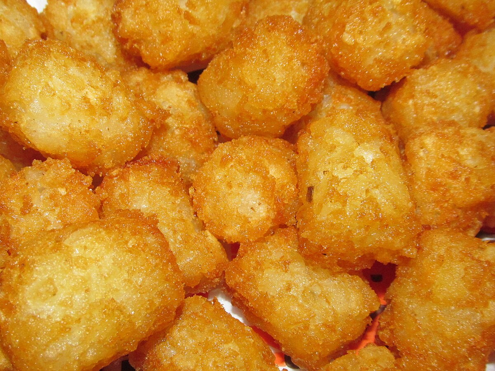

Final extractions and Qubit results from the new set of samples for RNAseq! See post for details.    

# Samples    

## Batch 3:    

| Sample ID | Species                  | Bin | Experiment Day | Treatment |
|-----------|--------------------------|-----|----------------|-----------|
|       421 | dermasterias_imbricata   |   1 |              6 |   exposed |
|       424 | dermasterias_imbricata   |   9 |              6 |   control |
|       429 | pycnopodia_helianthoides |   2 |              6 |   exposed |
|       435 | pycnopodia_helianthoides |   3 |              6 |   exposed |
|       436 | dermasterias_imbricata   |  11 |              6 |   control |
|       442 | dermasterias_imbricata   |  12 |              6 |   control |
|       444 | pycnopodia_helianthoides |  12 |              6 |   control |
|       463 | dermasterias_imbricata   |   8 |              6 |   exposed |
|       466 | dermasterias_imbricata   |  16 |              6 |   control |
|       520 | dermasterias_imbricata   |   9 |             12 |   control |
|       522 | pycnopodia_helianthoides |   9 |             12 |   control |
|       540 | pycnopodia_helianthoides |  12 |             12 |   control |

## Batch 4:    

| Sample ID | Species                  | Bin | Experiment Day | Treatment |
|-----------|--------------------------|-----|----------------|-----------|
|       427 | dermasterias_imbricata   |   2 |              6 |   exposed |
|       428 | pisaster_ochraceus       |   2 |              6 |   exposed |
|       432 | pycnopodia_helianthoides |  10 |              6 |   control |
|       439 | dermasterias_imbricata   |   4 |              6 |   exposed |
|       451 | dermasterias_imbricata   |   6 |              6 |   exposed |
|       456 | pycnopodia_helianthoides |  14 |              6 |   control |
|       467 | pisaster_ochraceus       |  16 |              6 |   control |
|       526 | dermasterias_imbricata   |  10 |             12 |   control |
|       532 | dermasterias_imbricata   |  11 |             12 |   control |
|       538 | dermasterias_imbricata   |  12 |             12 |   control |
|       552 | pycnopodia_helianthoides |  14 |             12 |   control |
|       327 | dermasterias_imbricata   |  12 |              0 | NA        |

# RNA Extraction Notes:   

## Batch 3  
Label:       
12:30-1pm        

Tater Tots:        
1:17-1:27pm        

       
Close-up image of tater tots to give the reader an idea of what they looked like. Source: Wikipedia.        

Start protocol at 1:28 PM    
Incubate til 2:10pm   

Finish protocol:  3:36 PM      

- sample 442 --> sample kind of yellowy/brown    

## Batch 4
Label:      
3:45-4pm     

Start protocol at: 4:09PM         
Incubate til: 4:54pm           

Finish protocol: 6:17PM       

- Samples 451 and 467 are yellowy/brown    
- Sample 439 --> too much liquid eluted... so likely some extra DNA/RNA Wash Buffer wasn't filtered through... but hardly any, just noticeable that the final elution volume is more than 15ul     
- Samples sat on ice after extraction. Into -80C at 6:45pm

Batch 3 done on qubit at 7:20pm.

# Qubit Results:   

Standards:    
Batch 3 (Samples 421-540) --> S1: 64.95; S2: 837.47       
Batch 4 (Samples 427-327) --> S1: 65.95; S2: 771.51    

| SampleID | Species                  | Bin | ExperimentDay | Experiment | RNA (ng/ul) | Total RNA in remaining sample (14ul remains) | Notes                             |
|----------|--------------------------|-----|---------------|------------|-------------|----------------------------------------------|-----------------------------------|
|      421 | dermasterias_imbricata   |   1 |             6 |    exposed |        62.4 |                                        873.6 |                                   |
|      424 | dermasterias_imbricata   |   9 |             6 |    control |        16.2 |                                        226.8 |                                   |
|      429 | pycnopodia_helianthoides |   2 |             6 |    exposed |        64.6 |                                        904.4 |                                   |
|      435 | pycnopodia_helianthoides |   3 |             6 |    exposed |         126 |                                         1764 |                                   |
|      436 | dermasterias_imbricata   |  11 |             6 |    control |        86.6 |                                       1212.4 |                                   |
|      442 | dermasterias_imbricata   |  12 |             6 |    control |         164 |                                         1968 | only 12ul remain- messed up Qubit |
|      444 | pycnopodia_helianthoides |  12 |             6 |    control |          74 |                                         1036 |                                   |
|      463 | dermasterias_imbricata   |   8 |             6 |    exposed |         148 |                                         2072 |                                   |
|      466 | dermasterias_imbricata   |  16 |             6 |    control |         108 |                                         1512 |                                   |
|      520 | dermasterias_imbricata   |   9 |            12 |    control |        18.7 |                                        261.8 |                                   |
|      522 | pycnopodia_helianthoides |   9 |            12 |    control |        74.2 |                                       1038.8 |                                   |
|      540 | pycnopodia_helianthoides |  12 |            12 |    control |         164 |                                         2296 |                                   |
|      427 | dermasterias_imbricata   |   2 |             6 |    exposed |        30.2 |                                        422.8 |                                   |
|      428 | pisaster_ochraceus       |   2 |             6 |    exposed |         124 |                                         1736 |                                   |
|      432 | pycnopodia_helianthoides |  10 |             6 |    control |         130 |                                         1820 |                                   |
|      439 | dermasterias_imbricata   |   4 |             6 |    exposed |        19.4 |                                        271.6 |                                   |
|      451 | dermasterias_imbricata   |   6 |             6 |    exposed |         144 |                                         2016 |                                   |
|      456 | pycnopodia_helianthoides |  14 |             6 |    control |         138 |                                         1932 |                                   |
|      467 | pisaster_ochraceus       |  16 |             6 |    control | TOO HIGH    |                    #VALUE!                   |                                   |
|      526 | dermasterias_imbricata   |  10 |            12 |    control |        97.8 |                                       1369.2 |                                   |
|      532 | dermasterias_imbricata   |  11 |            12 |    control |        55.2 |                                        772.8 |                                   |
|      538 | dermasterias_imbricata   |  12 |            12 |    control |        19.2 |                                        268.8 |                                   |
|      552 | pycnopodia_helianthoides |  14 |            12 |    control | TOO HIGH    |                    #VALUE!                   |                                   |
|      327 | dermasterias_imbricata   |  12 |             0 | NA         |        13.2 |                                        184.8 |                                   |

# Next Steps   
I need to have the samples packaged up and on dry ice by 12pm on the day that I want to ship them overnight to Genewiz.    
