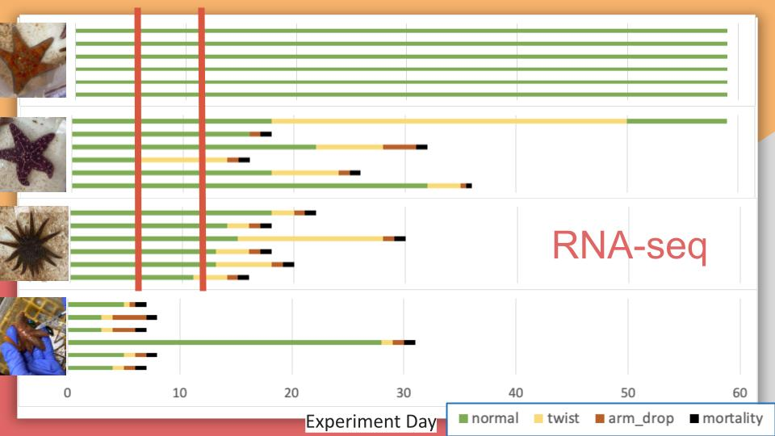

Shipped off RNA for more sequencing yesterday! See post for details.

# Samples Shipped:  

| Sample_ID | species                  | treatment | experiment_day | bin_number | qubit_result_ng.uL | final_sample_vol | total_RNA_in_remaining_sample |
|-----------|--------------------------|-----------|----------------|------------|--------------------|------------------|-------------------------------|
| PSC-421   | dermasterias_imbricata   |   exposed |              6 |          1 |               62.4 |               14 |                         873.6 |
| PSC-422   | pisaster_ochraceus       |   exposed |              6 |          1 |                134 |               14 |                          1876 |
| PSC-423   | pycnopodia_helianthoides |   exposed |              6 |          1 |               42.4 |               14 |                         593.6 |
| PSC-424   | dermasterias_imbricata   |   control |              6 |          9 |               16.2 |               14 |                         226.8 |
| PSC-425   | pisaster_ochraceus       |   control |              6 |          9 |                154 |               14 |                          2156 |
| PSC-426   | pycnopodia_helianthoides |   control |              6 |          9 |               94.4 |               14 |                        1321.6 |
| PSC-427   | dermasterias_imbricata   |   exposed |              6 |          2 |               30.2 |               14 |                         422.8 |
| PSC-428   | pisaster_ochraceus       |   exposed |              6 |          2 |                124 |               14 |                          1736 |
| PSC-429   | pycnopodia_helianthoides |   exposed |              6 |          2 |               64.6 |               14 |                         904.4 |
| PSC-430   | dermasterias_imbricata   |   control |              6 |         10 |               65.2 |               14 |                         912.8 |
| PSC-431   | pisaster_ochraceus       |   control |              6 |         10 |                110 |               14 |                          1540 |
| PSC-432   | pycnopodia_helianthoides |   control |              6 |         10 |                130 |               14 |                          1820 |
| PSC-433   | dermasterias_imbricata   |   exposed |              6 |          3 |                180 |               14 |                          2520 |
| PSC-434   | pisaster_ochraceus       |   exposed |              6 |          3 |                 72 |               14 |                          1008 |
| PSC-435   | pycnopodia_helianthoides |   exposed |              6 |          3 |                126 |               14 |                          1764 |
| PSC-436   | dermasterias_imbricata   |   control |              6 |         11 |               86.6 |               14 |                        1212.4 |
| PSC-437   | pisaster_ochraceus       |   control |              6 |         11 |               63.2 |               14 |                         884.8 |
| PSC-438   | pycnopodia_helianthoides |   control |              6 |         11 |                160 |               14 |                          2240 |
| PSC-439   | dermasterias_imbricata   |   exposed |              6 |          4 |               19.4 |               14 |                         271.6 |
| PSC-440   | pisaster_ochraceus       |   exposed |              6 |          4 |                 92 |               14 |                          1288 |
| PSC-441   | pycnopodia_helianthoides |   exposed |              6 |          4 | TOO HIGH           |               14 |            #VALUE!            |
| PSC-442   | dermasterias_imbricata   |   control |              6 |         12 |                164 |               12 |                          1968 |
| PSC-443   | pisaster_ochraceus       |   control |              6 |         12 |               21.8 |               14 |                         305.2 |
| PSC-444   | pycnopodia_helianthoides |   control |              6 |         12 |                 74 |               14 |                          1036 |
| PSC-451   | dermasterias_imbricata   |   exposed |              6 |          6 |                144 |               14 |                          2016 |
| PSC-452   | pisaster_ochraceus       |   exposed |              6 |          6 |               14.9 |               14 |                         208.6 |
| PSC-453   | pycnopodia_helianthoides |   exposed |              6 |          6 |               38.4 |               14 |                         537.6 |
| PSC-454   | dermasterias_imbricata   |   control |              6 |         14 |               80.6 |               14 |                        1128.4 |
| PSC-455   | pisaster_ochraceus       |   control |              6 |         14 |                130 |               14 |                          1820 |
| PSC-456   | pycnopodia_helianthoides |   control |              6 |         14 |                138 |               14 |                          1932 |
| PSC-463   | dermasterias_imbricata   |   exposed |              6 |          8 |                148 |               14 |                          2072 |
| PSC-464   | pisaster_ochraceus       |   exposed |              6 |          8 |               70.4 |               14 |                         985.6 |
| PSC-465   | pycnopodia_helianthoides |   exposed |              6 |          8 |                 63 |               14 |                           882 |
| PSC-466   | dermasterias_imbricata   |   control |              6 |         16 |                108 |               14 |                          1512 |
| PSC-467   | pisaster_ochraceus       |   control |              6 |         16 | TOO HIGH           |               14 |            #VALUE!            |
| PSC-468   | pycnopodia_helianthoides |   control |              6 |         16 |               64.6 |               14 |                         904.4 |
| PSC-520   | dermasterias_imbricata   |   control |             12 |          9 |               18.7 |               14 |                         261.8 |
| PSC-521   | pisaster_ochraceus       |   control |             12 |          9 |               41.6 |               14 |                         582.4 |
| PSC-522   | pycnopodia_helianthoides |   control |             12 |          9 |               74.2 |               14 |                        1038.8 |
| PSC-526   | dermasterias_imbricata   |   control |             12 |         10 |               97.8 |               14 |                        1369.2 |
| PSC-527   | pisaster_ochraceus       |   control |             12 |         10 |               26.8 |               14 |                         375.2 |
| PSC-528   | pycnopodia_helianthoides |   control |             12 |         10 |                200 |               14 |                          2800 |
| PSC-532   | dermasterias_imbricata   |   control |             12 |         11 |               55.2 |               14 |                         772.8 |
| PSC-533   | pisaster_ochraceus       |   control |             12 |         11 |               33.8 |               14 |                         473.2 |
| PSC-534   | pycnopodia_helianthoides |   control |             12 |         11 |                126 |               14 |                          1764 |
| PSC-538   | dermasterias_imbricata   |   control |             12 |         12 |               19.2 |               14 |                         268.8 |
| PSC-539   | pisaster_ochraceus       |   control |             12 |         12 |               16.9 |               14 |                         236.6 |
| PSC-540   | pycnopodia_helianthoides |   control |             12 |         12 |                164 |               14 |                          2296 |
| PSC-550   | dermasterias_imbricata   |   control |             12 |         14 |               26.6 |               14 |                         372.4 |
| PSC-551   | pisaster_ochraceus       |   control |             12 |         14 |               27.4 |               14 |                         383.6 |
| PSC-552   | pycnopodia_helianthoides |   control |             12 |         14 | TOO HIGH           |               14 |            #VALUE!            |
| PSC-562   | dermasterias_imbricata   |   control |             12 |         16 |               43.6 |               14 |                         610.4 |
| PSC-563   | pisaster_ochraceus       |   control |             12 |         16 |               9.34 |               14 |                        130.76 |
| PSC-564   | pycnopodia_helianthoides |   control |             12 |         16 |                150 |               14 |                          2100 |

So now, once I have the RNAseq data from these samples (23-28 business days), I'll have the following for the multi-species project:      

### Controls and Exposed for Day 6 and Day 12  
Note: Image only shows exposed stars disease signs. All controls had no disease signs.    

  

# Tracking Update
I just checked and it says that they'll be delivered today by end of day... not sure why they weren't delivered this morning, which is normally what happens when I select the priority overnight (which I did this time and previous times)... but luckily because of the hot weather, I put in a LOT of dry ice in a slightly bigger-than-necessary styrofoam cooler, so fingers crossed they arrive still frozen.

## UPDATE - They received the samples!

I checked the tracking again, and they signed for and received the samples :) 
