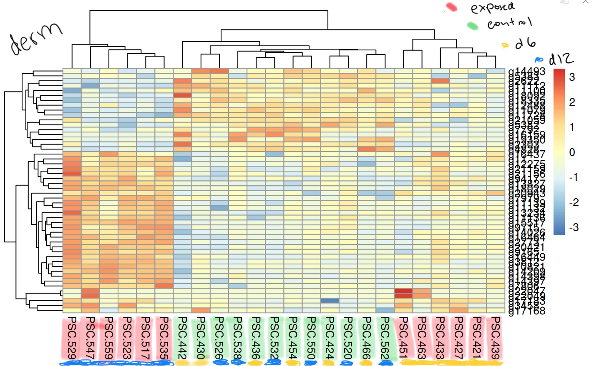

`DESeq2` results of control vs exposed within each species for the multi-species project. See post for details. 

# Overview

For each species, I ran `DESeq2` to compare the control and exposed groups, combining time points (day 6 and day 12), so that within each species, the comparison was: n=12 control vs n=12 exposed. 

The PCAs within each species showed a lot of overlap... suggesting that there needs to be some teasing apart of time possibly? Perhaps the exposed stars from day 12 are more different from the control and exposed from day 6 and the controls from day 12. 

Additionally, the heatmaps were interesting in that the expression patterns of the top 50 DEGs within each species showed clustering patterns that were similar between the _P. ochraceus_ and the _D. imbricata_, and the _P. helianthoides_ was much different. This could be the first clue as to why the sunflower stars are so much more vulnerable! More to be revealed after the DEG lists are annotated and enrichment is performed. More analyses with the time series may be coming soon as well.

# _P. helianthoides_ 

Code: [project-pycno-multispecies-2023/code/29-deseq2-pycno.Rmd](https://github.com/grace-ac/project-pycno-multispecies-2023/blob/main/code/29-deseq2-pycno.Rmd)

# DEG list
1977 DEGs.    

List (not annotated yet): [project-pycno-multispecies-2023/output/29-deseq2-pycno/DEGlist_pycno_controlVexposed.tab](https://github.com/grace-ac/project-pycno-multispecies-2023/blob/main/output/29-deseq2-pycno/DEGlist_pycno_controlVexposed.tab)

## PCA    

    

There seems to be a lot of overlap... maybe there's only a strong difference between the Day 12 exposed and the rest of them ...

## Heatmap (annotated roughly)   

  

Heatmap of expression of top 50 DEGs. Some interesting things are that there's a mix of the control and exposed and days 6 and 12... and in the exposed group from day 12, an exposed individual from day 6 is there, too. 

# _P. ochraceus_ 

Code: [project-pycno-multispecies-2023/code/30-deseq2-pisaster.Rmd](https://github.com/grace-ac/project-pycno-multispecies-2023/blob/main/code/30-deseq2-pisaster.Rmd)

# DEG list 
2298 DEGs.   

List (not annotated yet): [project-pycno-multispecies-2023/output/30-deseq2-pisaster/DEGlist_pisaster_controlVexposed.tab)](https://github.com/grace-ac/project-pycno-multispecies-2023/blob/main/output/30-deseq2-pisaster/DEGlist_pisaster_controlVexposed.tab)

## PCA 

## Heatmap (annotated roughly)   

Top 50 DEGs. The day 12 exposed _P. ochraceus_ are clustered, and the day 6 exposed _P. ochraceus_ are also clustered. Controls are all interspersed.   

# _D. imbricata_ 

Code: [project-pycno-multispecies-2023/code/31-deseq2-derm.Rmd](https://github.com/grace-ac/project-pycno-multispecies-2023/blob/main/code/31-deseq2-derm.Rmd) 

# DEG List 
325 DEGs. 

List (not annotated yet): [project-pycno-multispecies-2023/output/31-deseq2-derm/DEGlist_derm_controlVexposed.tab](https://github.com/grace-ac/project-pycno-multispecies-2023/blob/main/output/31-deseq2-derm/DEGlist_derm_controlVexposed.tab)

# PCA 

 

# Heatmap (annotated roughly) 

Top 50 DEGs. More similar to _P. ochraceus_ heatmap pattern than that of _P. helianthoides_. Day 12 exposed clustered, day 6 exposed clustered, and control day 6 and day 12 are clustered and interspersed together. 