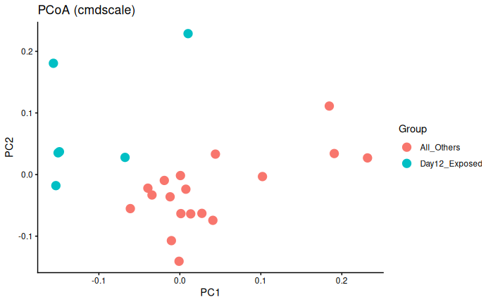
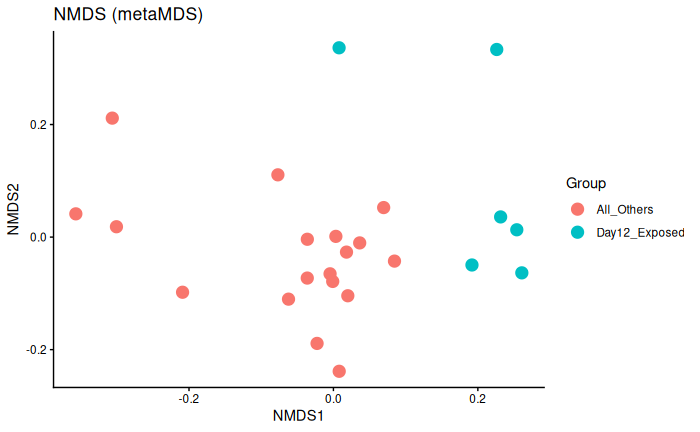
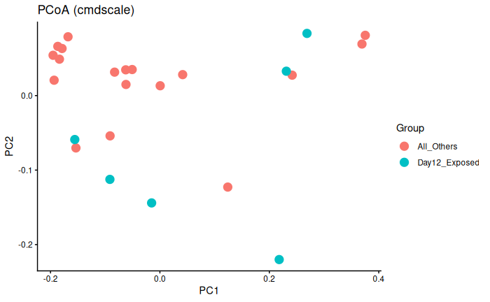
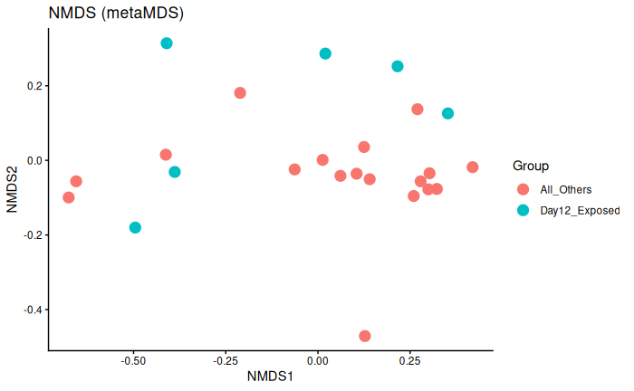
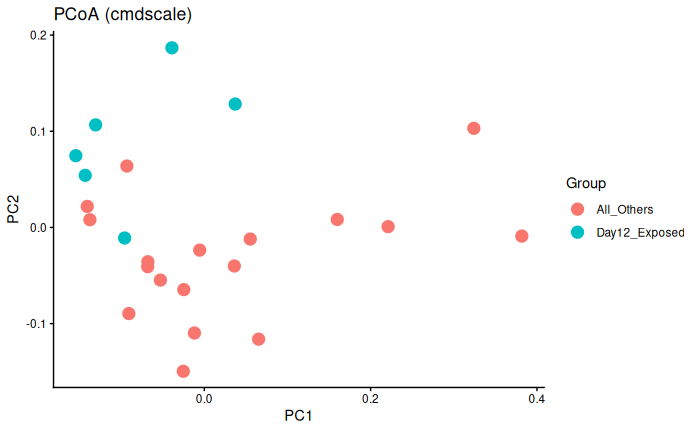
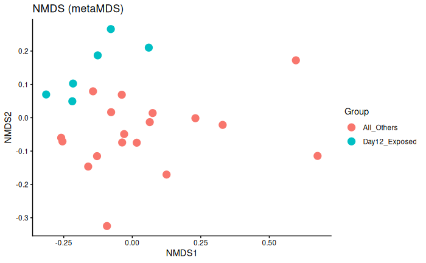

Permanova results and thoughts on the RNAseq data for the multi-species project. See post for details. 

Hi! 

So, the multi-species work consists of RNAseq data from two time points (Days 6 and 12) and of two treatment groups at each time point (Control and Exposed). The Exposed Day 12 group's RNA was extracted and sequenced at a different time than the RNA for the three other groups (day 12 control, day 6 control, and day 6 exposed). I wanted to run a permanova to see if there's a batch effect. 

Note: This GitHub repository is private due to working with collaborators' unpublished data. 

Code: [project-pycno-multispecies-2023/code/32-permanova.Rmd)](https://github.com/grace-ac/project-pycno-multispecies-2023/blob/main/code/32-permanova.Rmd)

Here's some representative code of what I did for each species:    

read in count matrix: 
```{r}
pyc <- read.csv("../data/pycno_transcript_count_matrix_2023.csv")
```

metadata for libraries: 
```{r}
pycme <- read.csv("../output/32-permanova/pycno_metadata.csv")
```
transpose the pyc data so that genes are the columns and samples are the rows:
```{r}
pyc_t <- as.data.frame(t(pyc[,-1]))
```


```{r}
pycdist <- vegdist(pyc_t, method = "bray")
```

```{r}
pycme$ContrastGroup <- ifelse(
    pycme$ExperimentalDay == "12" & pycme$Treatment == "exposed",
    "Day12_Exposed",
    "All_Others"
)
```

```{r}
pyc_results <- adonis2(pycdist ~ ContrastGroup, data = pycme, permutations = 999)
print(pyc_results)
```

```{r}
library(vegan)
library(ggplot2)

# Example using pycdist ----
dist_matrix <- pycdist  # replace with your own
group <- pycme$ContrastGroup

### -------- PCoA using cmdscale (metric MDS) -------- ###
pcoa <- cmdscale(dist_matrix, eig = TRUE, k = 2)
pcoa_df <- data.frame(
  PC1 = pcoa$points[,1],
  PC2 = pcoa$points[,2],
  Group = group
)

ggplot(pcoa_df, aes(PC1, PC2, color = Group)) +
  geom_point(size = 4) +
  theme_classic() +
  labs(title = "PCoA (cmdscale)")

### -------- NMDS (non-metric MDS) -------- ###
nmds <- metaMDS(dist_matrix, k = 2, trymax = 999)

nmds_df <- data.frame(
  NMDS1 = nmds$points[,1],
  NMDS2 = nmds$points[,2],
  Group = group
)

ggplot(nmds_df, aes(NMDS1, NMDS2, color = Group)) +
  geom_point(size = 4) +
  theme_classic() +
  labs(title = "NMDS (metaMDS)")

```

# Results: 

# _P. helianthoides_

```
Permutation test for adonis under reduced model
Permutation: free
Number of permutations: 999

adonis2(formula = pycdist ~ ContrastGroup, data = pycme, permutations = 999)
         Df SumOfSqs      R2      F Pr(>F)    
Model     1  0.16985 0.22763 6.4836  0.001 ***
Residual 22  0.57634 0.77237                  
Total    23  0.74619 1.00000                  
---
Signif. codes:  0 ‘***’ 0.001 ‘**’ 0.01 ‘*’ 0.05 ‘.’ 0.1 ‘ ’ 1
```

 



### Interpretation
Day 12 exposed is significantly different from day 6 exposed and control and day 12 control. 

This could be batch effect, or it literally could just be because Day 12 exposed are experiencing infection/immune response whereas the other three groups are not. 

# _P. ochraceus_

```
Permutation test for adonis under reduced model
Permutation: free
Number of permutations: 999

adonis2(formula = pisdist ~ ContrastGroup, data = pisme, permutations = 999)
         Df SumOfSqs     R2      F Pr(>F)  
Model     1  0.12848 0.0829 1.9886  0.097 .
Residual 22  1.42137 0.9171                
Total    23  1.54985 1.0000                
---
Signif. codes:  0 ‘***’ 0.001 ‘**’ 0.01 ‘*’ 0.05 ‘.’ 0.1 ‘ ’ 1
```

 

 

### Interpretation
Day 12 exposed is not significantly different from day 6 exposed and control and day 12 control. 

No batch effect. 

# _D. imbricata_

```
Permutation test for adonis under reduced model
Permutation: free
Number of permutations: 999

adonis2(formula = derdist ~ ContrastGroup, data = derme, permutations = 999)
         Df SumOfSqs      R2      F Pr(>F)  
Model     1  0.15872 0.13846 3.5358  0.014 *
Residual 22  0.98755 0.86154                
Total    23  1.14627 1.00000                
---
Signif. codes:  0 ‘***’ 0.001 ‘**’ 0.01 ‘*’ 0.05 ‘.’ 0.1 ‘ ’ 1
```

 

 

### Interpretation
Day 12 exposed is significantly different from day 6 exposed and control and day 12 control. 

This could be batch effect, or it literally could just be because Day 12 exposed are experiencing infection/immune response whereas the other three groups are not. 

# Overall interpretation 

Not sure why the _P. ochraceus_ group doesn't have a batch effect. 

The differences in _D. imbricata_ and _P. helianthoides_ could be due to disease OR to a batch effect?? 


