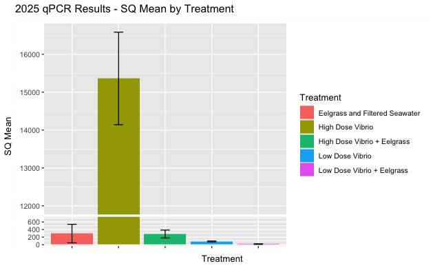

Results from last year's experiment ([see post](https://grace-ac.github.io/FHL2025_expt/)). 

The results are the amount of _V. pectenicida_ detected in the samples (0.45um filters that filtered 150mL of seawater). 

I processed half of the filter (other half is in the FTR -80C). I ran 2ul of DNA in triplicate for each sample on qPCR, targeting _V. pectenicida_. 

I paid attention to the SQ (Starting Quantity) amount. I removed any replicates that were way off from the other in the triplicate run per sample. I then averaged the SQ for the remaining replicates for each sample. 

As a reminder of the treatment groups:     

| Treatment                    | Treatment Code | Number of bags (replicates) | Eelgrass in treatment? Yes/No |
|------------------------------|----------------|-----------------------------|-------------------------------|
| Low Dose Vibrio + Eelgrass   | LDVE           | 8                           | Yes                           |
| High Dose Vibrio + Eelgrass  | HDVE           | 8                           | Yes                           |
| Low Dose Vibrio              | LDV            | 8                           | No                            |
| High Dose Vibrio             | HDV            | 8                           | No                            |
| Eelgrass + Filtered seawater | EFSW           | 8                           | Yes                           |

To get these results, I took the average of the replicates (which themselves are averages of the triplicates per sample) for each treatment, and calculated the standard error to plot. 

Look like in the High Dose of _V. pectenicida_, there is a strong effect of the presence of eelgrass. The presence of eelgrass decreased the amount of _V. pectenicida_ after 5 days. 

In the low dose, there doesn't seem to be a super strong effect.

In the control (EFSW =- eelgrass + filtered seawater) some _V. pectenicida_ has been picked up in some samples. This could be due to:   
- Contamination during the qPCR process 
- Contamination during the experimental set-up (though unlikely) 
- Ambient _V. pectenicida_ from the lab water --> we only filtered to 1um, which would have let _V. pectenicida_ through, and there has been wasting at the Labs   

This year's experiment we have more control treatments (seawater alone; seawater + media) AND we filtered the seawater down to 0.22um before adding to the treatment bags for the experiment. 