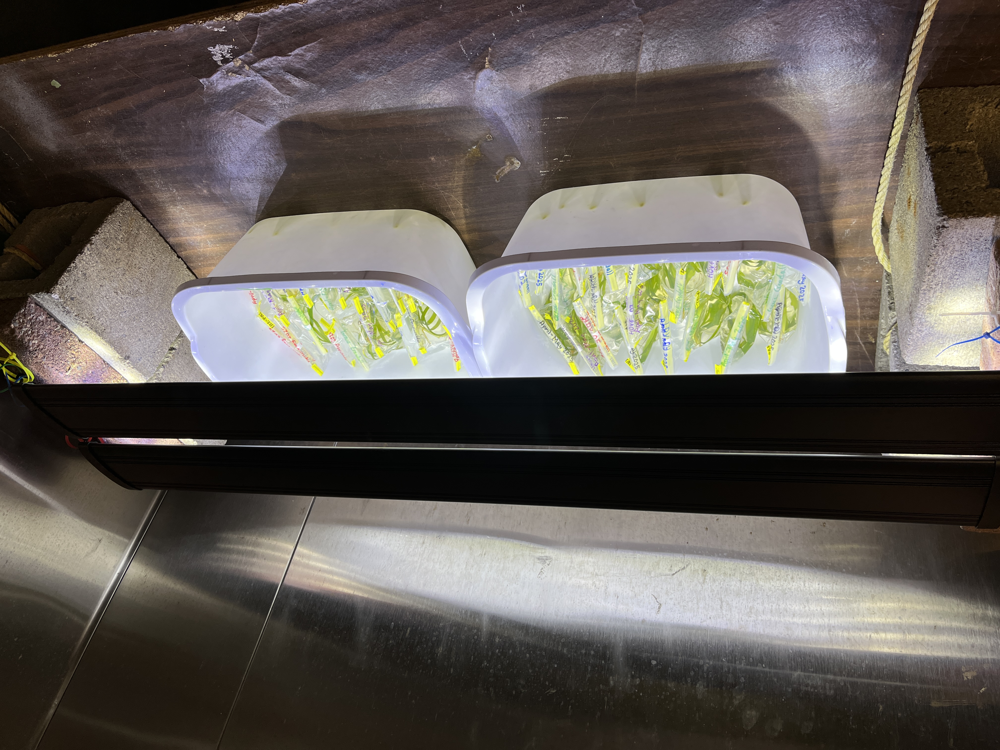
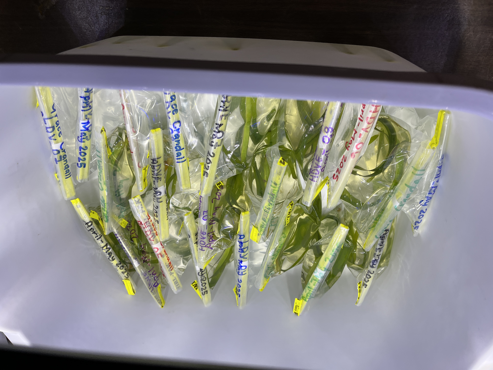
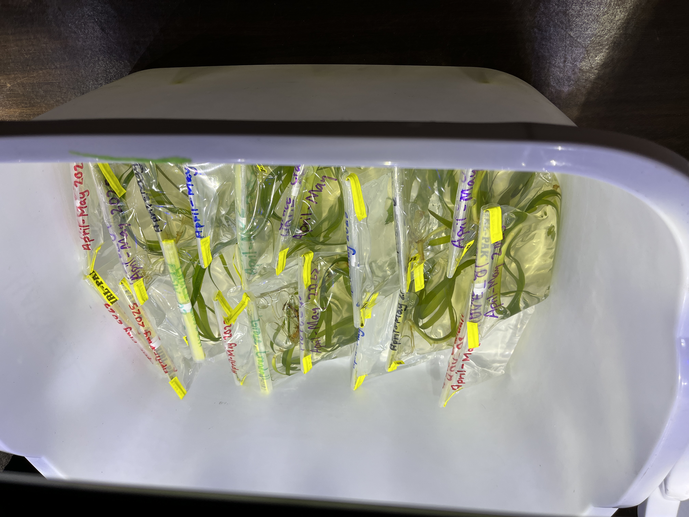
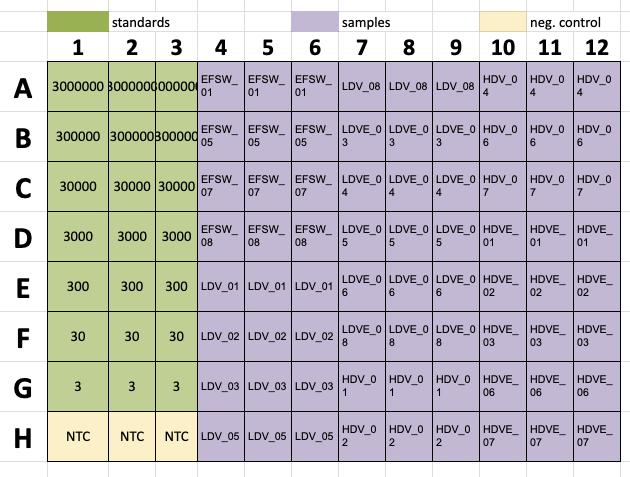
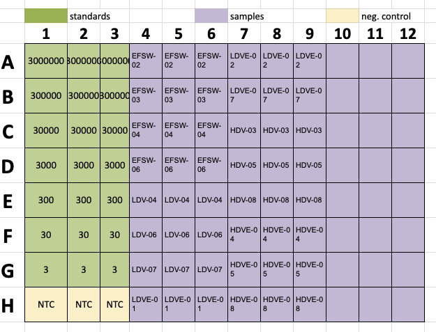
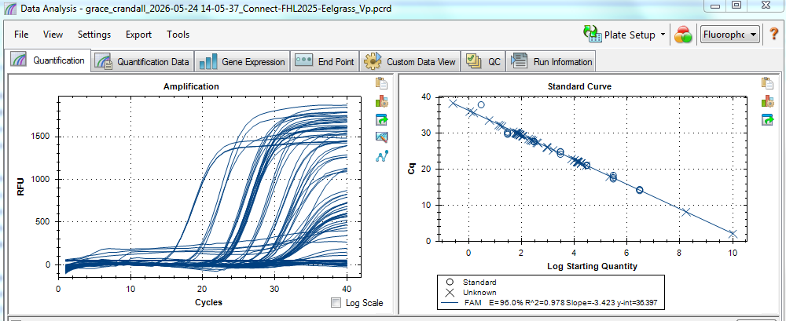
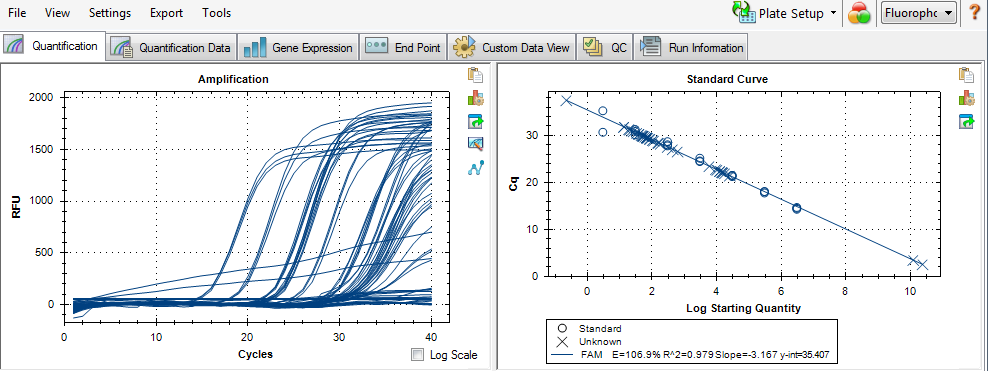

Details about last year's experiment run at Friday Harbor Laboratories: Can eelgrass presence decrease the amount of _Vibrio pectenicida_ in seawater? 

NOTE: Stay tuned for this year's iteration of the experiment that includes mussels!! 

# Question: Can eelgrass decrease the amount of _Vibrio pectenicida_ in seawater? 

## Treatment groups:  

| Treatment Number | Treatment                                            | Replicates |
|------------------|------------------------------------------------------|------------|
| 1                | Eelgrass + culture media + seawater                  | 8          |
| 2                | Eelgrass + High dose _Vibrio pectenicida_ + seawater | 8          |
| 3                | High dose _Vibrio pectenicida_ + seawater            | 8          |
| 4                | Eelgrass + Low dose _Vibrio pectenicida_ + seawater  | 8          |
| 5                | Low dose _Vibrio pectenicida_ + seawater             | 8          |

## Hypothesis:
1. Presence of eelgrass will decrease the amount of _Vibrio pectenicida_ in seawater over time. 

This tests the oxygenation hypothesis --> eelgrass produce oxygen which creates an uninhabitable environment for the anaerobic _V. pectenicida_. 

## Methods: 

_Eelgrass collection and prcoessing_ 
1. Eelgrass was sampled (n=24) from Fourth of July Beach, San Juan Island, Washington.          
2. Eelgrass was cleaned (epiphytes removed, low salinity rinse)        
3. Eelgrass was measured (length), and number of leaves were counted. Plants were assigned to treatment groups      randomly, but ensuring that no one treatment had all the longer plants     
4. Eelgrass was kept in filtered seawater in a cold room until ready to use in the experiment      

_Bacteria received_
1. Bacteria culture was received and followed instructions from sender for creation of the two doses from the stock. 

_Experiment setup_
1. 148.5 mL of 1um filtered seawater was added to 24oz whirlpak bags labeled with treatment ID and replicate numbers (1-8)       
2. Eelgrass was added to the appropriate bags (treatments 1, 2, and 4) (one plant per bag)         
3. 1.5 mL of the appropriate dose of _V. pectenicida_ culture was added to treatments 2, 3, 4, and 5     
4. 1.5 mL of the culture media (no _V. pectenicida_) was added to treatment 1 (the control)      
5. Whirlpak bags were kept in a temperature-controlled room (18C)     
6. UV lights (n=2) were set up over the bags - on at 7am, off at 7pm      

  

_Sampling_ 
1. Each bag was filtered (150mL of water) through a 0.45um filter      
2. Filters were folded with tools (using sterile technique between each use --> bleach, ethanol, flame)      
3. Filters were placed in 1.5mL snap cap tubes (sterile) and stored in -80C    

_Sample processing_ 
1. Using sterile technique, each filter was cut in half (remaining half stored in FTR -80C)      
2. DNA was extracted following ZymoBIOMICS DNA Miniprep Kit (D4300) protocol      
3. DNA was eluted in 50ul of water and stored in the middle -80C in FTR.      

_Running on qPCR - targetting V. pectenicida_ 
All steps in the FTR 209 laminar flow hood: 

Wiped down the laminar flow hood and pipets and tube racks with 10% bleach, then turned on the germicidal light for 20minutes. 

*Preparing the proper concentrations of reagents* 
1. Dilute primers: Sent to me from Colleen Burge at 100um concetration - added 5ul of 100um stock + 45ul of 1x TE Buffer     
2. Dilute probe: Add 5ul of 100um probe + 45ul 1X TE Buffer     
3. Prepare standard curve serial dilutions of _V. pectenicida_ gBlock:          
- Prepare diluent          
- Start at dilution 1 where the stock is what CB sent and the diluent is the 1X TE + ytRNA thing made in 3.a.         
- take 10ul of dilution 1 and add 90ul of diluent to make dilution 2         
- take 10ul of dilution 2 and add 90ul of diluent to make dilution 3         
and so on

Store the curve in the FRIDGE for up to three months      

*Making the master mix*   
Perform in laminar flow hood after wiping down hood space + pipets and tube racks with 10% bleach and germicidal light for 20mins.     Enough of each reagent for the number of wells needing to fill + 2 extra wells to account for pipetting error.    

*Load the plate* 
1. Add 18ul of the master mix to each well that will have template added      
2. Add 2ul of molecular grade water to wells H1-H3          
3. Vortex and spin down the standard curve --> add 2ul (in triplicate) the dilutions 3 copies through 3000000 copies       
4. Add 2ul of DNA (in triplicate) for samples to run        
5. Seal the plate with the adhesive film and spin down in centrifuge        

*Run the plate*
Following the instructions from Melanie, run the plate on the machine in FTR 228.       

# qPCR Results:    

_Plates run_     
*NOTE: I ran plate 2, but got an R^2 of 0.49... so likely really bad pipetting error (tried to run two plates in one day and I think I can't focus well enough to do that - moving forward will only run 1 plate in a day). So, plate 3 is the re-run of plate 2 (same samples). 

| Plate 1 | Plate 3 |
| :---: | :---: |
|  |  |   

Plate 1:   
E = 96.0%      
R^2 = 0.978      
Slope = -3.423       
y-int = 36.397       

Plate 3:   
E = 106.9%        
R^2 = 0.979      
Slope = -3.167     
y-int = 35.407      

Notes on the above:    
E = efficiency: tells how well reagents are working. Ideally should be between 90-110% (so both plates are good).    
R^2 = tells how well the standard curve fits a straight line. Can also tell how well pipetting. Should be as close to 1 as possible - both are close to 1! (Note from above - plate 2 (intiial run of samples from plate 3) had an R^2 of 0.49 - so I was clearly very sleepy and shouldn't have done two plates in a day).     
Slope = should be between -3.1 and -3.6 (both plates are good).      
y-int = not typically used to assess quality, but values are between 20 and 40 (both plates good).    

Screenshots of finished runs:      
Plate 1:    
    

Plate 3:   
    

## Results from the qPCR:   
So the results I am paying attention to from the qPCR output is the SQ (Starting Quantity) from each well.     

Results figures and associated code will be a separate notebook post. 

