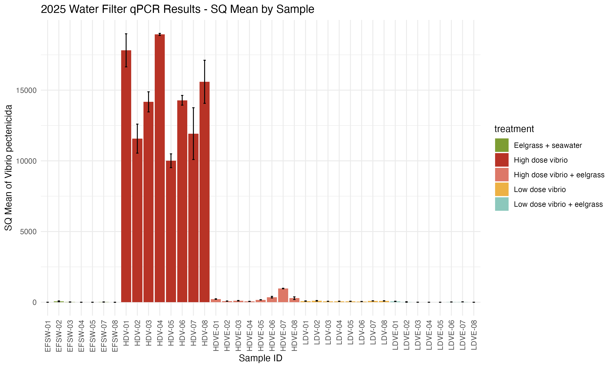
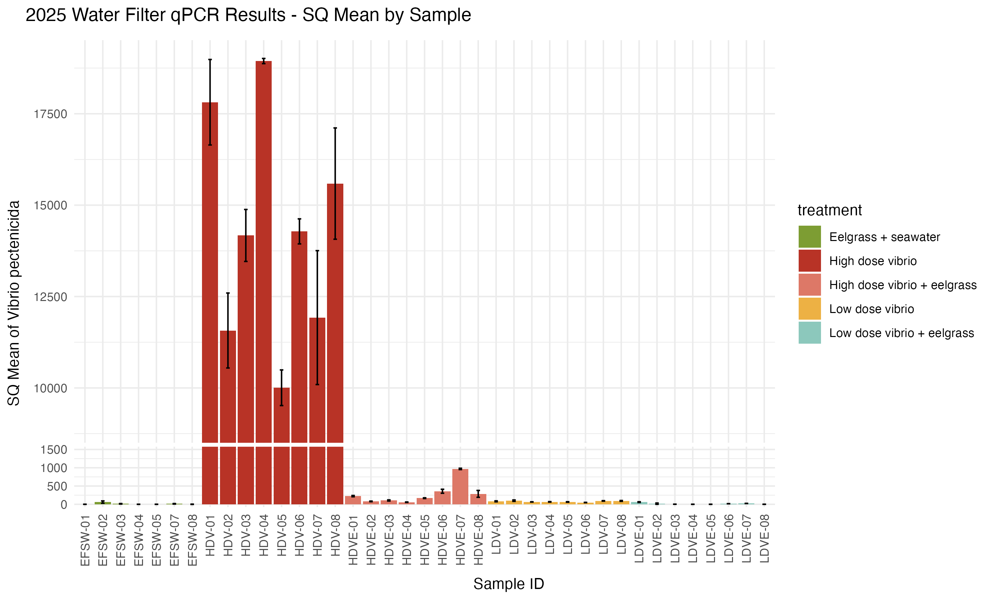
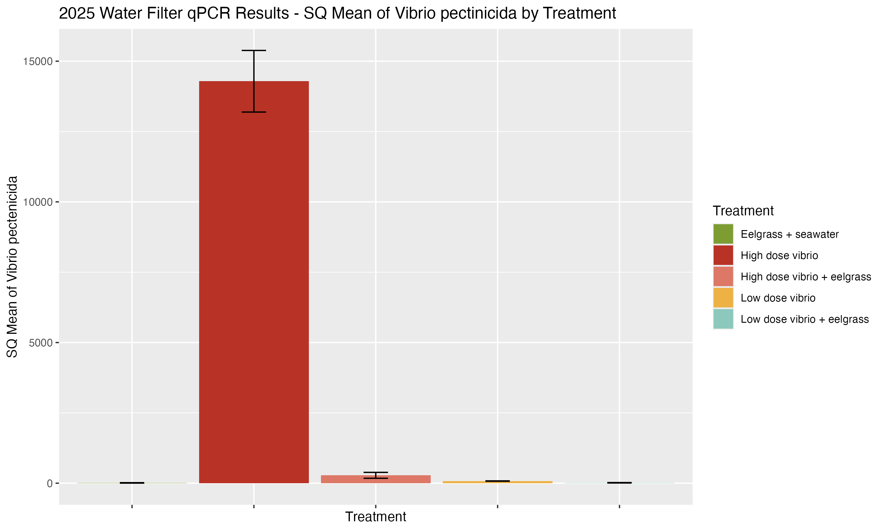
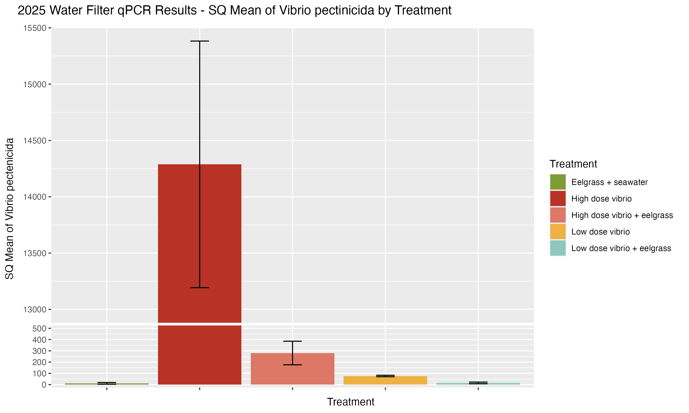

This is an update on results from [this post](https://grace-ac.github.io/FHL2025-results/).   

# Update: 
Experiment details: [post here](https://grace-ac.github.io/FHL2025_expt/)

In my post from [2026-06-10](https://grace-ac.github.io/FHL2025-results/), the EFSW (eelgrass + seawater) treatment had quite a bit of _V. pectenicida_ (see figure in post).    

I re-did the analyses based on some reading that I did looking into the appropriate methods of cleaning qPCR data post-run.    

Here's what I did:     
1. Focus on SQ (Starting Quantity) and SQ Mean. 
2. Remove any replicates (samples were run in triplicates) if SQ is wayyyy out of range. 
3. Calculate CV (Coefficient of variance) for each sample (SD/Mean)*100. Tells variance around the mean. Helps determine if a replicate should be removed. 

Google sheet with filtering: [2025_water-filter_qPCR_summary_results](https://docs.google.com/spreadsheets/d/1cfXnMYVNQ-VFfosS0PjJoaMlXfnggYZnX2UwSFThrzY/edit?gid=0#gid=0)         
So, for each sample: 
1. Calculate SQ Mean, SD, and CV (only including wells that aren't contaminated (aka way out of range compared to other replicates of the sample and if CV is way high)). 
2. The SQ mean is mean amount or V. pec in 2ul of the sample. Divide the mean by 2 to get the amount of V. pec in 1ul of sample

Calculate the amount of V. pectenicida in the whole treatment bag      
1. Calculate amount of V. p in 1mL of water by multiplying the amount in 1ul of sample times 1000     
2. Multiply the amount in 1mL by 150 to get the amount in the bag      

For each treatment group calculate:
1. Mean amount of Vp across samples (n=8)     
2. Standard Error of Vp across samples (n=8). SE = sd/(sqrt(n)) 

Create summary results        
Mean amount of Vp in 150ml of sample per treatment with error bars (standard error) 

Updated R code of creating results figures: [eelgrass-vpec/code/02-2025-Expt-results.Rmd](https://github.com/grace-ac/eelgrass-vpec/blob/main/code/02-2025-Expt-results.Rmd)   
Updated Figures:        

| _V. pectenicida_ Per Sample | _V. pectenicida_ Per Sample with y-axis break |
| :---: | :---: |
|  |  | 

| _V. pectenicida_ Per Treatment | _V. pectenicida_ Per Treatment with y-axis break |
| :---: | :---: |
|  |  | 

With the updated methods of filtering the qPCR results, the amount of _V. pectenicida_ in EFSW treatment is a bit less. 

But, I think it does mean that I did have some contamination either during the DNA extraction process, but more likely during the qPCR process. 

