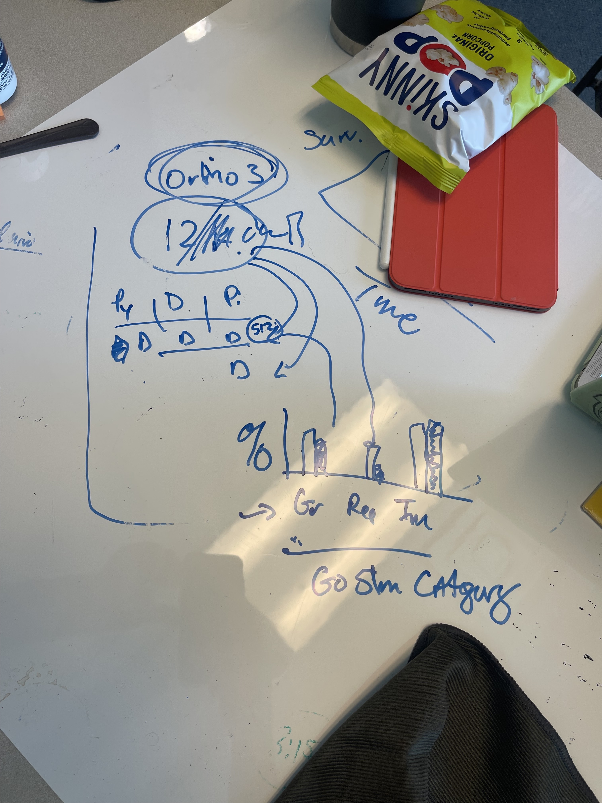

Post with notes on meeting chat and what I'll be doing next. 

# Meeting Agenda: 
1. The crab paper ([submission post](https://grace-ac.github.io/submit-crab-paper/)) was sent back twice before being able to be sent out to review - one was an easy fix of adding things to the document like a conflict of interest statement. The other that I needed input on was "* Please ensure to add separate figure and table legend in the main document as it is journal mandatory.". What does that mean?    
2. Thoughts on dissertation chapters? ([post here](https://grace-ac.github.io/DissChapThoughts/))    
3. Next steps for the multi-species work? Share results ([post here](https://grace-ac.github.io/MUSP_results-orthDEG/))
4. Help with TREQ ordering - TaqMan reagent still hasn't been ordered even though I placed the request on June 9th!! 

# Meeting Notes: 
1. SR: Probably means that they want the table figure and legends to be at the end of the paper after the Literature Cited. 
2. SR: Do what is most interesting, also reminder that we can reassess for what the chapter will be after finish with the current multi-species data set because there could be something really cool to build off of for another chapter!
3. SR: make a figure that is looking at the orthogroups shared across all species. Look at how the DEG orthogroups for each species related to the 12k orthogroups that are shared across all species. Make a figure, then can go from there and add same figure of what's unique to each species, what's shared between two, etc. Something like this:       

   

4. The order got stuck in approval... Steven emailed the person who needs to approve. 

# To Dos:   
1. Did it!!! Moved the table and figure legends to the end of the Literature Cited section (paper draft [here](https://docs.google.com/document/d/1VnbVEyc_edowy-QhXOcR3vYQ2FQxsaS3a_Z1JXU6S7U/edit?tab=t.0)) and re-submitted to the journal. 
2. Will focus on finishing current dataset results of the multi-species work and we'll re-assess chapter thoughts after that is done. 
3. Will make some figures and will also make a notebook post about the OrthoFinder results that I did a long time ago to re-familiarize myself with what it all means. 
4. The email from Steven worked! It all got approved. 

I can't work on the FHL 2026 experiment sample lab work like I hoped I would be able to before meeting with Drew next Tuesday because of the ordering issues, so I'm front-loading the multi-species work and paper drafting to share with her instead of the labwork results, which will have to come later after supplies arrive. 