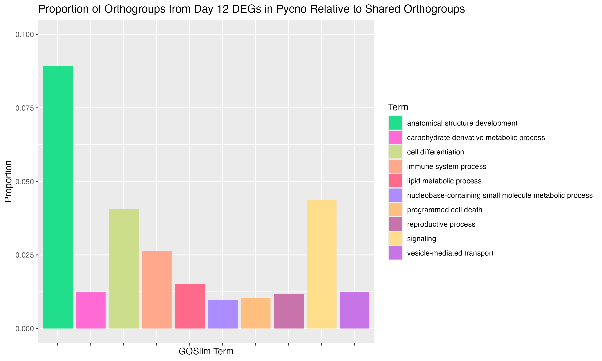
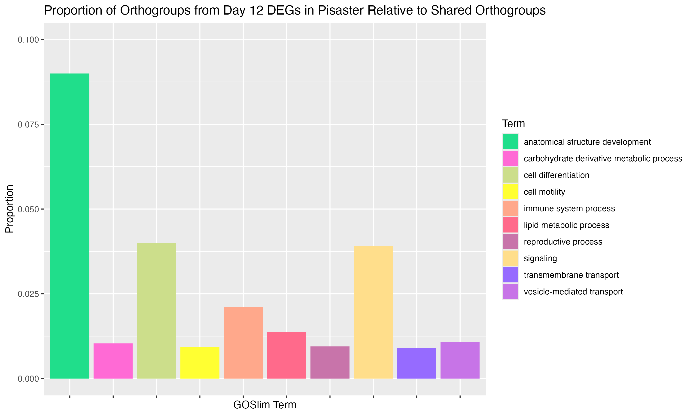
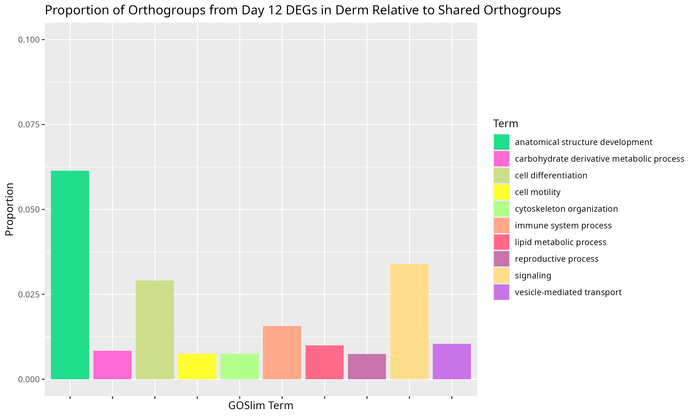

Details and results of tying DEG results to orthogroups (Part I). 

R code: [project-pycno-multispecies-2023/code/26-figures.Rmd](https://github.com/grace-ac/project-pycno-multispecies-2023/blob/main/code/26-figures.Rmd)

Each figure below is the same, but for each species. The data comes from the GOSlim lists of Day 12 DEGs from orthogroups that are unique to each species. The y-axis is the proportion of those Orthogroups unique to each species associated with the number of orthogroups (12547) shared across all three species. 

# _P. helianthoides_ 
Table used to create figure: [project-pycno-multispecies-2023/output/25-degs-orth-GOSlim/GOSlim-DEGlist_pycnoDay12_all_unique_orthogroups.tab](https://github.com/grace-ac/project-pycno-multispecies-2023/blob/main/output/25-degs-orth-GOSlim/GOSlim-DEGlist_pycnoDay12_all_unique_orthogroups.tab)

# _P. ochraceus_ 
Table used to create figure: [project-pycno-multispecies-2023/output/25-degs-orth-GOSlim/GOSlim-DEGlist_pisasterDay12_all_unique_orthogroups.tab](https://github.com/grace-ac/project-pycno-multispecies-2023/blob/main/output/25-degs-orth-GOSlim/GOSlim-DEGlist_pisasterDay12_all_unique_orthogroups.tab)

# _D. imbricata_ 
Table used to create figure: [project-pycno-multispecies-2023/output/25-degs-orth-GOSlim/GOSlim-DEGlist_dermDay12_all_unique_orthogroups.tab](https://github.com/grace-ac/project-pycno-multispecies-2023/blob/main/output/25-degs-orth-GOSlim/GOSlim-DEGlist_dermDay12_all_unique_orthogroups.tab)

# Thoughts and next steps
I think these figures are fine... I think it's hard to compare across species currently, so I think a goal would be to have for each species a multi-panel plot of figures of the different GOSlim-deg+orthogroup lists comparing to all three species and to one or the other species... 

Lots to sort through - lots of data!!!

Hopefully meeting with Steven later this week to go over these plots and anything else I come up with to come up with a next steps plan. 

