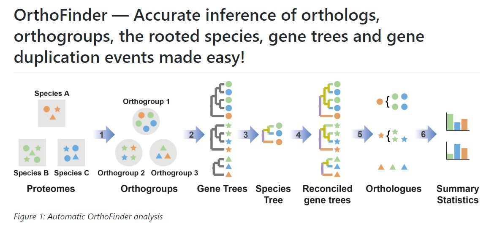
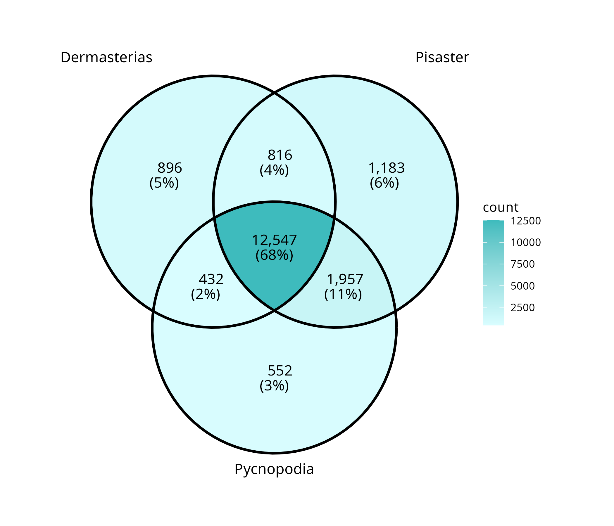
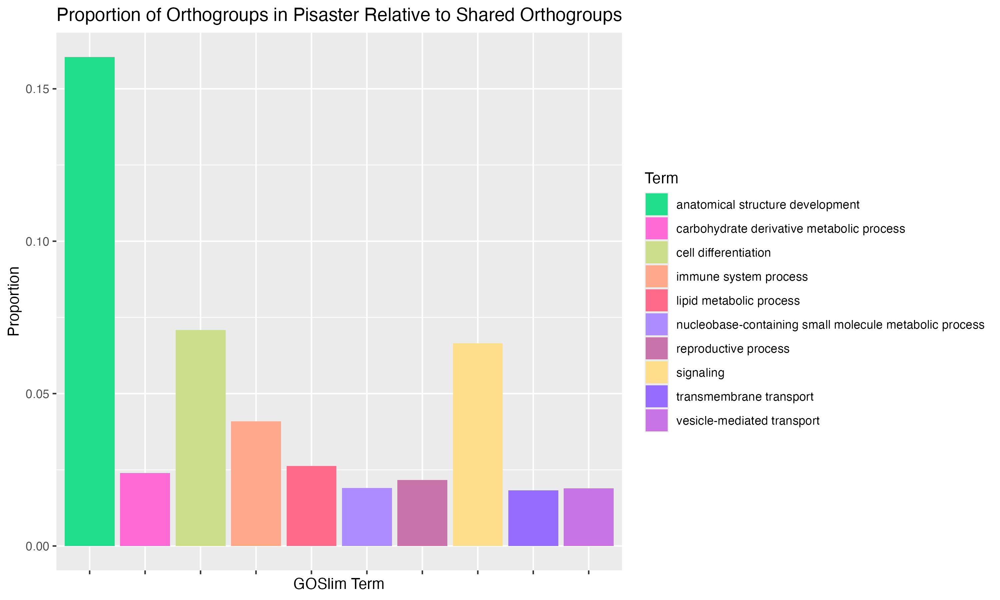
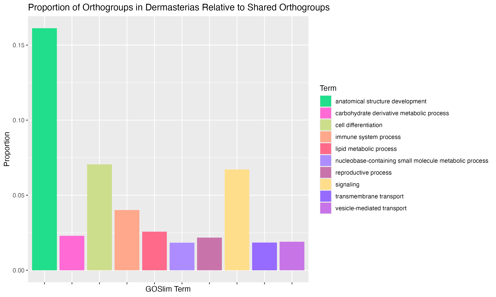

Post detailing results from OrthoFinder comparing the protein lists from _P. helianthoides_, _P. ochraceus_, and _D. imbricata_. 

R code: [project-pycno-multispecies-2023/code/37-orthofinder.rmd](https://github.com/grace-ac/project-pycno-multispecies-2023/blob/main/code/37-orthofinder.rmd)

All OrthoFinder results live on Grace Crandall's laptop- `/Users/graciecrandall/Documents/`

# What is OrthoFinder? 
New paper published: [OrthoFinder: improved phylogenetic orthology inference with enhanced accuracy and scalability](https://www.nature.com/articles/s41592-026-03126-6). 

Emms, D.M., Liu, Y., Belcher, L. et al. OrthoFinder: improved phylogenetic orthology inference with enhanced accuracy and scalability. Nat Methods (2026). [https://doi.org/10.1038/s41592-026-03126-6](https://doi.org/10.1038/s41592-026-03126-6)

OrthoFinder GitHub Repo (see readme.md file for the repository for more info [here](https://github.com/OrthoFinder/OrthoFinder))

I think I need to re-run OrthoFinder, but it's still a BETA release, so I'll stick with the current latest (Version 2.5.5) that is the latest downloadable non-BETA version of OrthoFinder. 

## How it works:    
You take protein lists from the species of interest (in my case: _Pycnopodia helianthoides_, _Pisaster ochraceus_ and _Dermasterias imbricata_), and run them using OrthoFinder (R Code detailing how I ran it on my laptop using `command line` [here](https://github.com/grace-ac/project-pycno-multispecies-2023/blob/main/code/37-orthofinder.rm)).    

Tutorial here: [tutorials.html](https://davidemms.github.io/menu/tutorials.html)


# What are Orthogroups and Orthologs? 

      
Source: [https://plantsandpython.github.io/PlantsAndPython/P_9_COMPARATIVE_GENOMICS/1_Practice.html](https://plantsandpython.github.io/PlantsAndPython/P_9_COMPARATIVE_GENOMICS/1_Practice.html)

# What will OrthoFinder tell us in relation to this Multi-Species Experiment? 
The Multi-Species experiment involved three sea star species (_Pycnopodia helianthoides_, _Pisaster ochraceus_ and _Dermasterias imbricata_) co-housed in tanks - 1 individual per species (each tank had three sea stars, one of each species). 

OrthoFinder will tell us 

# Running OrthoFinder: 
2026-06-24  
R code with notes on how I run it: [code/27-orthofinder.Rmd)](https://github.com/grace-ac/project-pycno-multispecies-2023/blob/main/code/27-orthofinder.Rmd)

Note - I'm re-running OrthoFinder because I know it's quick and it helps me to remember what all the files and results are when I go through the process again. The original OrthoFinder work that I did in December is this R code (which is essentially what I am re-doing now): [code/37-orthofinder.rmd](https://github.com/grace-ac/project-pycno-multispecies-2023/blob/main/code/37-orthofinder.rmd) 

## Downloand and install OrthoFinder
[Download and install instructions](https://davidemms.github.io/orthofinder_tutorials/downloading-and-running-orthofinder.html)

In terminal on my laptop, I ran `wget https://github.com/davidemms/OrthoFinder/releases/latest/download/OrthoFinder.tar.gz` to get the latest version of OrthoFinder downloaded. Previous version I used was OrthoFinder version 2.5.5 Copyright (C) 2014 David Emms.

Extract the package: 
```
tar xzvf OrthoFinder.tar.gz
cd OrthoFinder/
```

It prompts you to then change directories into OrthoFinder:    
`cd OrthoFinder/`. run `pwd`: `/Users/graciecrandall/OrthoFinder`. 

Run ` orthofinder -h` to see the help file. 

`OrthoFinder version 2.5.5 Copyright (C) 2014 David Emms`. The newest release ([v3.0.1b1](https://github.com/davidemms/OrthoFinder/releases)) is still BETA. 

## DIAMOND
I have this downloaded from a while ago. 
Version: diamond version 2.1.16.

# Running OrthoFinder
## Files Needed
Key files multispecies: 
[Key-Files](https://github.com/grace-ac/project-pycno-multispecies-2023/wiki/Key-Files)

Files needed:       
Pycno protein fasta:       
`https://gannet.fish.washington.edu/seashell/bu-github/paper-pycno-sswd-2021-2022/data/augustus.hints.aa`     

Head: 
```
>g3450.t1
MNYRTDDEIYEDEVDEETKLHHRIDERGVNGTDSRDEPTRVPPAKQLKIQAPVLASRLQL
EAVRRPHPPPLHPPQIHLYLEPHLEALQQRCDSYKGIVG*
>g3451.t1
MKINKEKSKVMHLSRCKTPTDEHLPHYTLQETQSKLFCRLKGLRDYNFRSFILAFLQYNP
SDLISVSDAFLHPFLARTSCSKVPCPLLPKMKIRRRQLGITHHRKTT*
```

Pisaster protein fasta:      
https://github.com/grace-ac/project-pycno-multispecies-2023/blob/main/data/Pisaster_ochraceus_v2_gene_models/augustus.hints.aa.gz

Head:      
```
>g19253.t1
XPNPNPNPNPNPNPNPNPNPNPNPNPNPNPNPNPNPNPNPNPNPNPNPNPNPNPNPNPNP
NPNPNPNPNPNPNPNPNPNPNPNPNPNPNPNPNPNPNPNPNPNPNPNPNPNPNPNPNPNP
NPNPNPNPNPNPNPNPNPNPNPNPNPNPNPNPNPNPNPNPNPNPNPNPNPNPNPNPNPNP
NPNPNPNPNPNPNPNPNPNPNPNPNPNPNPNPNPNPNPNPNPNPNPNPNPNPNPNPNPNP
```

Dermasterias protein fasta:     

https://github.com/grace-ac/project-pycno-multispecies-2023/blob/main/data/Newest_Derm_files/Dermasterias_imbricata/augustus.hints.aa.gz 

Head:      
```
>g7941.t1
MQYLPFRGVLCVFWGFLLIETFRPANAGDFALVADLRNGTIYAGSIGQSLADIAPLPLTG
VIRPLAVEYDPVEKMVYWTDVNSLPSPKITRAHVNGSGQMTLVDQLHLPDGLALDVESRL
VYWTDGVLGYIGRTRMNGTGARETIVVGLDQPRAIITDSGFIYWTDWGNSSRIERAGLDG
SNRTTLITGNLVWPNGLFKDGNNLYWCDAKLDKIERSDLLGNNREIVIDLTSYPQIHPFD
LAVYDEYIYWTDWGYTTLIRVHTSGRGEQNYGPSVFQQSGGLHIQKEPNYCNSSPCQNGA
ICIDVINGFSCICPSEHQGITRSENPSGSGPCVNGGTCTTIPGGFTCQCPAGYDGPTCTI
EFIVKKRDREIAGKCKRLH*
```

## Running OrthoFinder: 
Then in terminal, 
(base) Graces-MacBook-Air-81:Documents graciecrandall$ mkdir orthofinder2026      
(base) Graces-MacBook-Air-81:Documents graciecrandall$ cd orthofinder2026/      
(base) Graces-MacBook-Air-81:orthofinder2026 graciecrandall$ ls      
# here - copy and paste the three aa files into the folder (make sure named for each species)
(base) Graces-MacBook-Air-81:orthofinder2026 graciecrandall$ ls
derm-protein.faa	pisaster-protein.faa	pycno-protein.faa

*Note: I previously renamed the file suffixes from `.aa` to `.faa`. 

Run: 
```
orthofinder -f . -S diamond -t 16

```
Started 2026-06-24 14:42:05 

Ended:    
2026-06-24 15:15:10 : Done orthologues

**Results:**
    `/Users/graciecrandall/Documents/orthofinder2026/OrthoFinder/Results_Jun24/`

CITATION:
 When publishing work that uses OrthoFinder please cite:
 Emms D.M. & Kelly S. (2019), Genome Biology 20:238

 If you use the species tree in your work then please also cite:
 Emms D.M. & Kelly S. (2017), MBE 34(12): 3267-3278
 Emms D.M. & Kelly S. (2018), bioRxiv https://doi.org/10.1101/267914


# Results: 
Online resource for exploring results: [Tutorial: exploring-orthofinders-results.html](https://davidemms.github.io/orthofinder_tutorials/exploring-orthofinders-results.html)

Results live on Grace Crandall's laptop in: `/Users/graciecrandall/Documents/orthofinder2026/OrthoFinder/Results_Jun24/`

I make some results tables in this R code: [project-pycno-multispecies-2023/code/27-orthofinder.Rmd](https://github.com/grace-ac/project-pycno-multispecies-2023/blob/main/code/27-orthofinder.Rmd)     

## Results data tables:    
All are in [project-pycno-multispecies-2023/output/27-orthofinder](https://github.com/grace-ac/project-pycno-multispecies-2023/tree/main/output/27-orthofinder)

1. [Orthogroups.tsv](https://github.com/grace-ac/project-pycno-multispecies-2023/blob/main/output/27-orthofinder/Orthogroups.tsv): table copied straight from OrthoFinder output on my laptop. A table of all the orthogroups across all three species' protein lists.  
2. [shared_orthologs_all_species-long.tsv](https://github.com/grace-ac/project-pycno-multispecies-2023/blob/main/output/27-orthofinder/shared_orthologs_all_species-long.tsv): long format (columns: Orthogroup; Species; Protein) table of the orthogroups that are shared across ALL THREE SPECIES    
3. [shared_orthologs_all_species-wide.tsv](https://github.com/grace-ac/project-pycno-multispecies-2023/blob/main/output/27-orthofinder/shared_orthologs_all_species-wide.tsv): wide format (columns: Orthogroup; Dermasterias; Pisaster; Pycnopodia) table of orthogroups that are shared across ALL THREE SPECIES     
4. GOSlim table of Orthogroups shared across all three species: []()
5. _P. helianthoides_: Annotated Orthogroup list with GO and blast: [pycno_orthogroups_GO_annotations.tab](https://github.com/grace-ac/project-pycno-multispecies-2023/blob/main/output/27-orthofinder/pycno_orthogroups_GO_annotations.tab)    
6. _P. ochraceus_: Annotated Orthogroup list with GO and blast: [pisaster_orthogroups_GO_annotations.tab](https://github.com/grace-ac/project-pycno-multispecies-2023/blob/main/output/27-orthofinder/pisaster_orthogroups_GO_annotations.tab)     
7. _D. imbricata_: Annotated Orthogroup list with GO and blast: [derm_orthogroups_GO_annotations.tab](https://github.com/grace-ac/project-pycno-multispecies-2023/blob/main/output/27-orthofinder/derm_orthogroups_GO_annotations.tab)    
8. _P. helianthoides_: GOSlim for all _P. helianthoides_ orthogroups: [GOSlim_all_pycno_orthogroups.tab](https://github.com/grace-ac/project-pycno-multispecies-2023/blob/main/output/27-orthofinder/GOSlim_all_pycno_orthogroups.tab)    
9. _P. ochraceus_: GOSlim for all _P. ochraceus_ orthogroups: [GOSlim_all_pisaster_orthogroups.tab](https://github.com/grace-ac/project-pycno-multispecies-2023/blob/main/output/27-orthofinder/GOSlim_all_pisaster_orthogroups.tab)    
10. _D. imbricata_: GOSlim for all _D. imbricata_ orthogroups: [GOSlim_all_derm_orthogroups.tab](https://github.com/grace-ac/project-pycno-multispecies-2023/blob/main/output/27-orthofinder/GOSlim_all_derm_orthogroups.tab)


Summary table from OrthoFinder:     
Input files to OrthoFinder are the protein lists from each species.

**Also note, that there are 12,547 orthogroups shared across all three species.** 

|                                                     | Dermasterias imbricata | Pisaster ochraceus | Pycnopodia helianthoides |
|-----------------------------------------------------|------------------------|--------------------|--------------------------|
| Number of genes                                     | 25030                  | 35696              | 26581                    |
| Number of genes in orthogroups                      | 21692                  | 30464              | 22253                    |
| Number of unassigned genes                          | 3338                   | 5232               | 4328                     |
| Percentage of genes in orthogroups                  | 86.7                   | 85.3               | 83.7                     |
| Percentage of unassigned genes                      | 13.3                   | 14.7               | 16.3                     |
| Number of orthogroups containing species            | 14691                  | 16503              | 15488                    |
| Percentage of orthogroups containing species        | 79.9                   | 89.8               | 84.3                     |
| Number of species-specific orthogroups              | 896                    | 1183               | 552                      |
| Number of genes in species-specific orthogroups     | 3176                   | 6375               | 1669                     |
| Percentage of genes in species-specific orthogroups | 12.7                   | 17.9               | 6.3                      |

## Results figures:    

### Venn Diagram of ALL Orthogroups shared across all the species:      




### _P. helianthoides_ orthogroups in proportion to all shared orthogroups (12547) across all three species


Top 10 GOSlim terms for the orthogroups unique to _P. helianthoides_. Y-axis is proportion of those orthogroups related to the 12,547 shared orthogroups across all three species. X-axis is the 10 top GOSlim terms - top meaning most counts. Color-coded by Term. 

### _P. ochraceus_ orthogroups in proportion to all shared orthogroups (12547) across all three species



Top 10 GOSlim terms for the orthogroups unique to _P. ochraceus_. Y-axis is proportion of those orthogroups related to the 12,547 shared orthogroups across all three species. X-axis is the 10 top GOSlim terms - top meaning most counts. Color-coded by Term. 

### _D. imbricata_ orthogroups in proportion to all shared orthogroups (12547) across all three species



Top 10 GOSlim terms for the orthogroups unique to _D. imbricata_. Y-axis is proportion of those orthogroups related to the 12,547 shared orthogroups across all three species. X-axis is the 10 top GOSlim terms - top meaning most counts. Color-coded by Term. 

## Proportion plot notes: 
All three figures are very similar... each species has about 70 GOSlim terms, but that's a lot to include in a figure. 

Not sure of how else I can visualize these differences.

I'm also not accounting for any DEGs in these figures --> these are just orthogroups based on each species' genome protein lists. 


