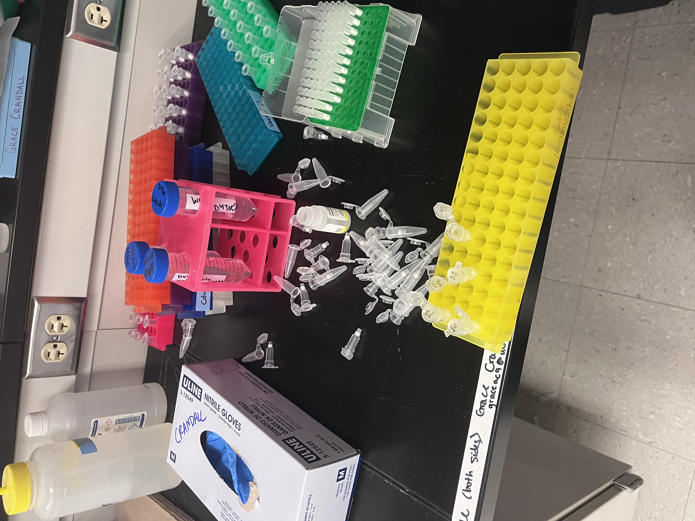

Notes on DNA extractions of the second batch of 0.45um 1/2 water filters from FHL 2026 experiment. 

# background info

Experiment info: [Lab Notebook Post](https://grace-ac.github.io/FHL2026_expt/)

# DNA extraction info

## Samples 
--> extracted DNA from n=23 0.45um water filters (cut in half --> remaining half of filter is in FTR -80C) and 1 blank sample (DNA extraction control). 

Samples extracted: 

| sample_id | treatment_id | treatment                 | sample_type   | vol_filtered_mL | sample_location | extraction_batch | DNAextract_date | amount_sample_processed | extraction_kit                       | DNA_location | elution_liquid | elution_vol_ul | notes                                                                                                              |
|-----------|--------------|---------------------------|---------------|-----------------|-----------------|------------------|-----------------|-------------------------|--------------------------------------|--------------|----------------|----------------|--------------------------------------------------------------------------------------------------------------------|
| F_T0_01   | NA           | 0.22um filtered SW + Vpec | 0.45um filter |             150 | -80 FHL         |                2 |      2026-07-07 | half-filter             | ZymoBIOMICS DNA Miniprep Kit (D4300) | FTR -80C     | water          |             50 | half filter remaining in -80C; DNA from half filter                                                                |
| F_ESW_04  | ESW          | eelgrass + sw             | 0.45um filter |             150 | -80 FHL         |                2 |      2026-07-07 | half-filter             | ZymoBIOMICS DNA Miniprep Kit (D4300) | FTR -80C     | water          |             50 | half filter remaining in -80C; DNA from half filter                                                                |
| F_ESW_06  | ESW          | eelgrass + sw             | 0.45um filter |             150 | -80 FHL         |                2 |      2026-07-07 | half-filter             | ZymoBIOMICS DNA Miniprep Kit (D4300) | FTR -80C     | water          |             50 | half filter remaining in -80C; DNA from half filter                                                                |
| F_ESW_08  | ESW          | eelgrass + sw             | 0.45um filter |             150 | -80 FHL         |                2 |      2026-07-07 | half-filter             | ZymoBIOMICS DNA Miniprep Kit (D4300) | FTR -80C     | water          |             50 | half filter remaining in -80C; DNA from half filter                                                                |
| F_EVP_03  | EVP          | eelgrass + vp             | 0.45um filter |             150 | -80 FHL         |                2 |      2026-07-07 | half-filter             | ZymoBIOMICS DNA Miniprep Kit (D4300) | FTR -80C     | water          |             50 | half filter remaining in -80C; DNA from half filter                                                                |
| F_EVP_08  | EVP          | eelgrass + vp             | 0.45um filter |             150 | -80 FHL         |                2 |      2026-07-07 | half-filter             | ZymoBIOMICS DNA Miniprep Kit (D4300) | FTR -80C     | water          |             50 | half filter remaining in -80C; DNA from half filter                                                                |
| F_VPSW_03 | VPSW         | vp + sw                   | 0.45um filter |             150 | -80 FHL         |                2 |      2026-07-07 | half-filter             | ZymoBIOMICS DNA Miniprep Kit (D4300) | FTR -80C     | water          |             50 | half filter remaining in -80C; DNA from half filter                                                                |
| F_VPSW_07 | VPSW         | vp + sw                   | 0.45um filter |             150 | -80 FHL         |                2 |      2026-07-07 | half-filter             | ZymoBIOMICS DNA Miniprep Kit (D4300) | FTR -80C     | water          |             50 | half filter remaining in -80C; DNA from half filter                                                                |
| F_EM_01   | EM           | eelgrass + mussel + sw    | 0.45um filter |             150 | -80 FHL         |                2 |      2026-07-07 | half-filter             | ZymoBIOMICS DNA Miniprep Kit (D4300) | FTR -80C     | water          |             50 | half filter remaining in -80C; DNA from half filter                                                                |
| F_EM_02   | EM           | eelgrass + mussel + sw    | 0.45um filter |             150 | -80 FHL         |                2 |      2026-07-07 | half-filter             | ZymoBIOMICS DNA Miniprep Kit (D4300) | FTR -80C     | water          |             50 | half filter remaining in -80C; DNA from half filter                                                                |
| F_EM_04   | EM           | eelgrass + mussel + sw    | 0.45um filter |              35 | -80 FHL         |                2 |      2026-07-07 | half-filter             | ZymoBIOMICS DNA Miniprep Kit (D4300) | FTR -80C     | water          |             50 | May 27th 11:33pm At bagging time - mussel was spawning (male); half filter remaining in -80C; DNA from half filter |
| F_EM_05   | EM           | eelgrass + mussel + sw    | 0.45um filter |             150 | -80 FHL         |                2 |      2026-07-07 | half-filter             | ZymoBIOMICS DNA Miniprep Kit (D4300) | FTR -80C     | water          |             50 | half filter remaining in -80C; DNA from half filter                                                                |
| F_EMVP_01 | EMVP         | eelgrass + mussel + vp    | 0.45um filter |             150 | -80 FHL         |                2 |      2026-07-07 | half-filter             | ZymoBIOMICS DNA Miniprep Kit (D4300) | FTR -80C     | water          |             50 | half filter remaining in -80C; DNA from half filter                                                                |
| F_EMVP_04 | EMVP         | eelgrass + mussel + vp    | 0.45um filter |             150 | -80 FHL         |                2 |      2026-07-07 | half-filter             | ZymoBIOMICS DNA Miniprep Kit (D4300) | FTR -80C     | water          |             50 | half filter remaining in -80C; DNA from half filter                                                                |
| F_EMVP_05 | EMVP         | eelgrass + mussel + vp    | 0.45um filter |             150 | -80 FHL         |                2 |      2026-07-07 | half-filter             | ZymoBIOMICS DNA Miniprep Kit (D4300) | FTR -80C     | water          |             50 | half filter remaining in -80C; DNA from half filter                                                                |
| F_EMVP_08 | EMVP         | eelgrass + mussel + vp    | 0.45um filter |             150 | -80 FHL         |                2 |      2026-07-07 | half-filter             | ZymoBIOMICS DNA Miniprep Kit (D4300) | FTR -80C     | water          |             50 | half filter remaining in -80C; DNA from half filter                                                                |
| F_MVP_02  | MVP          | mussel + vp               | 0.45um filter |             150 | -80 FHL         |                2 |      2026-07-07 | half-filter             | ZymoBIOMICS DNA Miniprep Kit (D4300) | FTR -80C     | water          |             50 | half filter remaining in -80C; DNA from half filter                                                                |
| F_MVP_08  | MVP          | mussel + vp               | 0.45um filter |             150 | -80 FHL         |                2 |      2026-07-07 | half-filter             | ZymoBIOMICS DNA Miniprep Kit (D4300) | FTR -80C     | water          |             50 | half filter remaining in -80C; DNA from half filter                                                                |
| F_ShSW_04 | ShSW         | mussel shell + sw         | 0.45um filter |             150 | -80 FHL         |                2 |      2026-07-07 | half-filter             | ZymoBIOMICS DNA Miniprep Kit (D4300) | FTR -80C     | water          |             50 | half filter remaining in -80C; DNA from half filter                                                                |
| F_ShSW_08 | ShSW         | mussel shell + sw         | 0.45um filter |             150 | -80 FHL         |                2 |      2026-07-07 | half-filter             | ZymoBIOMICS DNA Miniprep Kit (D4300) | FTR -80C     | water          |             50 | half filter remaining in -80C; DNA from half filter                                                                |
| F_SW_03   | SW           | seawater + media          | 0.45um filter |             150 | -80 FHL         |                2 |      2026-07-07 | half-filter             | ZymoBIOMICS DNA Miniprep Kit (D4300) | FTR -80C     | water          |             50 | half filter remaining in -80C; DNA from half filter                                                                |
| F_SW_04   | SW           | seawater + media          | 0.45um filter |             150 | -80 FHL         |                2 |      2026-07-07 | half-filter             | ZymoBIOMICS DNA Miniprep Kit (D4300) | FTR -80C     | water          |             50 | half filter remaining in -80C; DNA from half filter                                                                |
| F_SW_07   | SW           | seawater + media          | 0.45um filter |             150 | -80 FHL         |                2 |      2026-07-07 | half-filter             | ZymoBIOMICS DNA Miniprep Kit (D4300) | FTR -80C     | water          |             50 | half filter remaining in -80C; DNA from half filter                                                                |
| BLANK2    | BLANK        | BLANK                     | BLANK         | NA              | NA              |                2 |      2026-07-07 | NA                      | ZymoBIOMICS DNA Miniprep Kit (D4300) | FTR -80C     | water          |             50 |                                                                                                                    |

## Kit and protocol info: 

ZymoBIOMICS DNA MiniPrep Kit --> D4300 

Extraction protocol notes: [Protocol_eDNA-extraction_protocol_GAC_2026Samples](https://docs.google.com/document/d/1s0auROq_3DyB4Hh2Jaw2QkpfmojLRoo6oEsJdvEcBUI/edit?usp=sharing)

I'm now using a centrifuge that can hold 24 tubes - though the 24-tube centrifuge that was in FTR 213 has an error code (error 3), so I walked back and forth between 213 and 209 (used the 24-tube centrifuge in 209) to do the protocol. 

During the near-to-last step ([Step 11, Page 7](https://github.com/grace-ac/project-pycno-multispecies-2023/blob/main/protocols/FilterDNA_extraction_protocol_d4300t_d4300_d4304_zymobiomics_dna_miniprep_kit.pdf)), I put 50ul of water into the first sample (F-T0_01) to elute DNA and went to close the cap, and my finger slipped and all the tubes went flying. So there is a chance of cross-contamination, however none of the tubes except that one sample had any liquid in it and the DNA was trapped on the filter. The F-T0-01 tube fell on the ground (cap was open), while all the others were on the benchtop. I proceeded and if the qPCR looks weird for those samples, I'll re-extract from the other half of the filter in the -80C. As a note: since I wasn't sure if liquid was in the filter for F-T0-01, I added another 50ul so the elution volume is >50ul, will need to measure before I run 2ul on qPCR for downstream calculations. Photo below:    

# Up next
1. Finish extracting DNA from remaining water filters (n=35 remaining)   
2. Run 2ul of each sample's DNA on qPCR looking for _V. pectenicida_ <-- late July (out of town July 10-20). 

NOTE!!!

The TaqMan Fast Universal PCR Master Mix arrived 1+ week ago and I never was alerted... I asked about the order today because I hadn't received any tracking or delivery info, and was told that it was delivered, so then I went to SAFS front desk and asked, and we looked in the freezer storage and found it. A drafted email that was supposed to be sent to me telling me it arrived was never sent - so it's important to check on shipments because you never know if it was sent or delivered! I thought it seemed like too long, which is why I asked about it today. The TaqMan was still cold and is meant to be stored at 4C. 

I called customer service to get thoughts on it and here are the notes from that call:   

- Received that order was completed 6/29/2026, but no tracking info

- Checked today - emailed Janna Southworth asking if it was ordered and if there was tracking info

- She said it was delivered → sent me invoice that it was delivered to central receiving 6/26/2026

- It was sent to UW SAFS, but no email to me 

- Johnny found that it was received and that an email was drafted to send me June 30th, but it wasn’t sent 

- Called customer service to ask if the TaqMan is ok to use:
 
Stored at freezer for 1 week      
Doesn’t have any stability data on the freezer      
Usually with freeze thaws on the enzymes → not sure if this one would totally freeze              

Look:
If froze completely, enzyme would be in ice crystals and could destroy the master mix <-- tubes were liquid      
Likely not a concern       
If see any precipitate → don’t want those        
Vortex it before use and see if see anything coming out of solution and that would be where we’d be concerned            
No data to back up if it works fine       
 
Make sure mix is well mixed before use!!!! 

