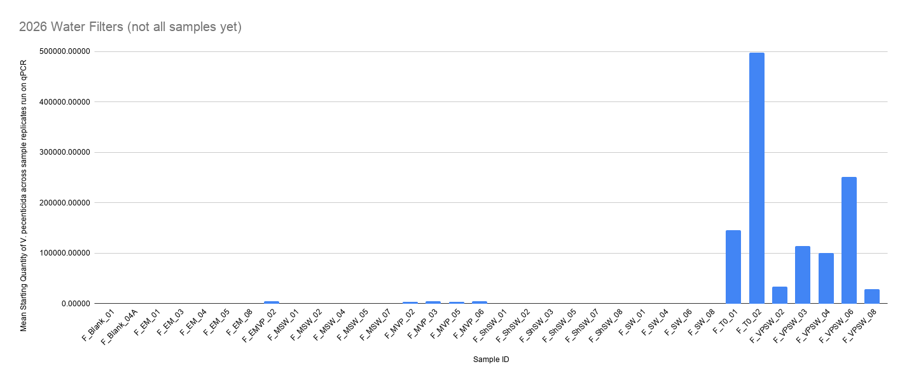

qPCR results from Plates 1 and 2 from DNA (2ul) from 1/2 of the 0.45um water filters from FHL 2026 experiment.

# Experiment details: 
Experiment info: [Lab Notebook Post](https://grace-ac.github.io/FHL2026_expt/) 

# Plate 1 Samples Run: 

# Protocol notes:
See document here: [qPCR Notes Plate 1](https://docs.google.com/document/d/1N9un_IMGBzH6Ej-LOFhFN3WEFiD5U1JmQD7FVOufG4w/edit?tab=t.y11d14ovrdxk#heading=h.qhm71heez09f), tab for Plate 1, July 23, 2026. 

# qPCR run results:      

| qPCR run results - FHL 2026 water filter plate 1 |        |
|--------------------------------------------------|--------|
| R^2                                              | 0.995  |
| y-int                                            | 36.879 |
| Slope                                            | -3.411 |
| E                                                | 96.4%  |

Results files: [here](https://drive.google.com/drive/folders/1a99qHGgR9u2Sjwyfo4wF0T97e3FJrctr)

# Plate 2 Samples Run:   

# Protocol Notes:
See document here: [qPCR Notes Plate 2](https://docs.google.com/document/d/1N9un_IMGBzH6Ej-LOFhFN3WEFiD5U1JmQD7FVOufG4w/edit?tab=t.soog8subegjo#heading=h.gfbl0e4p8day), tab for Plate 2, July 24, 2026. 

# qPCR run results: 

| qPCR run results - FHL 2026 water filter plate 2 | unfiltered | remove D3 (one of the reps of a standard curve) from analysis |
|--------------------------------------------------|------------|---------------------------------------------------------------|
| R^2                                              |       0.85 |                                                         0.979 |
| y-int                                            |     37.296 |                                                        36.393 |
| Slope                                            |     -3.358 |                                                        -3.266 |
| E                                                |     98.50% |                                                       102.50% |

Results files: [here](https://drive.google.com/drive/folders/1l4X7emQiq7lrBD8lhV_ZivkdBDkv03VM)   

Filtered results: [here](https://drive.google.com/drive/folders/1CG-7iAlUYbHz5PZI5YQPZHHF2V05jyyx)

# Plates 1 and 2 Results Figure: 

Very rough, created in excel to show what's going on ([spreadsheet here](https://docs.google.com/spreadsheets/d/16ILl6IBzr2ZG9QdnH5Miq7h0Mznk7li-flKc9vCcVu4/edit?gid=971205067#gid=971205067)).

Y-axis is the mean starting quantity across the replicates for each sample. qPCR is targeting _V. pecenicida_. 

X-axis is the sample ID. Sample IDs all start with "F" for "Filter". Then a series of letters that correspond to the treatment group, and then a number for the sample number (treamtent replicate). 

The codes for the treatments are:     

| code  | treatment                                     |
|-------|-----------------------------------------------|
| Blank |                DNA Extraction blank (control) |
| EM    | Eelgrass + mussels + seawater + culture media |
| EMVP  |        Eelgrass + mussels + seawater + V. pec |
| MSW   |              Mussel + seawter + culture media |
| MVP   |                    Mussel + seawater + V. pec |
| ShSW  |        Mussel shell + seawter + culture media |
| SW    |                       seawter + culture media |
| T0    |            time point zero: seawater + V. pec |
| VPSW  |                             V. pec + seawater |

There's still about 2 more plates worth of samples to run (one plate: 24 samples; second plate: final 8 samples + 16 eelgrass swab DNA). 

So I will run the third plate next Tuesday, then I'll extract DNA from a batch of eelgrass swabs and then run the final filter plate + some of the eelgrass swab DNA afterwards. 

# Assessing Supplies and Things I need to order: 
I have:   
- 8 qPCR plates       
- tons of tubes       
- tons of qPCR plate adhesive films       
- enough 10um F and R primers diluted for 8 more plates (and 100um F and R primers to dilute for more)      
- enough 10um Probe diluted for ~7 more plates (and 100um of Probe to dilute for more)     
- tons of molecular grade water      
- lots of serially diluted standard curve and more _V. pectenicida_ to dilute more if needed    
- tons of 1X buffer TE     
- tons of BSA    
- enough TaqMan Master Mix for ~3 more plates (NEED TO ORDER MORE)     
- NEED TO ORDER MORE 10X EXO IPC MIX     
- NEED TO ORDER MORE 50X EXO IPC DNA    

Number of plates I need to run to finish all the remaining samples (after I extract DNA):

| sample types       | DNA sample number |                       |
|--------------------|-------------------|-----------------------|
| 2026 filters       |                80 | 75 samples + 5 blanks |
| eelgrass swab      |                34 | 32 samples + 2 blanks |
| 2026 mussel tissue |                34 | 32 samples + 2 blanks |
| mussel swabs       |                42 | 40 samples + 2 blanks |

| qPCR plate number | samples | sample type        | status |
|-------------------|---------|--------------------|--------|
| Plate 1           |      24 | 2026 filters       | DONE   |
| Plate 2           |      24 | 2026 filters       | DONE   |
| Plate 3           |      24 | 2026 filters       |        |
| Plate 4           |       8 | 2026 water filters |        |
| Plate 4           |      16 | eelgrass swabs     |        |
| Plate 5           |      18 | eelgrass swabs     |        |
| Plate 5           |       6 | mussel tissue      |        |
| Plate 6           |      24 | mussel tissue      |        |
| Plate 7           |       4 | mussel tissue      |        |
| Plate 7           |      20 | mussel swabs       |        |
| Plate 8           |      22 | mussel swabs       |        |

SO!!!!

I will need to run at least 6 more qPCR plates (I say at least because the above numbers assume I don't need to re-run any plates). 

Therefore, I definitely need to order:   
- more TaqMan Master Mix
- More 10X EXO IPC MIX
- More 50X EXO IPC DNA 

I'll hold off on ordering more plates because as it is I have 2 extra, so I may not need more. 

