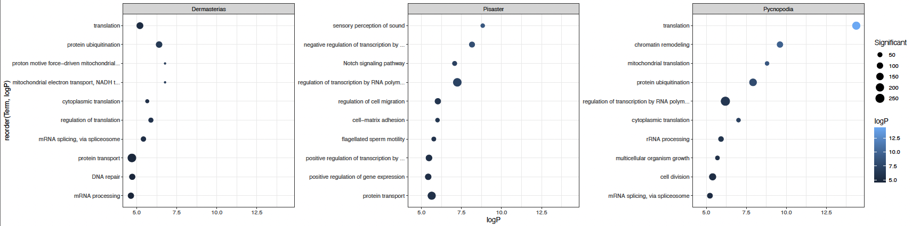

Rmd detailing use of `topGO` to get enrichment for each species at Day 6 and Day 12. 

Steven and Claude did this: 

1. [Steven's notebook post](https://sr320.github.io/tumbling-oysters/posts/85-seastar-wasting-go/)     
2. [SR + Claude code](https://github.com/grace-ac/project-pycno-multispecies-2023/blob/main/code/38-degs-orth-GOenrichment.Rmd)        
3. [SR + CLaude output files](https://github.com/grace-ac/project-pycno-multispecies-2023/tree/main/output/38-degs-orth-GOenrichment)     

I read through the code and clicked through it and recreated everything, but I didn't quite learn it thoroughly. 

So, I did a combination of reading the `topGO` manual, using chatGPT to help me understand the different code chunks, and created a new version of code that utilizes `topGO` to get enrichment. See details below. 

# Enrichment Files - Biological Process Only: 
R Code: [project-pycno-multispecies-2023/code/39-topGO-enrichment.Rmd](https://github.com/grace-ac/project-pycno-multispecies-2023/blob/main/code/39-topGO-enrichment.Rmd)     

Output Directory: [project-pycno-multispecies-2023/output/39-topGO-enrichment](https://github.com/grace-ac/project-pycno-multispecies-2023/tree/main/output/39-topGO-enrichment)

Input files were annotated DEG lists from each species from Day 12:     
```
pycD12 <- read.delim("../output/22-annot-DEGlists/DEGlist_transcripts_pycno_controlVexposed_annot_DAY12.tab")
pisaD12 <- read.delim("../output/22-annot-DEGlists/DEGlist_transcripts_pisaster_controlVexposed_annot_DAY12.tab")
dermD12 <- read.delim("../output/22-annot-DEGlists/DEGlist_transcripts_derm_controlVexposed_annot_DAY12.tab")
```
In all DEG files I removed the rows that had NA's in the "Gene.Ontology.IDs" column.

Background files were annotated count matrices from each species:   
```
pyc.all <- read.delim("../output/09-annot-pycno/Phel_transcript_counts_annotation.tab", sep = " ")
pisa.all <- read.delim("../output/10-annot-pisaster/Pisaster_transcript_counts_annotation.tab", sep = " ")
derm.all <- read.delim("../output/11-annot-derm/Derm_transcript_counts_annotation.tab", sep = " ")
```
In all background files I removed that rows that had 0s across all libraries in the counts. 

Result files:    
_P. helianthoides_    
- Top 50: [pycno.D12.topGO_BP_results.csv](https://github.com/grace-ac/project-pycno-multispecies-2023/blob/main/output/39-topGO-enrichment/pycno.D12.topGO_BP_results.csv)
- All: [pycno.D12.topGO_ALL_BP_results.csv](https://github.com/grace-ac/project-pycno-multispecies-2023/blob/main/output/39-topGO-enrichment/pycno.D12.topGO_ALL_BP_results.csv)

_P. ochraceus_    
- Top 50: [pisa.D12.topGO_BP_results.csv](https://github.com/grace-ac/project-pycno-multispecies-2023/blob/main/output/39-topGO-enrichment/pisa.D12.topGO_BP_results.csv)
- All: [pisa.D12.topGO_ALL_BP_results.csv](https://github.com/grace-ac/project-pycno-multispecies-2023/blob/main/output/39-topGO-enrichment/pisa.D12.topGO_ALL_BP_results.csv)

_D. imbricata_  
- Top 50: [derm.D12.topGO_BP_results.csv](https://github.com/grace-ac/project-pycno-multispecies-2023/blob/main/output/39-topGO-enrichment/derm.D12.topGO_BP_results.csv)      
- All: [derm.D12.topGO_ALL_BP_results.csv](https://github.com/grace-ac/project-pycno-multispecies-2023/blob/main/output/39-topGO-enrichment/derm.D12.topGO_ALL_BP_results.csv)     

The output files all have the below columns:  

| GO.ID      | Term        | Annotated | Significant | Expected | Fisher  |
|------------|-------------|-----------|-------------|----------|---------|
| GO:0006412 | translation |       387 |         191 |   103.29 | 4.3e-15 |

The above row below the column names is the first line from [pycno.D12.topGO_ALL_BP_results.csv](https://github.com/grace-ac/project-pycno-multispecies-2023/blob/main/output/39-topGO-enrichment/pycno.D12.topGO_ALL_BP_results.csv). 

From chatGPT:       
- GO.ID: GO Term ID     
- Term: Biological process    
- Annotated: Number of genes in the background that are annotated with a GO term. Reminder: the background is the count matrix from each species.     
- Significant: Number of the DEGs that are annotated with that GO term    
- Expected: The number of DEGs that would be exptected to have the GO term if differential expression were completely random. 
- Fisher: the p-value for the Fisher's Exact test. If p-value is small it means that observed is very different from expected, and if p-value is closer to one, it means that observed is roughly similar to what was expected (not significantly enriched).    

# Enrichment Summary Figure for Day 12: 
R code: [project-pycno-multispecies-2023/code/40-enrichment-figs.Rmd](https://github.com/grace-ac/project-pycno-multispecies-2023/blob/main/code/40-enrichment-figs.Rmd)       
Output directory: [project-pycno-multispecies-2023/output/40-enrichment-figs](https://github.com/grace-ac/project-pycno-multispecies-2023/tree/main/output/40-enrichment-figs) 

I made a quick dotplot figure with the help of chatGPT and google. I am showing the top 10 significantly (Fisher p-value <0.05) enriched GO terms for each species. 

To orient you to the figure:     
- x = enrichment significance
- y = GO term
- point size = number of DEGs   

logP was calculated by making the negative log p-value of the Fisher's p-value. Example code: 
```
pyc.table <- pyc.table %>%
    mutate(logP = -log10(Fisher))
``` 

As a reminder, the enrichment significance means the count (number) of DEGs that are annotated with that GO term. 



# Sharing with pycno team folks tomorrow
Tomorrow I'm meeting with Alyssa, Melanie, and Kate just in a casual chat. They want to see what I've been up to, so I'll show them the above figure and what Steven did and we'll chat about it. 