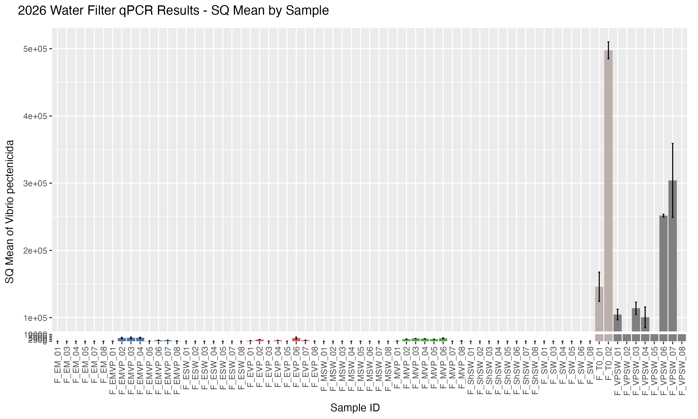
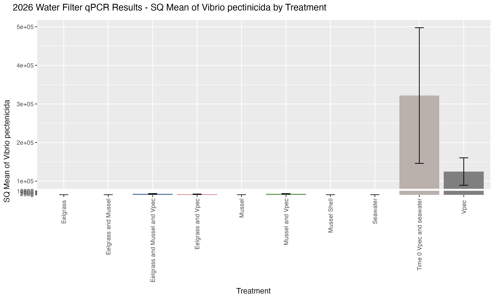

Current status of results from FHL 2026 Experiment Water Filter qPCR results targeting _V. pectenicida_. 

# Experiment Background
Post here: [FHL 2026 Experiment Details](https://grace-ac.github.io/FHL2026_expt/)

# Sample Info
I ran 2ul in triplicate of DNA that was extracted from half of a 0.45um filter (the other half of the filter for each sample is in the FTR -80C). 

I also ran DNA extraction blanks on qPCR (2ul in triplicate) and water blanks (2ul in triplicate). All blanks and water samples were negative for _V. pectenicida_. 

From the qPCR output files, I did some calculations (google sheet [here](https://docs.google.com/spreadsheets/d/16ILl6IBzr2ZG9QdnH5Miq7h0Mznk7li-flKc9vCcVu4/edit?gid=0#gid=0)) and removed replicates from calculations if the SQ was WAY off from the other two replicates. 

# Results

## Result files 
Data files from 2026 water filters qPCR results:     
1. [Sample Results with Calculations](https://github.com/grace-ac/eelgrass-vpec/blob/main/data/2026-Expt-results/2026-plate-sample_2026filters_results.csv)        
2. [Treatment Results with Calculationis](https://github.com/grace-ac/eelgrass-vpec/blob/main/data/2026-Expt-results/2026-water-filter-treatment-means-stderror.csv)

## Result Figures
[R code](https://github.com/grace-ac/eelgrass-vpec/blob/main/code/03-2026-Expt-results.Rmd)

NOTE! There are 2 samples that I am ignoring 2 of the 3 replicates run on qPCR because there was clearly some contamination. Sample IDs are: F_MSW_02 and F_ShSW_08. 

### Per Sample 
Mean (averaged across the triplicates run per sample (or duplicates if wells were removed)) with standard error (standard deviation / SQRT(n), where n = triplicate or duplicate run per sample). 

### Per Treatment
Mean (averaged across the samples) with standard error (standard deviation / SQRT(n), where n = number of samples per treatment). 

## Interpretation of results so far:

Eelgrass and seawater --> no _V.pec_.. so that's great! As expected. 

Eelgrass and mussel --> no _V. pec_.. also as expected!

Eelgrass and mussel and V.pec --> there are low levels of _V.pec_ in the water... VERY low. Likely that presence of eelgrass and/or mussels is decreasing the amount of _V. pec_ in the water. 

Eelgrass and V.pec --> low levels of _V.pec_ in the water... also VERY low. Also what was expected- presence of eelgrass decreases the amount of _V. pec_ in the water. 

Mussel and seawater --> no _V. pec_ - also as expected. Yay!

Mussel and V.pec --> VERY low levels of _V. pec_ - also as expected and suggesting that presence of mussels is decreasing the amount of _V. pec_ in the water. 

Mussel shell and seawater --> No _V. pec_ - also as expected. 

Seawter --> no _V. pec_ - as expected.

Time 0 Vpec and Seawater --> VERY high levels of _V. pec_ - as expected. 

Vpec and seawater --> high levels of _V. pec_, but less than the Time 0 treatment... which is interesting. I would have expected the Vpec to increase over time, but maybe the fact that the experiment took place in a room set to 16C (ideal for eelgrass) that it was too cold for the Vpec to replicate?

# Next Steps

Extract DNA from the other sample types. 

Coming up: Eelgrass swabs (is Vp forming a biofilm on the eelgrass and that's how it is removed from water?) and mussel tissue (is Vp being accumulated in mussel tissue and that's how it's being removed from water?). 

And later... (I need to purchase another extraction kit) mussel shell swab samples. 

There are also a few remaining water filter samples that I need to run on qPCR (5 samples, 1 time 0 sample, and 2 DNA extraction blanks) that I'll run on a plate with eelgrass swab DNA after I extract that. 
