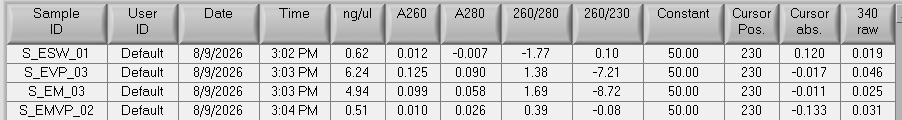

See post for details on extracting DNA from eelgrass swabs from the FHL 2026 _V. pec._, eelgrass and mussel experiment! 

# Background info on the project 
Post: [FHL 2026 Experiment Details](https://grace-ac.github.io/FHL2026_expt/)

# DNA Extraction of Eelgrass Swabs Info: 
## Samples processed
Started with one sample/treatment plus 2 DNA extraction blanks to test the protocol:    

| sample_id  | treatment_id | treatment              | sample_type   |
|------------|--------------|------------------------|---------------|
| S_ESW_01   | ESW          | eelgrass + sw          | eelgrass_swab |
| S_EVP_03   | EVP          | eelgrass + vp          | eelgrass_swab |
| S_EM_03    | EM           | eelgrass + mussel + sw | eelgrass_swab |
| S_EMVP_02  | EMVP         | eelgrass + mussel + vp | eelgrass_swab |
| S_Blank_01 | NA           | NA                     | NA            |
| S_Blank_02 | NA           | NA                     | NA            |

## Protocol notes: 
Extraction Kit: [Qiagen DNeasy PowerSoil Pro Kit (Cat: 47014)](https://www.qiagen.com/us/products/discovery-and-translational-research/dna-rna-purification/dna-purification/microbial-dna/dneasy-powersoil-pro-kit)  

Extraction Notes: [here](https://docs.google.com/document/d/14VaGHQvKW3SYEEvZ1-95MSYHTaCVlhU6/edit?usp=sharing&ouid=109180173241522173082&rtpof=true&sd=true)   

Protocol was modified by Becca Maher specifically for swabs from eelgrass tissue (see link to notes above).   

Eelgrass swab sampling protocol: [here](https://docs.google.com/document/d/15Y1ogjHQ8rRCv9VB0iyzydAmJdkucYw3m8x022UN8PE/edit?usp=sharing)

Notes for next time:   
1. Turn on the heat block to 65C before starting protocol so it's ready on time.     

## Results:   
To check to see if this (new to me) protocol worked for these samples, I ran 1ul of each sample on the Nanodrop. 

Results:     

but this is just all DNA... not _V. pec_. Just wanted to check to see if there's DNA from the samples before I process the remaining 28!
