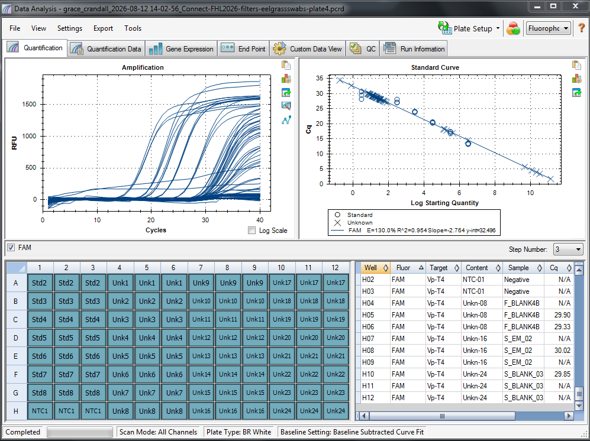
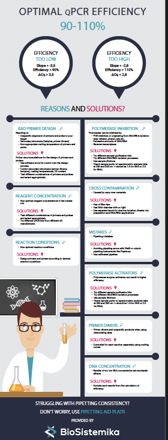

Ran a fourth plate (finishing the 2026 water filters and starting in on the eelgrass swab DNA) on qPCR. Updated results in the post!

# qPCR Plate 4 Info: 

Plate Map 4: [here](https://docs.google.com/spreadsheets/d/1ts5fJ6B-sbki5-YEOxT-W_iuEooWrJKU/edit?usp=sharing&ouid=109180173241522173082&rtpof=true&sd=true)

## Plate 4 qPCR Run Results:

| qPCR plate 4 |         |
|--------------|---------|
| R2           | 0.954   |
| E            | 130.00% |
| Y-int        |  32.496 |
| Slope        |  -2.764 |

R^2 is great. 

E of 130.0% means:       
(comment from online forum where someone else asked a similar question: [here](https://www.researchgate.net/post/How_does_a_qRTPCR_efficiency_of_more_than_100_affect_the_interpretation_or_analysis_of_results))        
HI, your efficiency is too high with 120-150%! The accepted range for qPCR is
generally 80 to 110% (some paper say: 90 to 110%).
High efficiency: This might happen when you have PCR inhibitors present in your template. The inhibitors get diluted out with low copy numbers in the mixture, which can artificially raise your efficiency.
Another possibility is if you have non-specific products being amplified in the dilute samples that lower the Cts. 

Y-int is fine. Between 20 and 40.        

Slope of -2.764 is not ideal. The slope should be between -3.1 and -3.6 for a good qPCR run...

## SO....

I don't know that I can trust these results...? I emailed Colleen Burge to get her thoughts. I also messaged Melanie Prentice and she recommended I try a clean up kit on the DNA to get rid of any PCR inhibitors... I started a GitHub issue to get other thoughts, too ([here](https://github.com/RobertsLab/resources/issues/2487)). 

Essentially, since there was low DNA in the few samples I ran on nanodrop (post [here](https://grace-ac.github.io/eelgrassswab_dna-extractions-part1/)), it likely is not that there was too much DNA added to the wells, which Melanie said is another reason why you might get high efficiency rates. 

So, it's likely that there are PCR inhibitors in the swab DNA samples... so I'll need to get a clean up kit and do that. Not quite sure what kit to use or anything like that - never done this before! More soon. 

Inforgraphic I found about qPCR efficiency issues and troubleshooting:     

