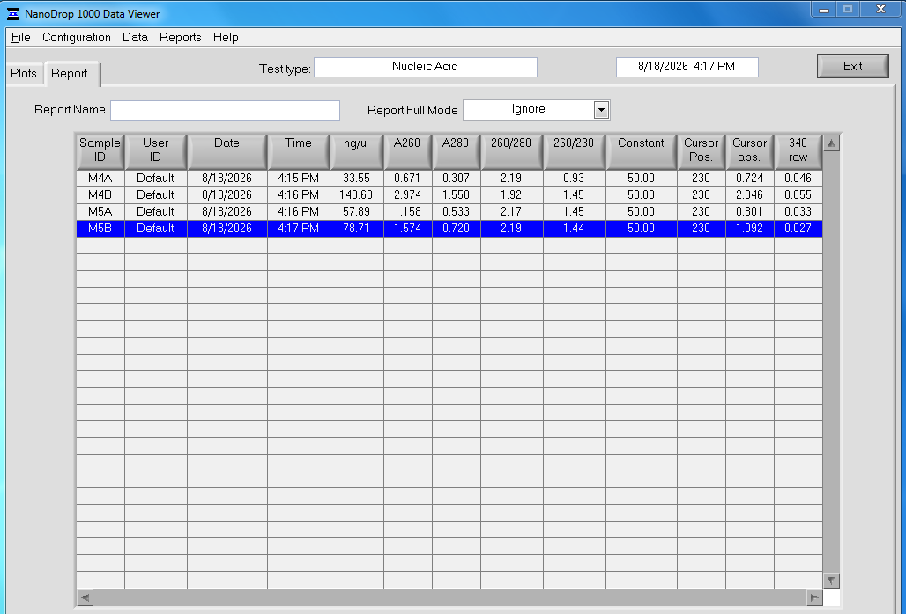

Notes on protocol and process in post. 

# Kit and protocol notes
Kit: [Qiagen Blood and Tissue](https://www.qiagen.com/us/products/discovery-and-translational-research/dna-rna-purification/dna-purification/genomic-dna/dneasy-blood-and-tissue-kit) (These are old kits (2020 and 2023) from Olivia Graham from FHL). 

Protocol notes: [here](https://docs.google.com/document/d/1juGroa-ubpDF-hYmn4hHuXhtTBuUJqUBvFeKoWbqe7U/edit?tab=t.4o2gkbl6modr)

# Samples extracted
To test the protocol, I used 4 mussels from the 2025 experiment. As a reminder, the mussels were not offiially part of the 2025 experiment and were just thrown (2/bag) into whirlpak bags with seawater spiked with _V. pectenicida_. 

I also saved swabs from the mussels prior to shucking and weighing tissue. 

I processed from bags 4 and 5. Therefore, I am calling the mussels: M4A, M4B, M5A, and M5B.

# up next
tomorrow i'll run 1ul of each sample on the nanodrop and will update this post with the results!!

# Issues/Questions:
1. There was hardly any Proteinase K in the kits from Olivia. I used up the last bits of two tubes, and the remaining tube has ~200ul... Each sample requires 20ul, and I have 32 samples (with DNA controls, it'll 36 total preps I need for Proteinase K). So, I unfortunately won't be able to extract DNA from more mussels unless I can get more Proteinase K. It is [sold separately](https://www.qiagen.com/us/products/discovery-and-translational-research/enzymes-for-molecular-biology/proteinase-k?catno=19131), so I might have to do that. Unless there's some in the lab that no one is using from Qiagen. There is currently only enough Proteinase K for **10 samples**... and I have to do 36. 

2. Should I mash up the whole mussel body for the 2026 samples and then weigh out XX mg of it to then proceed? Today I just pulled out the mushy tissue chunks and ended up weighing out from the different chunks. So it's possible I didn't get the whole body mixed in. 

3. I did what Chris recommended, which is to elute the DNA twice, both at 150ul Buffer AE. However, that final elution volume of 300ul ended making it so that the tip of the filter was touching the BufferAE + eluted DNA... that doesn't seem ideal? So if yields look good when I do the nanodrop tomorrow, maybe I'll just do 200ul of elution volume (2x at 100ul Buffer AE) ?? 

# 2026-08-18 Updates

## Nanodrop results: 

So... looks like there's DNA in all the sample tissue size, with the most being in the sample M4B (which was 15mg of tissue). So perhaps I'll use that amount moving forward! 

## Proteinase K:
Chris has extra that she said I can have!! So crisis is averted and Chris saved the day. 
