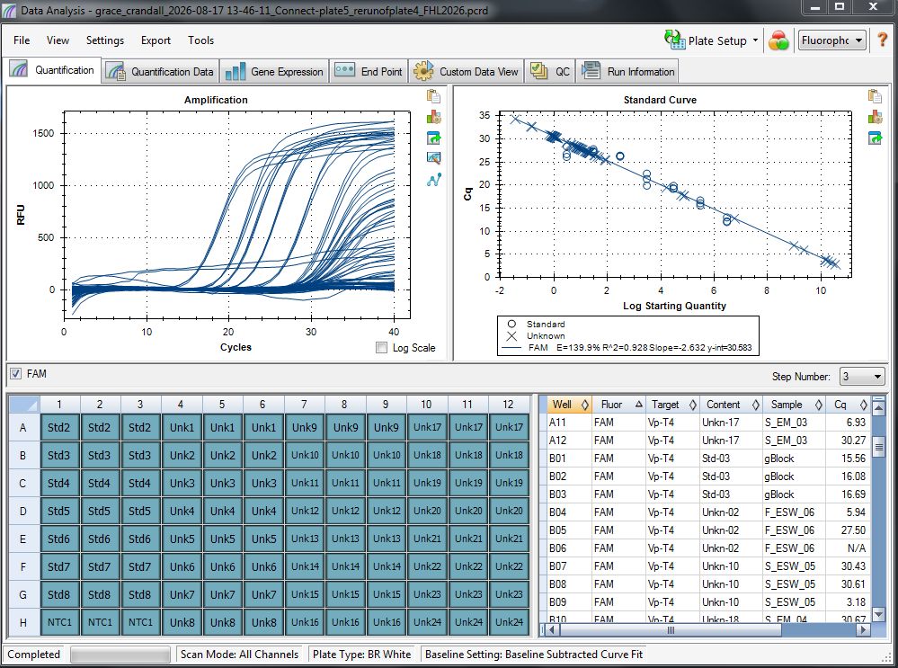

Re-running plate 4 samples to see if things improve. Spoiler: they didn't. Details in post. 

# qPCR Plate 5 Info: 

Plate Map 5: [here](https://docs.google.com/spreadsheets/d/1yHAuVCKnZfgd-NJSdztyYQ7jr9iUfiPW/edit?gid=375170068#gid=375170068) (plate is re-run of same samples from plate 4). 

## Plate 5 qPCR Run Results: 

| qPCR plate 5 |         |
|--------------|---------|
| R2           | 0.928   |
| E            | 139.90% |
| Y-int        |  30.583 |
| Slope        |  -2.632 |

Result files live in this google drive: [here](https://drive.google.com/drive/folders/1_NeGG6jdb1jAYrC4S1sZmIxrC7lbjkZo?usp=sharing)

## Feedback on how to move forward 
See this GitHub Issue: [#2487](https://github.com/RobertsLab/resources/issues/2487)

Waiting to hear on what the best course of action is, since the efficiency is still too high, rendering the results unusable :(. 

# Notes:
1. Will need to order more TaqMan Master Mix (currently have 1 full tube and one half tube ~ enough for 1 full plate). 

