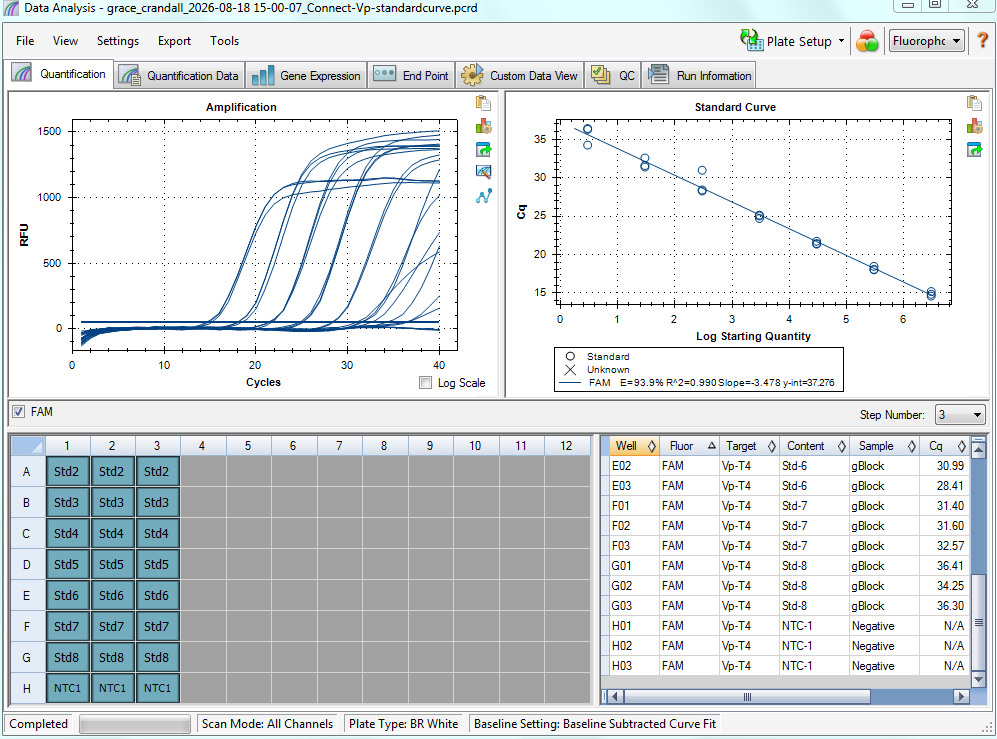

Ran a plate of just the standard curve to see what it looks like. Details in post!

# Plate info: 
[Plate Map](https://docs.google.com/spreadsheets/d/13HyhKTIDaHZszXXQ6MlN3ZIwnL620s7W/edit?rtpof=true) 

# Results

Result files in [this google drive folder](https://drive.google.com/drive/folders/1bLXEA3fE70PZeZXklfOM-y842xgqvGM8?usp=drive_link).

It looks preeeettttyyyyy darnnnn gooooood i think... so I'm not sure what the efficiency issue is from the past two plates... GitHub issue to follow: [#2487](https://github.com/RobertsLab/resources/issues/2487)