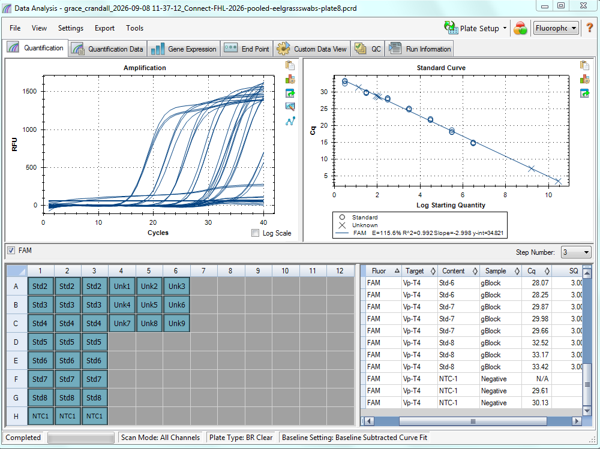

See post for details for qPCR plate #8. 

# Samples run: 
I pooled DNA into three pools:   

Pool 1 --> 1ul of DNA from each (n=16) of the exposed eelgrass swab DNA samples. These came from treatment groups that were exposed to _V. pectenicida_. 

Pool 2 --> 1ul of DNA from each (n=16) of the control eelgrass swab DNA samples. These came from treatment groups that were NOT exposed to _V. pectenicida_. 

Pool 3 --> 2ul from each (n=6) of the DNA extraction blanks from the eelgrass swab DNA extractions. These should not have any _V. pectenicida_ DNA in them. 

# Plate run: 
1. Standard curve    
2. NTC     
3. The three pools 

Each in triplicate. 

Plate map: [here](https://docs.google.com/spreadsheets/d/1T6iQb5vEHTXplzHvJFfUzJ9wV0wSTCV6/edit?gid=375170068#gid=375170068)

# Results:    

 

Result Files: [here](https://drive.google.com/drive/folders/19xge2nuUq1l4IfBVkDZhcphK7-9MKs8F).  

# Thoughts  
Sam added thoughts to this GitHub Issue: [here](https://github.com/RobertsLab/resources/issues/2487) 