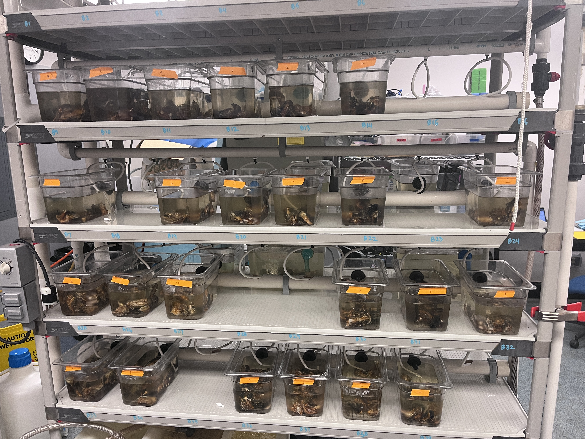

Will continually update this log and adjust date to most recent date for tracking oyster morts and steps being taken to improve the oyster tank rack in FTR. 

# Improving the system

Notes:   
- A lot of the valves are broken, so those will need to be replaced
- The tubing is pretty old and could use replacing 

Goals:    
- Find replacement tubing and valves and get OK'd by Steven for ordering 

# Up-To-Date Mort check

Spreadsheet link: [here](https://docs.google.com/spreadsheets/d/1t-kk9bqcTaQnzZ45wAmJMQ0EBh7wmi6O0cTCFS4XFDw/edit?usp=sharing)

Copied spreadsheet below:      

| date       | initials | row | tank | number_mortalities |
|------------|----------|-----|------|--------------------|
| 2026-09-11 | GAC      |   1 |    7 |                  1 |
| 2026-09-11 | GAC      |   1 |   10 |                  1 |
| 2026-09-11 | GAC      |   1 |    9 |                  2 |
| 2026-09-11 | GAC      |   1 |    5 |                  2 |
| 2026-09-11 | GAC      |   2 |    2 |                  1 |
| 2026-09-11 | GAC      |   2 |    6 |                  1 |
| 2026-09-11 | GAC      |   2 |    5 |                  3 |
| 2026-09-11 | GAC      |   2 |   10 |                  2 |
| 2026-09-11 | GAC      |   3 |    5 |                  2 |
| 2026-09-11 | GAC      |   4 |    9 |                  1 |
| 2026-09-11 | GAC      |   4 |    5 |                  1 |
| 2026-09-11 | GAC      |   4 |    2 |                  2 |
| 2026-09-10 | GAC      |   1 |    2 |                  2 |
| 2026-09-10 | GAC      |   1 |    9 |                  1 |
| 2026-09-10 | GAC      |   2 |   10 |                  1 |
| 2026-09-10 | GAC      |   2 |    2 |                  1 |
| 2026-09-10 | GAC      |   3 |    2 |                  1 |
| 2026-09-10 | GAC      |   3 |    6 |                  1 |
| 2026-09-10 | GAC      |   4 |   10 |                  2 |
| 2026-09-10 | GAC      |   4 |    9 |                  1 |
| 2026-09-10 | GAC      |   4 |    6 |                  1 |

# 2026-09-09

Setting up the system. 

The racks are already plumbed and have a pump system and a chiller that can be hooked up. 

I set up 4 rows, 6 tanks per row. Each tank has a water input and a drain that drains into a PVC pipe that controls the outflow to the holding tank that the pump is connected to to recirculate the water through the system. 

Steven and I then added 10 individuals per tank from 6 different oyster families. Family numbers: 2, 5, 6, 7, 9, and 10. 

I'll be checking daily for mortalities, logging how many are dead from which row, tank (family) number, and tossing the morts into a bucket in the cold room. 

I'll also be spot-checking temperature and salinity. 

    
