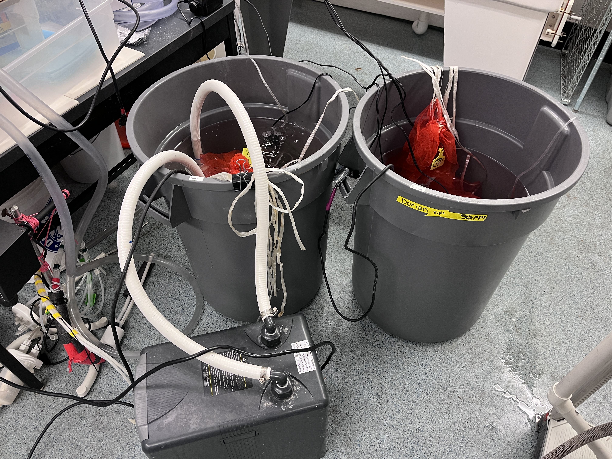

Will continually update this log and adjust date to most recent date for tracking oyster bucket temp and salinity checks and feeding log. 

# 2026-09-12

Temp and Salinity log update: 

| date       | initials | tank    | temp           | salinity | feeding |
|------------|----------|---------|----------------|----------|---------|
| 2026-09-11 | AH       | Control |         19.4 C |       20 | 2mL     |
| 2026-09-11 | AH       | El Nino |         25.9 C |       31 | -       |
| 2026-09-12 | GAC      | Control | 17.9 C (64.2F) |       19 | -       |
| 2026-09-12 | GAC      | El Nino | 25.9 C (78.6F) |       31 | -       |

# 2026-09-11 
Arianna and Steven set things up today, but the set up is:  

Left (control: ~18C and 20PSU + 3x feed); Right (El Nino conditions: 26C and 30PSE and 1x feed). 

I'll be doing daily temp and salinity checks for each bucket. I'll also be feeding the control bucket Monday, Wednesday, and Friday (2mL of shellfish diet) and the El Nino group on Monday only (2mL of shellfish diet). The shellfish diet lives in the FTR 213 fridge. 