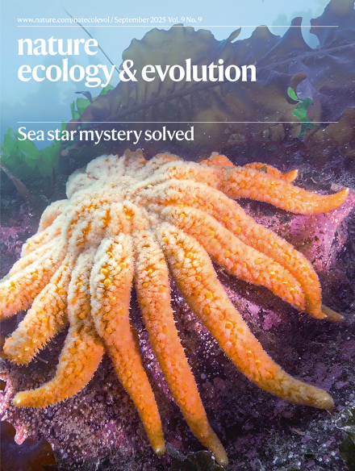

# Sunflower Sea Stars and Sea Star Wasting Disease
I've been working on the epidemiology team for Sea Star Wasting Disease (SSWD) since Summer 2021. 

I've been involved in running and helping design disease challenge experiments, taking samples, processing samples, and my main focus is studying the immune response of the sea stars using transcriptomics. 

# Exciting anouncements: 
Our big team's big announcement: We found the pathogen that causes sea star wasting disease in Sunflower Sea Stars! 

# _Vibrio pectenicida_ Causes Sea Star Wasting Disease in Sunflower Sea Stars!

## We got the cover! 

Link to paper: [here](https://www.nature.com/articles/s41559-025-02797-2) 

At long last, the big announcement has been revealed - our epidemiology team, with invaluable support and help from tons of folks from many organizations and institutions, have discovered the pathogen that causes sea star wasting disease in Sunflower Sea Stars.

The organizations that have contributed personnel, expertise, resources, and more to this project are: Hakai Institute, the University of British Columbia, the University of Washington, the US Geological Survey, and the Washington Department of Fish and Wildlife. It was funded by The Nature Conservancy and the Tula Foundation, with research conducted at the Marrowstone Marine Field Station in Washington State, run by the US Geological Survey’s Western Fisheries Research Center.

Coauthors:      
Melanie B. Prentice, Grace A. Crandall, Amy M. Chan, Katherine M. Davis, Paul K. Hershberger, Jan F. Finke, Jason Hodin, Andrew McCracken, Colleen T. E. Kellogg, Rute B. G. Clemente-Carvalho, Carolyn Prentice, Kevin X. Zhong, C. Drew Harvell, Curtis A. Suttle & Alyssa-Lois M. Gehman  

# A selection of some of the media coverage of this work: 

**Altmetric tracker: [here](https://nature.altmetric.com/details/179977185) where you can find everywhere that the article was talked about in news, blogs, X, Facebook, Bluesky, Wikipedia, etc.** 

## Articles: 

- The Conversation: [The bacteria killing sea stars in the Pacific: How our team uncovered a decade-long mystery](https://theconversation.com/the-bacteria-killing-sea-stars-in-the-pacific-how-our-team-uncovered-a-decade-long-mystery-259875)      
- Science News: [The mystery of melting sea stars may finally be solved](https://www.sciencenews.org/article/sea-star-wasting-mystery-solved-melting)        
- KUOW NPR: [Scientists crack the case of the melting sea stars. It only took a decade](https://www.kuow.org/stories/scientists-crack-the-case-of-the-melting-sea-stars-it-only-took-a-decade)       
- Seattle Times: [Inside the search for WA’s sea star killer](https://www.seattletimes.com/seattle-news/climate-lab/inside-the-search-for-was-sea-star-killer/)      
- Vox: [A wasting disease killed millions of sea stars. After years of searching, scientists just found a cause.](https://www.vox.com/science/421961/sea-star-wasting-disease-cause-new-research)       

## Podcast: 

Science Weekly (The Guardian) [A decade long mystery - why were billions of starfish turned to goo?](https://open.spotify.com/episode/7hCPKBfj6tPn0hEJxSxfe0?si=c83f99f241244603)

## Radio: 

KQED NPR (I got interviewed!): [Interview on KQED by Natalia Navarro](https://omny.fm/shows/kqed-segmented-audio/kqed-newscast-ab5dda15-8238-43bf-a90f-1219ca0a5eb2)
